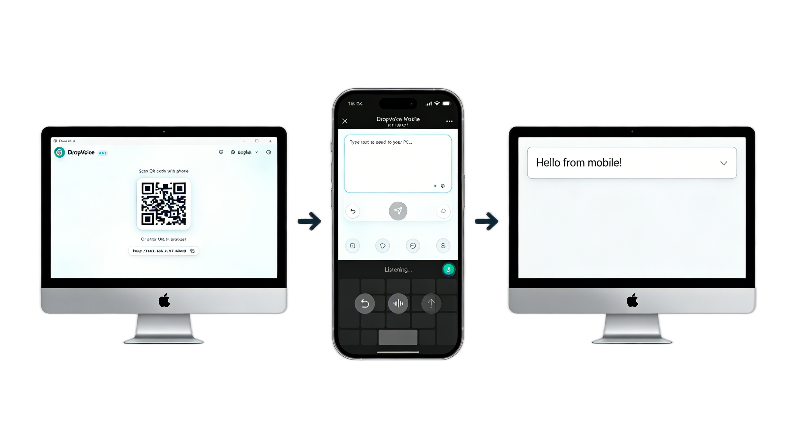

# DropVoice

DropVoice 让你可以通过手机语音输入法，将转换后的文字发送到电脑上。

[English](README.md) | 简体中文

## 功能特性

- 🖥️ **跨平台支持**：支持 Windows、macOS 和 Linux
- 📡 **局域网通信**：二维码连接 + WebSocket 即时传输
- 🌐 **多语言支持**：中英文界面
- 🎨 **多主题支持**：浅色、深色、跟随系统三种主题模式
- 📲 **移动端体验**：设置页面 + PWA 支持



## 快速开始

### 安装

从 [Releases](https://github.com/jukanntenn/DropVoice/releases) 下载适合你平台的最新版本。

### 使用方法

1. 🚀 **启动 DropVoice**
   - 服务器自动启动
   - 显示连接二维码

2. 📱 **手机连接**
   - 用手机扫描二维码
   - 浏览器打开 DropVoice 移动端界面

3. ⌨️ **发送文本**
   - 在移动端输入框中输入文本
   - 按 Enter 或点击"发送到电脑"
   - 文本将出现在电脑光标位置

### Linux 系统要求

Linux 用户需要安装 `xdotool`：

```bash
# Ubuntu/Debian
sudo apt install xdotool

# Fedora
sudo dnf install xdotool

# Arch Linux
sudo pacman -S xdotool
```

### macOS 系统要求

macOS 安装后需要进行以下设置：

1. **允许应用打开**：首次启动时右键点击应用选择"打开"，或在系统设置 → 隐私与安全性中点击"仍要打开"
2. **授予辅助功能权限**：前往系统设置 → 隐私与安全性 → 辅助功能，将 DropVoice 添加到列表中
   - 此权限用于键盘文本注入
   - 未授权时文本将无法输入到电脑

## 安全说明

⚠️ **重要**：DropVoice 仅应用于可信的局域网环境。

- 仅有基本的令牌验证
- WebSocket 通信无加密
- 请仅在安全的家庭/办公网络中使用

## 常见问题

### 手机无法连接

- 确认手机和电脑在同一局域网
- 检查防火墙是否允许端口 38425
- 确认服务器正在运行

### 文本未出现

- 确保电脑上的光标在文本输入框内
- 检查 WebSocket 连接是否活跃

### 中文输入法问题

部分应用与中文输入法存在兼容性问题：

- **Telegram 乱码**：使用中文输入法时文本可能显示为乱码
- **中文标点丢失**：中文标点符号可能无法正确输入

**解决方案**：在电脑上切换到英文输入法后再发送文本。

## 许可证

MIT License

## 支持

如有问题或功能建议，请使用 [GitHub Issues](https://github.com/jukanntenn/DropVoice/issues)。
