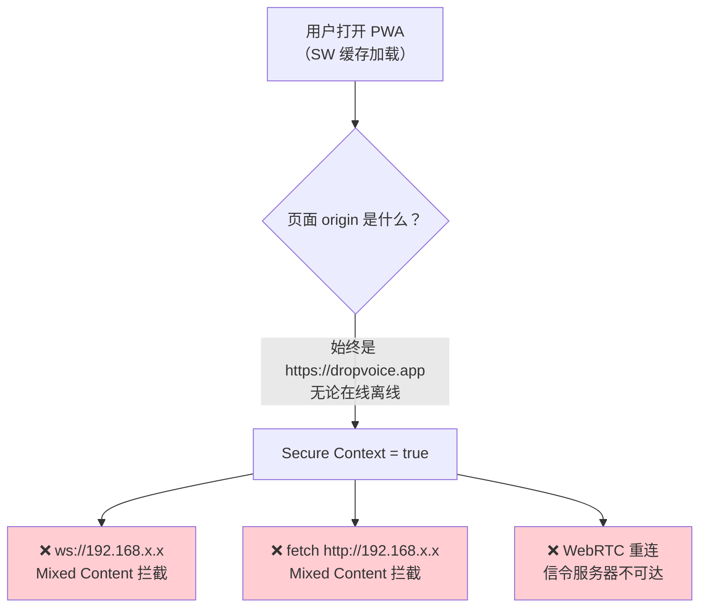
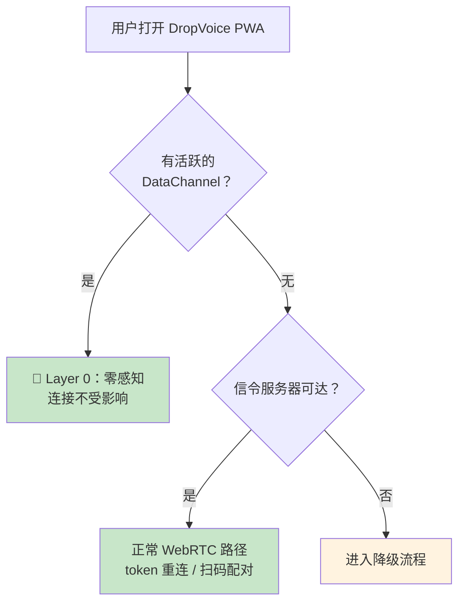
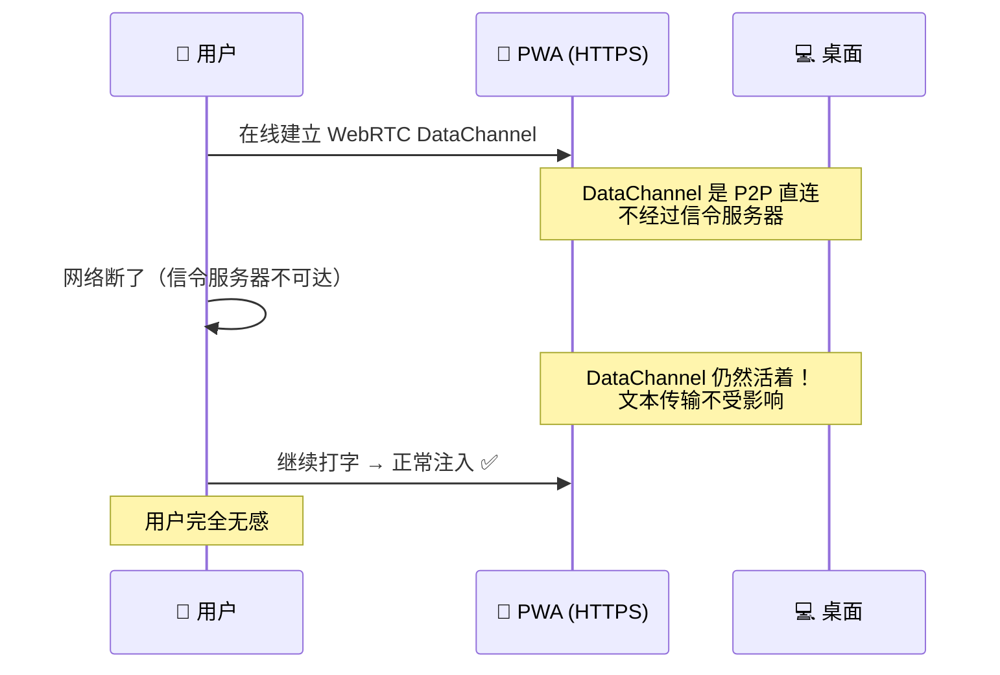
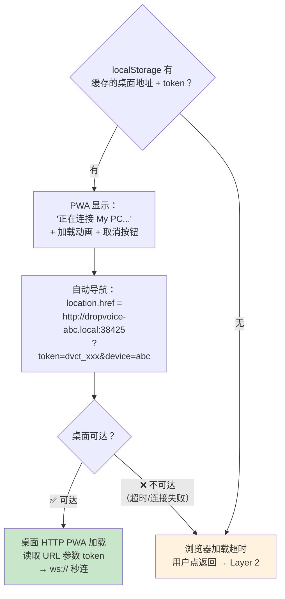
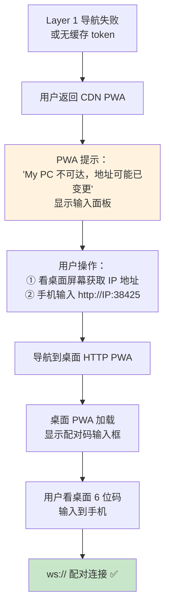
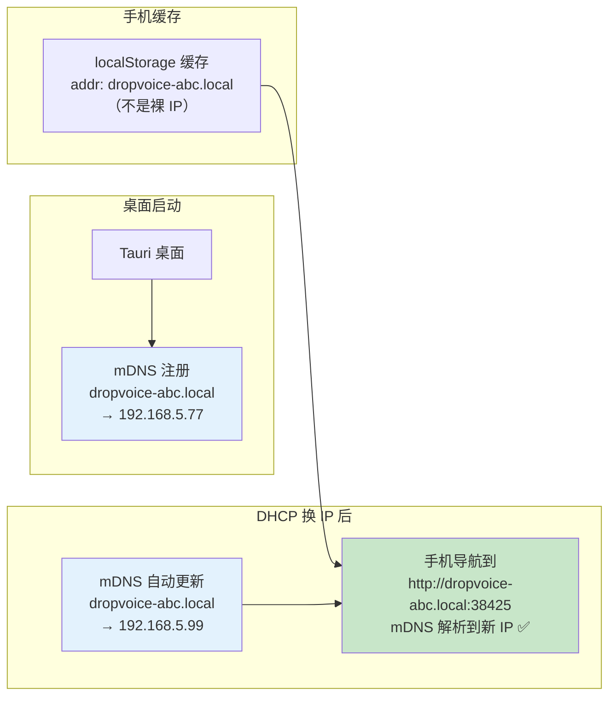
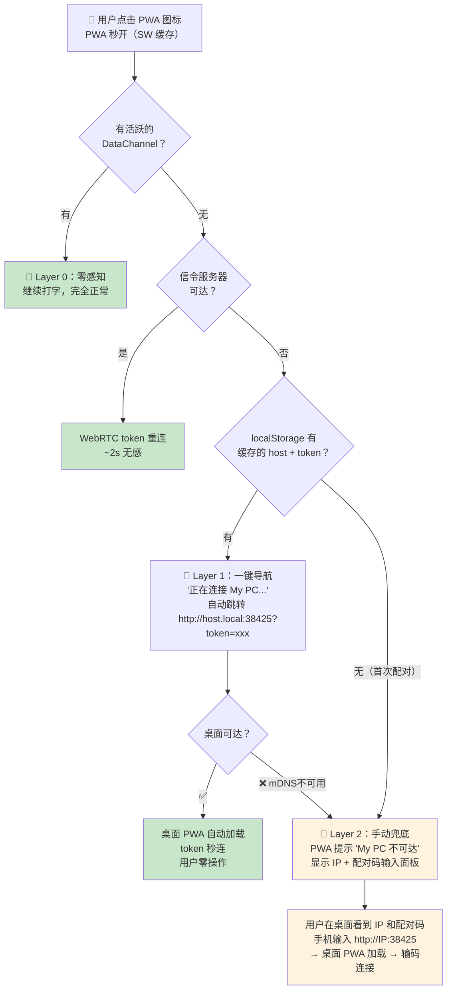

# DropVoice 离线降级策略设计

> 状态：设计草案（v0.1）
> 范围：后续优化版本，**本次不实施**
> 前置文档：[`webrtc-scan-direct-design.md`](./webrtc-scan-direct-design.md)（主路径设计）
>
> 本文聚焦"信令服务器不可达或无外部网络"场景下的降级策略，目标是让用户体验尽可能丝滑。

---

## 1. 核心约束

### 1.1 Mixed Content 限制不因离线豁免

> **现实依据**（MDN Web Security / W3C Secure Contexts 规范）：Mixed Content 的限制基于页面 origin，不基于网络状态。



HTTPS PWA 离线时仍然无法连接局域网。**离线时唯一出路：导航到桌面 HTTP PWA（`http://<桌面地址>:38425`）。**

### 1.2 桌面 HTTP PWA 的能力边界

桌面通过本地 axum 的 `ServeDir` 托管 PWA 静态文件（与 CDN PWA 同一份 `apps/mobile/dist/` 构建产物）。

| 能力 | `http://<桌面IP>` | `https://dropvoice.app` |
|---|---|---|
| ws:// 连接 | ✅（非 Secure Context，无 Mixed Content） | ❌（Mixed Content 拦截） |
| 摄像头扫码 | ❌（非 Secure Context） | ✅ |
| WebRTC DataChannel | ✅（可用，但信令不可达时无法建连） | ✅ |
| localStorage | 独立（`http://<桌面IP>` origin） | 独立（`https://dropvoice.app` origin） |

**核心限制**：桌面 HTTP PWA 无法使用摄像头扫码 → 降级路径只能手输 IP + code，不能扫码。

---

## 2. 降级触发条件



降级仅在以下条件同时满足时触发：
1. 没有活跃的 DataChannel（连接已断）
2. 信令服务器不可达（网络断开或服务器宕机）

---

## 3. 三层降级设计

### Layer 0：连接还活着（零感知）



WebRTC DataChannel 建立后是 P2P 直连，不依赖信令服务器。信令只在建立连接和断线重连时需要。**网络断了但连接还活着 → 用户零感知。**

---

### Layer 1：一键导航（best effort 自动连接）

当 DataChannel 断了，需要重建连接，但信令不可达时：



**关键设计点**：

1. **导航 URL 携带 token**：`http://<addr>:38425/?token=dvct_xxx`。桌面 HTTP PWA 加载后从 URL 读取 token，自动用 `ws://<addr>:38425/ws?token=dvct_xxx` 连接。**用户零操作，秒连。**

2. **token 通过 URL 参数跨 origin 传递**，解决了 localStorage 不共享的问题。

3. **桌面 HTTP PWA 连接成功后**，把 token 存入自己的 localStorage（`http://<addr>` origin），后续在该 origin 内的重连直接用。

---

### Layer 2：手动兜底（地址变了或首次配对）



**降级场景下的连接方式优先级**：

| 方式 | 桌面 HTTP PWA 可用 | 用户操作量 | 说明 |
|---|---|---|---|
| **token（缓存）** | ✅ | **零操作** | Layer 1 的默认路径 |
| **配对码** | ✅ | 输 6 位数字 | code 失效或首次配对时用 |
| **手输 IP** | ✅ | 输 IP 地址 | 导航必需 |
| **扫码** | ❌ | — | HTTP 页面非 Secure Context，摄像头不可用 |

**优先级：token > code > IP。扫码在降级场景下不可用。**

---

## 4. mDNS `.local` 地址：解决"IP 变了"

Layer 1 的 best effort 失败，主要原因是桌面 DHCP 续租换了 IP。解决方案：**桌面端注册 mDNS 服务，用 `.local` 域名替代裸 IP。**



**原理**：
- 桌面启动时用 Rust mDNS 库（如 `mdns-sd` crate）注册 `dropvoice-<shortid>.local`
- 手机 OS 的 mDNS 解析器（iOS Bonjour / Android NSD）自动解析 `.local` 到桌面当前 IP
- DHCP 换了 IP？mDNS 自动更新广播，`.local` 始终指向正确 IP
- 手机端缓存的 `.local` 地址永远有效（只要桌面在线且 mDNS 可用）

> **现实依据**：iOS Safari 通过 Bonjour 支持 `.local` 解析；Android Chrome 通过 NSD 支持。这是 OS 层面的 mDNS 解析，不需要浏览器直接处理 UDP 5353。

> **边界**：如果网络封锁 UDP 5353（企业 VPN 等），mDNS 解析失败。此时回退到手输 IP（Layer 2）。

---

## 5. 二维码载荷（含降级字段）

主路径设计（[`webrtc-scan-direct-design.md` §6.5](./webrtc-scan-direct-design.md)）定义的 QR 载荷：

```
dropvoice://pair?code=123456&device=<deviceId>&name=<urlencoded-name>
```

降级策略**扩展** QR 载荷，增加地址字段（向后兼容，主路径可忽略）：

```
dropvoice://pair?code=123456&device=<deviceId>&name=My%20PC&host=dropvoice-abc.local&ip=192.168.5.77
```

| 字段 | 主路径使用 | 降级使用 |
|---|---|---|
| `code` | ✅ 提取后走信令 offer | ✅ 桌面 HTTP PWA 内输入配对 |
| `device` | ✅ 信令端点路径参数 | ❌ 不需要 |
| `name` | ✅ 设备列表显示 | ❌ 不需要 |
| `host` | ❌ 忽略 | ✅ mDNS `.local` 地址（Layer 1 首选） |
| `ip` | ❌ 忽略 | ✅ 裸 IP（mDNS 不可用时 fallback） |

**在线模式**：PWA 摄像头扫码 → 提取 code + device → WebRTC 信令连接（忽略 host/ip）

**离线降级**：PWA 从扫码时缓存的 host/ip + token → 导航桌面 HTTP PWA

---

## 6. 完整降级流程（用户视角）



### 用户感知对照表

| 场景 | 用户操作 | 感知 |
|---|---|---|
| 连接还活着 | 无 | 完全无感 |
| 信令可达，需重连 | 无 | ~2s 自动重连 |
| 信令不可达，有缓存 token | **无**（自动导航+自动连接） | 页面跳转一下，秒连 |
| 信令不可达，mDNS 被封 | 输 IP + code | 手动但简单 |
| 首次配对，信令不可达 | 输 IP + code | 手动，极少数场景 |

**核心原则体现**：
- Layer 0（连接活着）：**零操作**
- Layer 1（有缓存 token）：**零操作**（导航+连接全自动）
- Layer 2（地址变了/首次）：**最少操作**（输 IP + code，扫码不可用但不需要——桌面屏幕直接显示 IP 和 code）

---

## 7. 前置依赖（主路径必须先满足）

本降级策略依赖以下主路径设计已落地：

1. ✅ 桌面 axum `ServeDir` 正确托管 PWA 静态文件（需修复 `mobile.html` → `index.html` 文件名问题，以及 `tauri.conf.json` 的 `bundle.resources` 声明）
2. ✅ 统一的 `dvct_` connection token 格式（URL 参数安全）
3. ✅ 6 位配对码桌面生成 + 桌面验证
4. ✅ TransportAdapter 运行时自动选择传输方式（WsTransport / RtcTransport）
5. ✅ Service Worker 离线缓存（已有，需确认预缓存策略）

---

## 8. 待验证项

| 项目 | 验证方法 | 风险 |
|---|---|---|
| mDNS `.local` 在 iOS Safari / Android Chrome 的解析 | 真机导航 `http://x.local:port` | 部分 OS/浏览器可能不解析自定义 `.local` |
| token URL 参数长度 | `dvct_` + 43 字符 = 48 字符，URL 无超长风险 | 低 |
| 桌面 ServeDir 托管完整 PWA | 修复文件名问题后真机访问 `http://IP:38425` | 中（当前有 bug） |
| 导航超时的检测与 UX | Layer 1 自动导航失败时如何检测并回退到 Layer 2 | 中（浏览器超时行为不一） |
