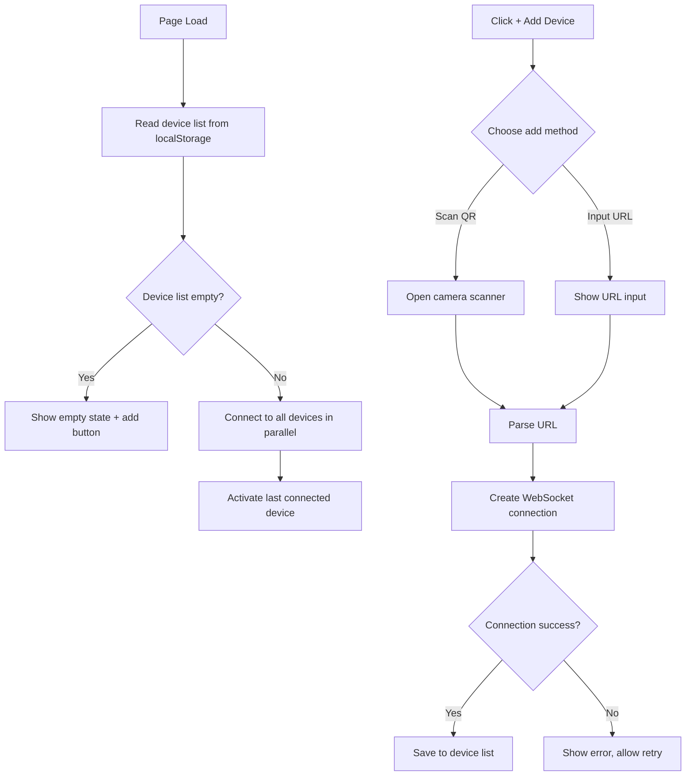
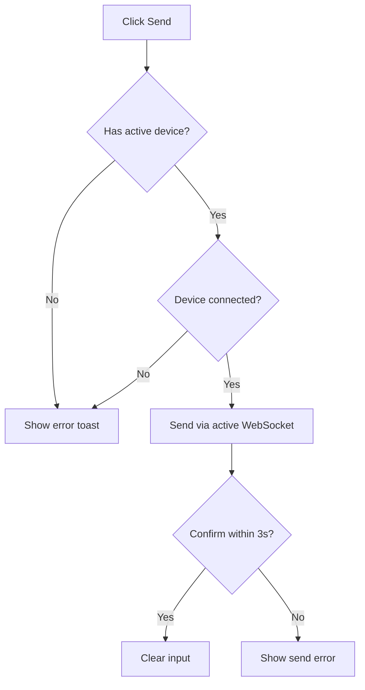

# Multi-Device Connection and Switching Feature

**Date**: 2026-03-02
**Status**: Design Approved
**Author**: AI Assistant

---

## Overview

Enable mobile phone to connect to multiple PCs simultaneously via multiple WebSocket connections, with an intuitive card/tab UI for switching between devices.

### Current State

- Mobile app has single WebSocket connection to the PC that served the page
- `useWebSocket` hook manages one connection
- Device loads from PC server URL

### Target State

- Mobile can connect to 3-5 PCs simultaneously
- Card/tab UI at top for device switching
- Status integrated into device cards
- Persistent device list with auto-reconnect
- Add devices via QR scan or URL input

---

## Requirements

### Functional

| ID | Requirement |
|----|-------------|
| R1 | Phone can connect to multiple PCs (max 5) via multiple WebSocket connections |
| R2 | Device cards displayed horizontally at top of screen with scroll support |
| R3 | Each card shows device name and connection status (connected/disconnected/connecting) |
| R4 | Click card to switch active device |
| R5 | Long-press card to rename device |
| R6 | Click X on card to disconnect and remove device |
| R7 | Add device via QR code scan (primary) or URL input (fallback) |
| R8 | Device list persisted to localStorage, auto-reconnect on page load |
| R9 | Only show error on send failure, no success toast |
| R10 | Default device name: "PC-{last IP octet}" (e.g., "PC-100") |

### Non-Functional

| ID | Requirement |
|----|-------------|
| N1 | No backend changes required |
| N2 | Auto-reconnect with exponential backoff (max 5 attempts) |
| N3 | Graceful handling of network disconnection |
| N4 | Responsive design for mobile screens |

---

## Architecture

### Data Structures

```typescript
interface Device {
  id: string;                      // UUID
  name: string;                    // User-defined name, default "PC-{IP_last_octet}"
  url: string;                     // WebSocket URL: ws://192.168.1.100:38425/ws
  status: 'connected' | 'disconnected' | 'connecting';
  lastConnected: number;           // Timestamp
}

interface DeviceManagerState {
  devices: Device[];
  activeDeviceId: string | null;
}

interface StoredDevice {
  id: string;
  name: string;
  url: string;
  lastConnected: number;
}

interface DeviceStorage {
  devices: StoredDevice[];
  lastActiveDeviceId: string | null;
}
```

### Component Structure

```
src/mobile/
├── components/
│   ├── DeviceCard.tsx          # Individual device card with status
│   ├── DeviceTabs.tsx          # Horizontal scrolling tab bar
│   ├── AddDeviceModal.tsx      # Add device dialog
│   ├── QRScanner.tsx           # QR code scanner
│   └── DeviceNameEditor.tsx    # Rename device dialog
├── hooks/
│   ├── useMultiWebSocket.ts    # Multi-connection manager (replaces useWebSocket.ts)
│   └── useDeviceManager.ts     # Device management logic
├── utils/
│   └── deviceStorage.ts        # Device list persistence
└── App.tsx                     # Integrate device tabs, remove StatusIndicator
```

### UI Layout

```
┌─────────────────────────────────┐
│  ← [PC-客厅 ●] [PC-书房○] [+] 📷 │  ← Device tabs with status (horizontal scroll)
├─────────────────────────────────┤
│                                 │
│   ┌─────────────────────────┐  │
│   │  Text Input Area        │  │  ← Input box
│   │                         │  │
│   └─────────────────────────┘  │
│                                 │
│     [恢复]    [发送]    [清空]   │  ← Action buttons
└─────────────────────────────────┘
```

### Device Card Visual States

| State | Visual |
|-------|--------|
| Connected + Active | Green dot `●` + theme border + highlighted background |
| Connected + Inactive | Green dot `●` + normal border |
| Disconnected | Gray dot `○` + gray text |
| Connecting | Spinning icon `⟳` + yellow text |
| Connection Failed | Red dot `●` + red text + retry button |

---

## Data Flow

### Connection Flow



### Message Send Flow



---

## Technical Details

### WebSocket Connection Management

```typescript
class MultiWebSocketManager {
  private connections: Map<string, WebSocketConnection>;

  addDevice(device: Device): void {
    const ws = new WebSocket(device.url);
    this.connections.set(device.id, {
      ws,
      device,
      status: 'connecting'
    });
    this.setupEventHandlers(device.id, ws);
  }

  removeDevice(deviceId: string): void {
    const conn = this.connections.get(deviceId);
    conn?.ws.close();
    this.connections.delete(deviceId);
  }

  sendToActive(text: string): boolean {
    const activeId = this.getActiveDeviceId();
    const conn = this.connections.get(activeId);

    if (!conn || conn.ws.readyState !== WebSocket.OPEN) {
      return false;
    }

    conn.ws.send(JSON.stringify({ type: 'text', content: text }));
    return true;
  }
}
```

### Device Naming

```typescript
function getDefaultDeviceName(url: string): string {
  try {
    const urlObj = new URL(url);
    const hostname = urlObj.hostname;
    const lastOctet = hostname.split('.').pop();
    return `PC-${lastOctet}`;
  } catch {
    return 'Unknown Device';
  }
}

// Examples:
// ws://192.168.1.100:38425/ws → "PC-100"
// ws://192.168.1.5:38425/ws   → "PC-5"
```

### Storage Format

```json
{
  "devices": [
    {
      "id": "uuid-1",
      "name": "PC-客厅",
      "url": "ws://192.168.1.100:38425/ws",
      "lastConnected": 1709280000000
    },
    {
      "id": "uuid-2",
      "name": "我的工作电脑",
      "url": "ws://192.168.1.5:38425/ws",
      "lastConnected": 1709270000000
    }
  ],
  "lastActiveDeviceId": "uuid-1"
}
```

---

## Error Handling

| Scenario | User Message | Recovery |
|----------|--------------|----------|
| Invalid URL format | "无效的连接地址" | Allow re-input |
| WebSocket connection failed | "无法连接到 PC-xxx" | Show retry button |
| Send timeout (3s) | "发送失败，请检查连接" | Auto prompt retry |
| Device limit exceeded | "最多支持 5 台设备" | Disable add button |
| Network disconnected | Card shows disconnected | Auto-reconnect (max 5x) |

---

## Implementation Phases

### Phase 1: Core Multi-Connection Management

- [ ] Create `useMultiWebSocket.ts` Hook
- [ ] Create `useDeviceManager.ts` Hook
- [ ] Create `deviceStorage.ts` utility
- [ ] Define data types and interfaces

### Phase 2: UI Components

- [ ] Create `DeviceTabs.tsx` container component
- [ ] Create `DeviceCard.tsx` card component with status
- [ ] Create `AddDeviceModal.tsx` add device dialog
- [ ] Create `DeviceNameEditor.tsx` rename dialog
- [ ] Update `App.tsx` to integrate device tabs

### Phase 3: Add Device Features

- [ ] Create `QRScanner.tsx` QR code scanner
- [ ] Implement URL input and validation
- [ ] Device list persistence
- [ ] Auto-reconnect logic

### Phase 4: Internationalization & Polish

- [ ] Add Chinese and English translations
- [ ] Error handling refinement
- [ ] Loading state optimization
- [ ] Multi-device scenario testing

---

## Dependencies

```json
{
  "dependencies": {
    "html5-qrcode": "^2.3.8"
  }
}
```

---

## File Changes

| Operation | Path | Description |
|-----------|------|-------------|
| **New** | `src/mobile/hooks/useMultiWebSocket.ts` | Multi WebSocket connection manager |
| **New** | `src/mobile/hooks/useDeviceManager.ts` | Device list management logic |
| **New** | `src/mobile/utils/deviceStorage.ts` | Device persistence storage |
| **New** | `src/mobile/components/DeviceTabs.tsx` | Device tab bar container |
| **New** | `src/mobile/components/DeviceCard.tsx` | Single device card |
| **New** | `src/mobile/components/AddDeviceModal.tsx` | Add device modal |
| **New** | `src/mobile/components/QRScanner.tsx` | QR code scanner |
| **New** | `src/mobile/components/DeviceNameEditor.tsx` | Rename modal |
| **Modify** | `src/mobile/App.tsx` | Integrate device tabs, remove StatusIndicator |
| **Deprecate** | `src/mobile/hooks/useWebSocket.ts` | Replaced by useMultiWebSocket |
| **Modify** | `src/mobile/locales/zh.json` | Add device translations |
| **Modify** | `src/mobile/locales/en.json` | Add device translations |

---

## Testing Plan

| Scenario | Test Steps |
|----------|------------|
| Add device (QR scan) | Scan PC QR code, verify connection success |
| Add device (URL input) | Manually input ws:// URL, verify connection success |
| Switch device | Click different device cards, verify send to correct device |
| Rename device | Long-press card, input new name, verify save |
| Disconnect device | Click X button, verify device removed from list |
| Device limit exceeded | Add 6th device, verify error shown |
| Auto-reconnect | Restart PC, verify phone auto-reconnects |
| Offline recovery | Refresh page, verify device list and connections restored |
| Send failure | Disconnect network, verify error message shown |
| Edge cases | Empty list, all devices offline, invalid URL |

---

## Risks & Mitigation

| Risk | Impact | Mitigation |
|------|--------|------------|
| QR library compatibility | Some mobile browsers don't support | Provide URL input as fallback |
| Multi-WebSocket performance | 5 connections may affect performance | Set 5 device limit, auto-disconnect on errors |
| localStorage quota | Device info may fail to save | Catch errors and notify user |
| Network switching | Wi-Fi switch causes disconnect | Auto-reconnect with max 5 retries |

---

## Design Decisions

### Why No Backend Changes?

The existing backend already supports multiple WebSocket connections. The `ConnectionManager` only tracks connection count and doesn't distinguish between clients. The message protocol (`{"type": "text", "content": "..."}`) remains unchanged.

### Why 5 Device Limit?

- Practical use case: home/office setup with 2-3 PCs
- Performance consideration: multiple WebSocket connections
- UI space constraint: horizontal scrolling with too many items

### Why QR Scan Priority vs URL Input?

- QR code is fastest for on-site setup
- URL input enables remote/manual configuration
- Both options accommodate different scenarios

---

## Summary

**Core Changes:**
- Mobile app: single connection → multi-connection management
- New device tab UI (status integrated)
- QR scan + URL input for adding devices
- Persistent device list with auto-reconnect

**No Changes:**
- PC backend: no modifications required
- WebSocket protocol: unchanged
- Existing send/receive logic: unchanged

**User Experience:**
- Scan to connect, no configuration needed
- Card-based switching, clear and intuitive
- Offline recovery with auto-reconnect
- Max 5 devices, sufficient for daily needs
