# DropVoice 扫码直连设计 — WebRTC DataChannel + 信令

> 状态：设计评审稿（v3.1）
> 范围：v1.1「信令服务器（HTTPS 扫码）」里程碑
> 本文是设计文档，不是规格（specs/ 保持只读）；评审通过后按需落为 spec。
> 离线降级策略见独立文档 [`offline-degradation-design.md`](./offline-degradation-design.md)，本次不实施。
>
> **v3.1 变更**：基于第二轮实现者评审修正：KeepAlive 注释 vs ping 事件机制性误解（§4.6/§6.4）、TTL 60s vs hold 30s 边界竞态（§4.6）、时序图字段对齐 §4.1（§3.2）、AuthenticatedDevice 需新建 query 版（§4.8）、dev CSP（§5.3）、base64 引用修正（§3.3）、桌面 client 路径迁移纳入里程碑、Safari mDNS 风险降级（§10.2）。CF SSE 穿透已实测确认。

---

## 0. 实验验证摘要

所有阻断性风险已通过真实实验确认可落地（2026-08-08，Windows + WebView2 151 + Tauri 2.11.5）：

| 风险点 | 实验方法 | 结果 | 证据 |
| --- | --- | --- | --- |
| WebView2 隐藏窗口后 JS/DataChannel 被节流或冻结 | Tauri 2 app，关闭按钮隐藏到托盘 23 分钟 | ✅ **无节流无冻结**。`document.visibilityState` 保持 `visible`，1s 定时器 maxGap=1015ms，DataChannel 508 条消息零丢失 | `.local/exp-throttle/exp-log.txt` |
| WebRTC 空 iceServers 纯 host candidate 可连通 | Playwright Chromium，两个 context 建 DataChannel | ✅ ICE `connected`，DataChannel 双向通信正常 | `.local/exp-webrtc-test.js` |
| Chrome mDNS 混淆生成 `.local` 候选 | 同上，`getStats()` 检查 candidate | ✅ 生成 `a2ac709d-*.local` host candidate，不暴露原始 IP | 同上 |
| SSE + EventSource query token 认证 | Node.js SSE server + Playwright EventSource | ✅ 有效 token 连接成功，无效 token 401 拒绝，自定义事件推送正常 | `.local/exp-sse-test.js` |
| CF SSE 穿透（keepalive 防超时） | 真实部署到 VPS + CF，实测 SSE 流式到达 | ✅ 15s keepalive 运行良好，CF 不缓冲 `text/event-stream` | 人工实测 |

---

## 1. 背景与目标

### 1.1 产品需求

- 手机 PWA 是**常驻形态**：书签/主屏入口、设备列表、草稿、凭据持久化
- 连接**新设备**时，用户在 PWA 页面内用**摄像头扫码**桌面二维码直连
- 全程零操作：不装证书、不开设置、不输码（配对码对用户不可见）
- 数据**不中转**：文本只在手机↔桌面两点之间流动
- 手机与桌面必须在同一局域网（跨网络属 v2.0，不在本文范围）
- PWA 中可添加多台设备，过程依然是扫码连接

### 1.2 约束链（为什么只能走 WebRTC）

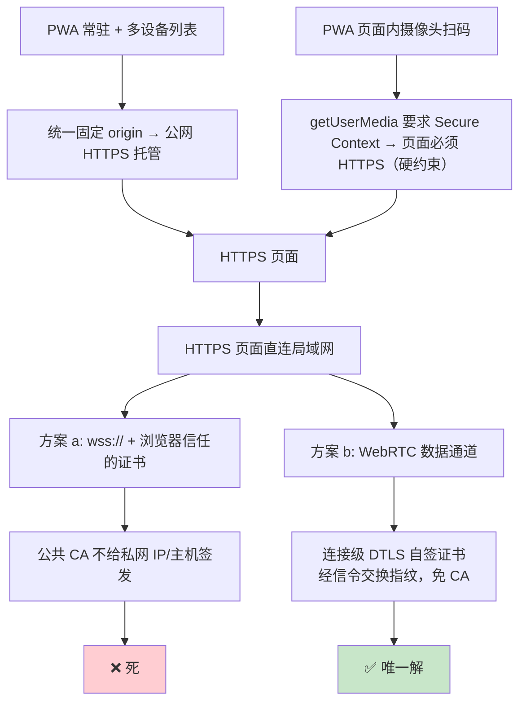

**实证记录**（Playwright + 真 Chromium，2026-08-06）：

- `https://` 页面 → `ws://192.168.5.77:38425` → 被 Mixed Content 拦截
- `http://` 页面 → `ws://192.168.5.77:38425` → 放行

> **现实依据**（MDN Web Security / W3C Secure Contexts 规范）：Mixed Content 的限制基于页面 origin，不基于网络状态。

### 1.3 WebRTC 原理简述

> **类比**：两个陌生人想直接通话，但互不知道对方号码。他们有个共同朋友（信令服务器），A 把自己号码（**offer**）交给朋友转给 B，B 把自己号码（**answer**）转回给 A。交换完号码后两人直拨，朋友退出。

| 类比 | WebRTC 术语 | 说明 |
| --- | --- | --- |
| 陌生人 A、B | Peer（手机 / 桌面） | 两个浏览器实例 |
| 电话号码 | **SDP**（Session Description Protocol） | 描述"我能收发什么数据、走什么编码" |
| 号码交换（经朋友） | **信令**（Signaling） | WebRTC 规范**故意不定义**信令怎么传——由应用自定 |
| 直拨 | **DataChannel**（DTLS 加密） | SDP 交换后数据 P2P 直连，不经服务器 |
| 连接级自签证书 | **DTLS** | 连接级证书，指纹随 SDP 一起交换，**浏览器不告警** |

关键点：**信令服务器只转发 SDP（几 KB，一次性），数据通道建立后服务器完全不参与数据传输。**

### 1.4 为什么桌面 peer 放 webview 而非 webrtc-rs

| 方案 | 成本 | 风险 |
| --- | --- | --- |
| webrtc-rs（Rust 全栈） | 拖入 ice/dtls/sctp 整套重依赖，编译慢 | 依赖维护风险、mDNS 解析要自己实现 |
| **主 webview 承载 WebRTC**（本文选型） | 零新 Rust 依赖；主 webview 已是 Secure Context | ~~隐藏窗口后台节流~~ **已实验验证无节流（§0/§5.2）** |

主 webview 在 Tauri 2 中已经是 Secure Context，RTCPeerConnection 可直接使用。

> **Secure Context 核实**（Tauri 2 源码 `crates/tauri/src/manager/mod.rs:337-346`）：Windows/Android 上 webview origin 是 `http://tauri.localhost`（默认）或 `https://tauri.localhost`（`useHttpsScheme: true`），macOS/Linux 是 `tauri://localhost`。`http://tauri.localhost` 匹配 WHATWG "potentially trustworthy" 的 `*.localhost` 规则，是 Secure Context → RTCPeerConnection 可用。**实验验证**：`window.isSecureContext === true`（`.local/exp-throttle/exp-log.txt`）。

两端都是浏览器引擎（手机 Chrome/Safari + 桌面 WebView2/WKWebView/WebKitGTK）→ mDNS 候选原生互通，Rust 侧无需实现任何 ICE/mDNS 细节。

---

## 2. 部署架构

### 2.1 域名统一

PWA 和信令服务器统一部署在同一域名下，目的是：

1. **彻底消除 CORS**（同源请求不触发 preflight）
2. dev / staging / prod 用同一套配置模式，仅切换域名

| 环境 | PWA origin | API origin | 说明 |
| --- | --- | --- | --- |
| dev | `http://localhost:5174`（Vite） | Vite proxy → `http://localhost:38424` | localhost 本身是 Secure Context，零证书 |
| staging | `https://dropvoice.bytehome.fun` | 同域 `/api/*` | staging VPS |
| prod | 待定，未上线 | 同域 `/api/*` | prod VPS，域名可动态配置 |

**API 路径约定**：所有配对服务器端点统一加 `/api` 前缀（如 `/api/devices`、`/api/devices/{id}/webrtc/offer`）。Caddy 将 `/api/*` 反向代理到 axum `:38424`，其余路径服务 PWA 静态文件。

域名通过环境变量 `VITE_API_BASE_URL` 注入 PWA 构建产物。dev 留空（走 Vite proxy），staging/prod 填实际域名。

### 2.2 PWA 分发：VPS 托管 + Cloudflare CDN 缓存

```
apps/mobile/dist/ → VPS（Caddy 提供静态文件）→ Cloudflare CDN 边缘缓存
```

> **Cloudflare 缓存行为（官方文档已核实）**：
>
> - 默认缓存：`.js`、`.css`、图片、字体 → 边缘命中后不回源
> - 默认不缓存：HTML、JSON → 回源 VPS
> - CF 免费版 **Proxy Read Timeout = 125 秒**（developers.cloudflare.com/fundamentals/reference/connection-limits，免费版不可配置，超时返回 524）。SSE 心跳 15s 远在此限制内。

Cache-Control 策略（Caddy 配置）：

```
# Vite content-hash 资源 → 永久缓存（CF + 浏览器双层缓存）
/assets/*    → Cache-Control: public, max-age=31536000, immutable

# 入口文件 → 每次校验（必须回源拿最新版）
/index.html  → Cache-Control: no-cache
/sw.js       → Cache-Control: no-cache
```

带宽测算（10 万用户）：

```
PWA 资源（Vite 构建，content-hash 文件名）：
  index.html  ≈ 2KB（gzip，不缓存，每次回源 VPS）
  sw.js       ≈ 2KB（不缓存，每次回源 VPS）
  其余 JS/CSS ≈ 400KB（CF 边缘缓存，命中后不回源）

10万注册 × 30% 日活 = 3万次加载/天
回源 VPS 流量：3万 × 4KB = 120MB/天 = 3.6GB/月 → 3Mbps VPS 毫无压力
Service Worker 缓存后：重复打开零网络流量，实际更低
```

### 2.3 整体架构图

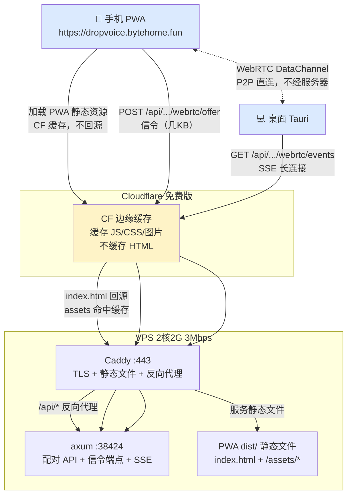

---

## 3. 凭据体系（统一设计）

### 3.1 三套凭据，各司其职

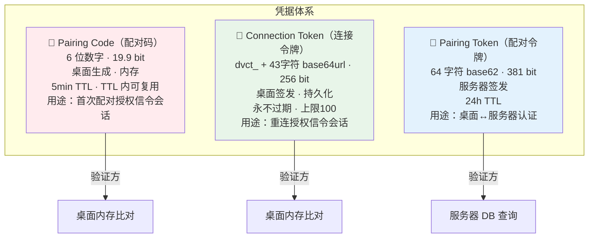

| 凭据 | 用途 | 生成方 | 验证方 | 存储 | TTL |
| --- | --- | --- | --- | --- | --- |
| **Pairing Code** | 首次配对（授权信令会话） | 桌面 | 桌面（收到 offer 时校验） | 桌面内存 | 5min，TTL 内可复用 |
| **Connection Token** | 重连（授权信令会话，不烧 code） | 桌面 | 桌面 | 桌面内存 + 持久化 | 无（上限 100 FIFO） |
| **Pairing Token** | 桌面↔服务器认证（注册/心跳/SSE） | 服务器 | 服务器 | 服务器 DB + 桌面配置 | 24h |

### 3.2 Pairing Code 统一（砍掉割裂的双码制）

**现状问题**：原设计有两种配对码——桌面生成的 8 位本地码（26.6 bit）、服务器生成的 6 位远程码（19.9 bit），验证逻辑也分叉（本地内存比对 vs 桌面反查服务器）。

**统一设计**：

- **只保留一种**：6 位数字，**桌面生成**，**桌面验证**
- 服务器零 code 知识——只是个"SDP 转发板"
- 砍掉服务器端 code DB 表 + `POST /devices/{id}/pairing-code` + `GET /pairing-codes/{code}` 端点

**为什么 6 位够安全**：19.9 bit 熵。code 只在 QR 中和桌面屏幕上出现，**从不在公网传输**——它随 SDP offer 走信令服务器时，校验发生在桌面本地。信令服务器不存 code、不校验 code。针对桌面的在线枚举需要先猜中 device_id（UUID v4，122 bit）才能发 offer，实际上不可行。

**code 的复用语义**：5min TTL 内同一 code 可被多次使用（支持多手机同时配对同一桌面——如会议场景）。TTL 过期后桌面重新生成新 code。

**code 的安全模型**（校验全在桌面）：

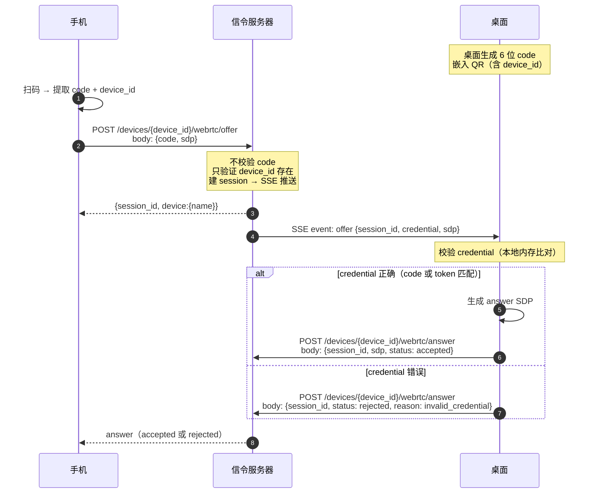

> **字段命名说明（以 §4.1 端点表为准）**：
>
> - `device_id` 在 URL path 中，不在 request body 中
> - 所有字段用 **snake_case**（`session_id` 非 `sessionId`）
> - `credential` 是 SSE 事件中的统一字段名，承载 code 或 token（服务器不解析，透传给桌面）
> - **credential 转换规则**：服务器收到 offer body 后，`credential = body.code.or(body.token)`；若两者都缺失返回 400。 credential 随 SSE `offer` 事件透传给桌面，桌面根据本地 code/token 列表判断类型。

### 3.3 Connection Token 格式（替代 UUID v4）

**现状问题**：原设计用 UUID v4 作为连接令牌。UUID 是标识符（identifier），不是凭证（credential），语义用错了。

**行业惯例**：主流服务的令牌全部是高熵随机字符串 + 可识别前缀：

| 服务 | Token 格式 | 特征 |
| --- | --- | --- |
| GitHub PAT | `ghp_` + 36 字符 base62 | 可识别前缀 + 高熵随机 |
| Stripe API Key | `sk_live_` + 24 字符 | 环境前缀 + 随机 |
| Tailscale | `tskey-` + base64url | 可识别前缀 + base64url |

**新设计**：不透明随机令牌（Opaque Random Token），base64url 编码 32 字节：

```
dvct_<43字符base64url>
```

| 属性 | 值 | 说明 |
| --- | --- | --- |
| 格式 | `dvct_` + 43 字符 base64url | `dvct` = DropVoice Connection Token |
| 熵 | 256 bit | UUID v4（122 bit）的 2 倍 |
| URL 安全 | ✅ | base64url 专为 query string 设计（`/`→`_`、`+`→`-`、无 `=`） |
| 生成 | CSPRNG 32 字节 → base64url | 用 `rand::Rng::fill` + base64 crate（需新增依赖） |

```rust
// 需在 apps/desktop/src-tauri/Cargo.toml 新增直接依赖：
//   base64 = "0.22"   （Cargo.lock 中已有 0.22.1，被 axum/hyper-util 等传递引入，
//                      但无任何 workspace 成员直接声明它，需显式添加）
//   rand（已有）

use base64::{engine::general_purpose::URL_SAFE_NO_PAD, Engine};
use rand::Rng;

pub fn generate_connection_token() -> String {
    let mut bytes = [0u8; 32];
    rand::thread_rng().fill(&mut bytes);
    format!("dvct_{}", URL_SAFE_NO_PAD.encode(&bytes))
}
```

> **核实说明**：`base64` crate 已在 `Cargo.lock` 中（0.21.7 和 0.22.1，被 axum/hyper-util/reqwest 等传递引入），但**无任何 workspace 成员直接声明它**——需在 desktop 的 `Cargo.toml` 显式添加 `base64 = "0.22"` 直接依赖。`rand::Rng::fill` 是 trait 方法，需 `use rand::Rng`。这与现有 `pairing_token`（`pairing-server/src/api/error.rs:8-13`，base62 字母表 `TOKEN_ALPHABET` + 64 字符 + `random_string()`）的生成逻辑**不同**，不能复用。

### 3.4 device_id

- **生成方**：桌面（UUID v4，122 bit 熵）
- **生成时机**：首次启动时生成，持久化到本地配置文件（`config.device.device_id`）
- **用途**：配对服务器设备注册的主键；信令端点路径参数；QR 载荷中的 `device` 字段
- **生命周期**：永久不变，跨重启复用。仅在配置文件被删除时重新生成（视为新设备）

---

## 4. 信令协议（配对服务器新增）

### 4.1 端点设计

复用现有 `AuthenticatedDevice`（Bearer pairing_token → device_id）与设备注册逻辑；会话存储为内存缓存 + TTL。

端点命名对齐 WebRTC 规范术语（W3C WebRTC §4.4.1.2 定义的标准 SDP 类型为 `offer` / `answer`）。路径参数使用 axum 0.8 的 `{id}` 语法（非 `:id`，否则 panic——axum 0.8 CHANGELOG + `path_router.rs:36-56` 确认）：

| Method | Path | 认证 | 说明 |
| --- | --- | --- | --- |
| `POST` | `/api/devices/{id}/webrtc/offer` | body 带 `code` 或 `token` | 手机发起：校验 deviceId 存在 → 存 offer → SSE 推送桌面 → 返回 `{session_id}` |
| `GET` | `/api/devices/{id}/webrtc/answer/{session_id}` | session_id 本身即为凭据（UUID v4，122 bit 不可猜） | 手机长轮询：**hold 最多 30s**，answer 就绪立即返回，无则 204 超时（注意：会话 TTL 60s > hold 30s，避免边界竞态，见 §4.6） |
| `GET` | `/api/devices/{id}/webrtc/events` | query `token`（pairing_token） | **桌面 SSE 长连接**：推送 incoming offer，每 15s 心跳 |
| `POST` | `/api/devices/{id}/webrtc/answer` | Bearer | 桌面回填 answer → 唤醒手机的长轮询 |

> **认证策略差异说明**：`GET answer/{session_id}` 不需要额外认证，因为 session_id 是手机刚刚 POST offer 后自己拿到的（已知值，高熵），且只能用来查询该 session 的 answer。`GET events`（SSE）需要 query token，因为桌面是被动接收**任意**手机的 offer——不能让任何人订阅某设备的所有 offer 流。两者的威胁模型不同：answer 查询是"查我自己创建的会话"，SSE 订阅是"旁听别人的所有配对请求"。

请求/响应示例：

```jsonc
// POST /api/devices/{id}/webrtc/offer
{ "code": "123456", "sdp": "v=0\r\n..." }         // 首次配对
// { "token": "dvct_xxx", "sdp": "v=0\r\n..." }    // 重连（不消耗 code）

// 响应（200）
{ "session_id": "9f1c…", "device": { "id": "…", "name": "My PC" } }
// 响应（404）deviceId 不存在
// 响应（429）超速率限制
```

```jsonc
// POST /api/devices/{id}/webrtc/answer（桌面调用，Bearer 认证）
{ "session_id": "9f1c…", "sdp": "v=0\r\n…", "status": "accepted" }
// 或
{ "session_id": "9f1c…", "status": "rejected", "reason": "invalid_credential" }

// GET /api/devices/{id}/webrtc/answer/{session_id}（手机长轮询）
// 响应（200）
{ "sdp": "v=0\r\n…", "status": "accepted" }
// 或
{ "status": "rejected", "reason": "invalid_credential" }
// 响应（204）answer 尚未就绪，手机继续轮询
// 响应（404）session_id 不存在或已过期
```

手机侧总请求数：2 个（POST offer + GET answer）。桌面侧：1 条 SSE 持久连接 + 每次配对 1 个 POST answer。

### 4.2 SSE 认证方案：query token（已实验验证 ✅）

> **现实约束**（WHATWG HTML 规范确认）：浏览器原生 `EventSource` 构造函数只接受 `{ url, withCredentials }`，**不支持自定义 HTTP header**，无法传 `Authorization: Bearer`。

**方案**：SSE 端点通过 query 参数传 pairing_token：

```
GET /api/devices/{id}/webrtc/events?token=<pairing_token>
Accept: text/event-stream
```

服务器从 query 提取 token 并复用现有 `AuthenticatedDevice` 校验逻辑。token 失效（401）时 SSE 返回 401，桌面感知后重新注册获取新 token，重建 SSE 连接。

> **实验验证**（`.local/exp-sse-test.js`）：EventSource + query token 方案已测试通过。有效 token → SSE 连接成功并接收事件；无效 token → 401 拒绝，`readyState=CLOSED`；POST 触发 → 自定义 `offer` 事件通过 SSE 实时推送。

> **安全性说明**：pairing_token 走 query 参数有日志泄露风险（access log）。缓解：① 生产环境 Caddy 日志过滤 query string；② pairing_token 24h TTL 过期自动失效；③ 连接是 HTTPS，传输层加密。

> **备选方案**：也可用 `withCredentials: true` + HttpOnly cookie 传递 pairing_token（cookie 不受 EventSource 限制）。但同域部署下 cookie 方案需要额外的 Set-Cookie 交互，query token 更简单。

### 4.3 为什么手机端用长轮询而非 SSE

| 维度 | SSE（服务器→手机推 answer） | 长轮询（手机 hold 等 answer） |
| --- | --- | --- |
| 认证 | EventSource 无法传 header，手机端只有 code/token 无 pairing_token | POST offer / GET answer 走 body / path，无限制 |
| 实现复杂度 | 手机需维持额外 SSE 连接 | 复用已有 HTTP 请求，零新增连接管理 |
| 延迟 | ~0s | ~0s（hold 模式，answer 就绪即返回） |
| CF 兼容 | ✅ | ✅ |

手机端没有 pairing_token（那是桌面↔服务器的凭据），无法走 SSE 认证。长轮询在认证上无限制（code/token 走 request body），且延迟与 SSE 相同。**手机端选长轮询是认证约束下的必然选择。**

桌面端有 pairing_token，但 EventSource 不能传 header → 走 query token 方案（§4.2）。

### 4.4 时序（首次配对）

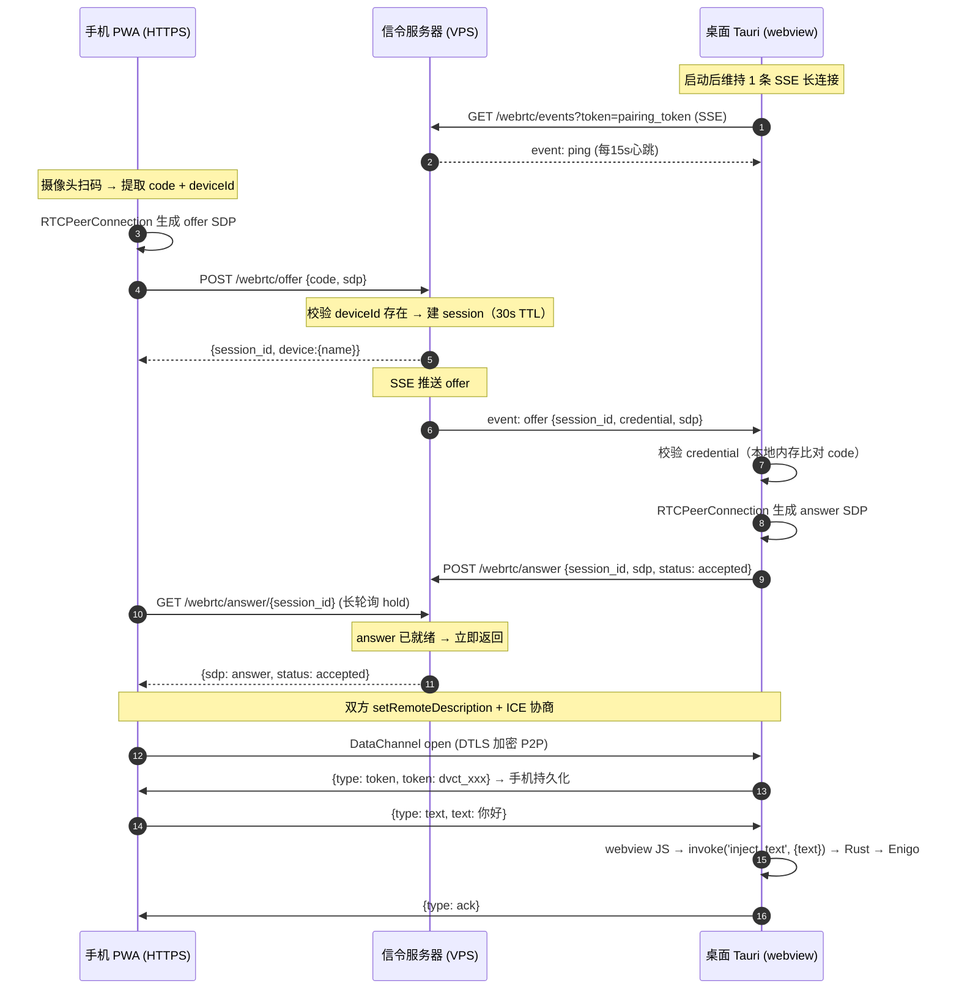

**信令延迟**：SSE 推送（≈0s）+ 桌面生成 answer（ICE 收集 <1s）+ 手机长轮询返回（≈0s）= **总延迟 <2s**。

### 4.5 时序（重连，token 认证）

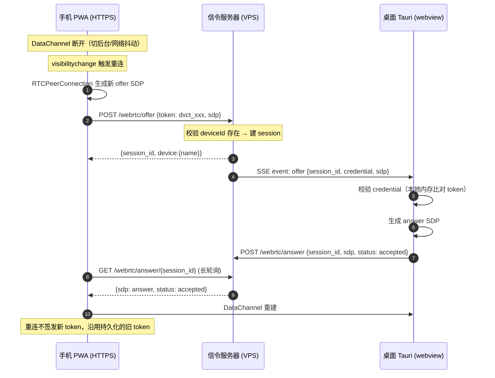

### 4.6 会话模型与资源边界

```rust
struct SignalSession {
    session_id: String,       // UUID v4，高熵不可猜
    device_id: String,        // 目标桌面设备 ID
    offer_sdp: String,        // 手机生成的 offer
    answer_sdp: Option<String>,        // 桌面回填的 answer（None 表示未就绪）
    answer_status: Option<AnswerStatus>,  // Accepted / Rejected
    credential: String,       // code 或 token，透传给桌面校验（服务器不解析）
    created_at: Instant,
    notify: Arc<Notify>,      // 唤醒手机长轮询
}
```

> **唤醒可靠性**（tokio `Notify` 源码确认）：`Notify` **会存储一个 permit**——若 `notify_one()` 先于 `notified()` 调用，permit 被存储，下一次 `notified()` 立即完成（`notify.rs:29-46`）。但仅存一个 permit（多次 `notify_one()` 合并为 1）。实现长轮询唤醒时，仍建议采用"先检查共享状态（answer_sdp 是否已就绪），再 await Notify"的双检模式。

- TTL：**60s**（显著大于长轮询 hold 30s + ICE 收集 + 余量，避免边界竞态——若 TTL ≤ hold，hold 未结束时 `cleanup_expired()` 可能已回收会话导致 404），`cleanup_expired()` 周期回收
- SDP 载荷上限 64KB（校验拒绝，防滥用）
- **每 device 并发会话软上限**：10（防滥用——攻击者知道 device_id 即可让桌面 SSE 忙于推送无效 offer、桌面持续 `invoke('validate_credential')`；超限时新 offer 返回 429）
- SSE 长连接每桌面维持 1 条。**保活机制**：SSE 流内部用 `tokio::select!` 每 15s `yield Ok(Event::default().event("ping").data(...))` 发送具名 `ping` 事件（防 CF 125s Proxy Read Timeout）。**不依赖** axum `KeepAlive`——`KeepAlive` 默认发的是 SSE 注释 `:\n\n`（`sse.rs:201-202`），`EventSource` 会静默吞掉注释，桌面 JS 收不到任何事件；具名 `ping` 事件可被 `addEventListener("ping")` 接收，用于连接活性监测

### 4.7 端点废弃

| 端点 | 新设计下 | 理由 |
| --- | --- | --- |
| `POST /devices` | ✅ 保留（加 `/api` 前缀） | 桌面注册，获取 pairing_token |
| `PUT /devices/{id}/status` | ✅ 保留（加 `/api` 前缀） | 桌面心跳，维持在线状态 + IP 刷新 |
| `GET /health` | ✅ 保留 | Caddy/CF 健康检查（不加 `/api` 前缀） |
| `POST /devices/{id}/pairing-code` | ❌ 废弃 | code 改为桌面生成，服务器不再生成 |
| `GET /pairing-codes/{code}` | ❌ 废弃 | code 验证在桌面本地，服务器不反查 |

### 4.8 认证与安全

- **credential 校验在桌面**：信令服务器只验证 deviceId 存在并转发 offer，code/token 的校验和 TTL 由桌面本地保证
- **pairing_token 校验在服务器**：桌面↔服务器的注册/心跳认证走现有 `AuthenticatedDevice` extractor（只读 `Authorization: Bearer` header，`api/auth.rs:33-39` 确认）。**SSE 端点不能直接复用此 extractor**（EventSource 不支持自定义 header），需新建一个 query 版认证 extractor：从 `Query<HashMap>` 提取 `token` 参数，底层复用 `device_repo::find_id_by_token` 和 cache 逻辑
- 数据通道安全：DTLS 加密（对 LAN 被动嗅探优于明文 ws://。对主动的信令服务器 MITM 不成立——但服务器本就是可信组件，它签发 pairing_token）
- **速率限制豁免方案**（参照现有 `/docs/*` 豁免先例，`api/mod.rs:93-99` 确认）：SSE 端点和长轮询端点须建在**独立的 `Router`** 上，通过 `merge()` 挂到外层 app（而非声明在 `build_router` 内部，否则会被 `route_layer(rate_limit)` 覆盖）。`route_layer` 是 baked-in 属性——它只作用于调用时已注册的路由，`merge()` 进来的独立 Router 不继承——所以 merge 顺序不重要（`Router::new().merge(build_router(s)).merge(exempt)` 和反过来效果相同）。`POST /webrtc/offer` 保持限速（1 req/s/IP，配对是低频操作）。

### 4.9 OpenAPI 与测试

- 4 个信令端点加 `#[utoipa::path]`，`cargo run -p dropvoice-pairing-server --bin gen-openapi` 重生成 `docs/openapi.{json,yaml}`
- 单元测试：会话 TTL/GC、credential 透传不解析、长轮询唤醒（含双检模式）、载荷上限、SSE 心跳
- e2e：真 SDP 交换（两端浏览器/Node 客户端打通 offer→answer→DataChannel）

---

## 5. 桌面端

### 5.1 信令客户端运行位置：webview JS

**设计决策**：信令客户端（SSE 长连接 + POST answer）和 RTCPeerConnection 运行在**主 webview 的 JS**中。

理由：

1. SSE 长连接和 RTCPeerConnection 必须在同一 JS 上下文——信令收到的 offer SDP 要直接喂给同上下文的 `RTCPeerConnection.setRemoteDescription()`
2. Tauri 的 webview 已是 Secure Context，可自由使用 `EventSource`、`fetch`、`RTCPeerConnection`
3. 避免在 Rust 和 JS 之间来回传递 SDP 字符串

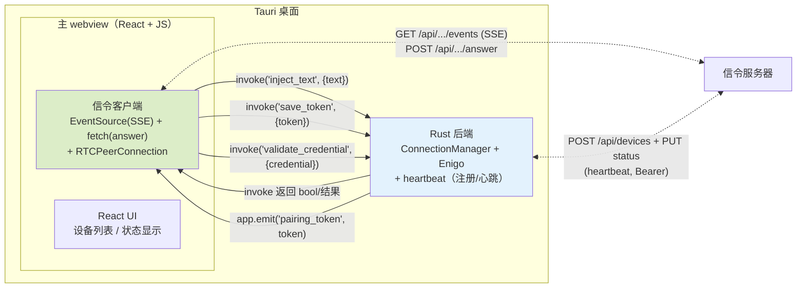

> **invoke 签名核实**（Tauri 2 `packages/api/src/core.ts:227,251-257`）：第二参数 `args` 类型是 `Record<string, unknown> | number[] | ArrayBuffer | Uint8Array`，**不接受裸值**。正确写法：
>
> - `invoke('inject_text', { text: "你好" })` — Rust 侧 `#[tauri::command] fn inject_text(text: String)`
> - `invoke('save_token', { token: "dvct_xxx" })` — Rust 侧 `#[tauri::command] fn save_token(token: String)`
> - `invoke('validate_credential', { credential: "123456" })` — Rust 侧返回 `bool`

**Rust ↔ webview 职责边界**：

| 职责 | 归属 | 说明 |
| --- | --- | --- |
| SSE 长连接 + offer/answer 信令 | webview JS | 与 RTCPeerConnection 同上下文 |
| RTCPeerConnection + DataChannel | webview JS | 浏览器原生 API |
| heartbeat（设备注册/心跳） | Rust | 复用现有 `pairing_client.rs`（注意：文件名是**单数** `pairing_client`，`network/mod.rs` 声明 `pub mod pairing_client`），维持 pairing_token |
| pairing_token 管理 | Rust | 持久化、过期续期；通过 `app.emit("pairing_token", token)` 推给 webview JS（**新增链路**——见下方说明） |
| credential 校验（code/token） | Rust | webview JS 收到 offer 后 `invoke('validate_credential')` 由 Rust 内存比对 |
| 文本注入（Enigo） | Rust | 接收 `invoke('inject_text')` 调用 |
| connection token 存储 | Rust | 内存 + 持久化配置文件 |

### 5.2 隐藏窗口后台行为（已实验验证 ✅ —— 之前的核心风险现已排除）

桌面端注入文字时，主窗口通常隐藏在托盘。**经实验确认：Tauri 2 在 Windows 上隐藏窗口后，JS 和 DataChannel 正常运行，不节流不冻结。**

#### 5.2.1 实验结论

**实验**（`.local/exp-throttle/`，Tauri 2.11.5 + WebView2 151 + Windows）：构建带系统托盘的 Tauri app，webview JS 中运行 1s 间隔定时器 + WebRTC DataChannel（空 iceServers）+ WebLock。点击关闭按钮隐藏到托盘（Rust 侧 `on_window_event(CloseRequested)` → `w.hide()` + `AtomicBool` 确认），持续隐藏 **23 分钟**。

**结果**：

| 指标 | 结果 |
| --- | --- |
| 隐藏时长 | **23 分钟**（1380 秒，远超 Chrome intensive throttling 的 5 分钟阈值） |
| Rust 确认隐藏 | ✅ `hidden=true` 全程（`AtomicBool` + `invoke('is_window_hidden')` 交叉验证） |
| `document.visibilityState` | **全程保持 `visible`**（Tauri 的 `SW_HIDE` 不触发 Chromium visibility 变更） |
| 1s 定时器 maxGap | **1015ms**（无节流） |
| DataChannel 消息 | **508 条**（每 3s 一对），**零丢失** |
| 冻结/节流检测 | **无**（无 `THROTTLE` 事件、无 `visibilitychange` 事件） |

#### 5.2.2 原理（源码追踪确认）

为什么隐藏窗口不节流？源码追踪揭示了两层机制：

1. **Tauri 的 `window.hide()` 不触及 WebView2 控制器的 `IsVisible`**：
   - 调用链：`WebviewWindow::hide()` → `WindowDispatch::hide` → `WindowMessage::Hide` → tao `set_visible(false)` → Win32 `ShowWindow(hwnd, SW_HIDE)`（`tao-0.35.0/src/platform_impl/windows/window_state.rs:422`）
   - 关键：这是**窗口级**操作，**不调用** `controller.put_IsVisible(false)`（wry 0.55.0 的 `webview2/mod.rs` 中 `set_visible` 才调 controller，而 `WebviewWindow::hide` 走 window 路径不走 webview 路径——`tauri-runtime-wry/src/lib.rs:3391` vs `3701-3710`）
   - WebView2 控制器的 `IsVisible` 保持 `true`

2. **Chromium 的 visibility 检测不触发**：
   - `document.visibilityState` 是 Chromium 判断页面是否可见的依据
   - 当 `IsVisible=true` 且窗口仅被 `SW_HIDE`（HWND 隐藏）时，WebView2 的 Chromium 引擎**不报告 visibility 变更**
   - 没有 visibility 变更 → 没有 Page Lifecycle `hidden` 状态 → 没有节流 → 没有 frozen

3. **`backgroundThrottling` 配置**（Tauri 源码 `config.rs:2212-2227`）：Windows/Linux 不支持，但**不需要支持**——因为 Tauri 的隐藏方式本身就不触发节流。该配置仅作为 macOS 的额外保险。

> **WebLock workaround**：虽然实验证明不需要，但 Tauri 源码建议的 WebLock 方案（`navigator.locks.request` 持有永不 resolve 的 Promise）仍可作为 belt-and-suspenders 防护。实验中 WebLock 成功获取且未造成问题。

#### 5.2.3 配置

```jsonc
{
  "app": {
    "windows": [{
      "label": "main",
      "visible": true,
      "backgroundThrottling": "disabled"   // macOS 14+ 生效；Windows/Linux 空操作但不报错
    }]
  }
}
```

```javascript
// webview JS 中持有 WebLock（额外保险，实验证明非必需但无害）
if ('locks' in navigator) {
    navigator.locks.request('dropvoice-keepalive', () => {
        return new Promise(() => {}); // 永不 resolve
    });
}
```

### 5.3 CSP 配置

> **核实结论**（W3C CSP Level 3 规范 + MDN）：`connect-src` **不约束 WebRTC** 的 ICE candidate 收集和 DTLS 连接——WebRTC 不走 Fetch 管道（WebAppSec issue #92）。因此**纯 host candidate 模式下 WebRTC 不需要额外的 CSP 指令**（不需要 `stun:` / `turn:`）。
>
> CSP 需要更新的是**信令层**：SSE（`EventSource`）和 `fetch`（POST answer）受 `connect-src` 约束。当前项目 CSP（`tauri.conf.json:25`）是 `connect-src 'self' ws: wss:`，缺少信令服务器域名，**会阻断 SSE 连接**。

**prod CSP**：

```jsonc
{
  "app": {
    "security": {
      "csp": "default-src 'self'; script-src 'self'; style-src 'self' 'unsafe-inline'; connect-src 'self' ws: wss: https://dropvoice.bytehome.fun; img-src 'self' data:"
    }
  }
}
```

- 新增 `https://dropvoice.bytehome.fun` 到 `connect-src`：允许 SSE + fetch 连接信令服务器
- **不需要** `stun:` / `turn:` scheme：WebRTC 不受 connect-src 约束
- `ws:` / `wss:` 保留：降级模式（WsTransport）仍需

**dev CSP**（桌面 webview origin 是 `http://localhost:5173`，信令服务器在 `http://localhost:38424`——`'self'` 不覆盖 `localhost:38424`，需显式列出）：

```jsonc
{
  "app": {
    "security": {
      "csp": "default-src 'self'; script-src 'self' 'unsafe-inline'; style-src 'self' 'unsafe-inline'; connect-src 'self' ws: wss: http://localhost:38424; img-src 'self' data:"
    }
  }
}
```

**构建时注入**：Tauri 2 的 CSP 是 build-time 静态字段，没有原生 env 模板。方案：在 `tauri.conf.json` 中用占位符 `__CSP_CONNECT_SRC__`，构建脚本（`beforeBuildCommand`）根据环境变量替换：

```bash
# 构建脚本（简化的 sed 替换）
if [ "$NODE_ENV" = "production" ]; then
  CSP_SRC="https://dropvoice.bytehome.fun"
else
  CSP_SRC="http://localhost:38424"
fi
sed -i "s|__CSP_CONNECT_SRC__|$CSP_SRC|g" src-tauri/tauri.conf.json
```

> dev 环境下 `script-src` 需 `'unsafe-inline'`（Vite dev server 注入 inline script）。

### 5.4 数据流

```
当前（纯后端）：
  Phone →ws→ axum → VecDeque → Enigo

新模式（webview 承载 WebRTC）：
  Phone →DataChannel→ webview JS
    → invoke('inject_text', {text: "你好"})
    → Rust: ConnectionManager.inject(text)
    → Enigo 键盘注入
```

invoke 是 Tauri 的本地 IPC，延迟 <1ms。人类打字速度 ~5 字符/秒，完全无感知。

### 5.5 ICE 简化（不做 trickle，已实验验证 ✅）

- 双方 `iceCandidatePoolSize: 1` 预收集 + `onicegatheringstatechange` 等待 `complete`（超时 2s fallback）
- `iceServers: []`（空）——同 LAN 只收集 host candidate（mDNS `.local` 地址），无需 STUN/TURN

> **实验验证**（`.local/exp-webrtc-test.js`）：空 iceServers 下，ICE 收集到 1 个 host candidate（`a2ac709d-*.local`，mDNS 混淆），ICE 状态 `connected`，DataChannel 双向通信正常。候选地址不暴露原始 IP。

```javascript
// 两端统一的 ICE 配置
const pc = new RTCPeerConnection({ iceServers: [] });
pc.addEventListener('icegatheringstatechange', () => {
  if (pc.iceGatheringState === 'complete') {
    // 所有 host candidate 已收集，生成最终 SDP
  }
});
// 超时 fallback：2s 后无论如何都生成 SDP（即使收集未完成）
```

### 5.6 多 DataChannel 管理

一台桌面可被多台手机同时连接。每条 DataChannel 独立管理：

- webview JS 维护 `Map<deviceId, RTCPeerConnection>`（每台已连接手机一个 PC 实例）
- 每收到一个 offer（经 SSE）→ 创建新的 RTCPeerConnection → 生成 answer
- DataChannel 的 `label` 固定为 `dropvoice`，`ordered: true`
- ConnectionManager（Rust）按连接来源区分，注入队列统一排队（现有逻辑已支持多设备）

### 5.7 生命周期

- 桌面运行期间：维持 SSE 长连接（JS 侧）+ WebLock 持有
- 收到 offer → invoke Rust 校验 credential → 创建 RTCPeerConnection → 生成 answer
- DataChannel 建立后 → 注册到 ConnectionManager → 走现有注入队列
- 会话 device_id 与桌面自身 device_id 不符 → 拒绝（防跨设备劫持）
- pairing_token 过期（SSE 返回 401）→ Rust heartbeat 重新注册 → 刷新 token → JS 重建 SSE

---

## 6. PWA 端

### 6.1 传输适配层

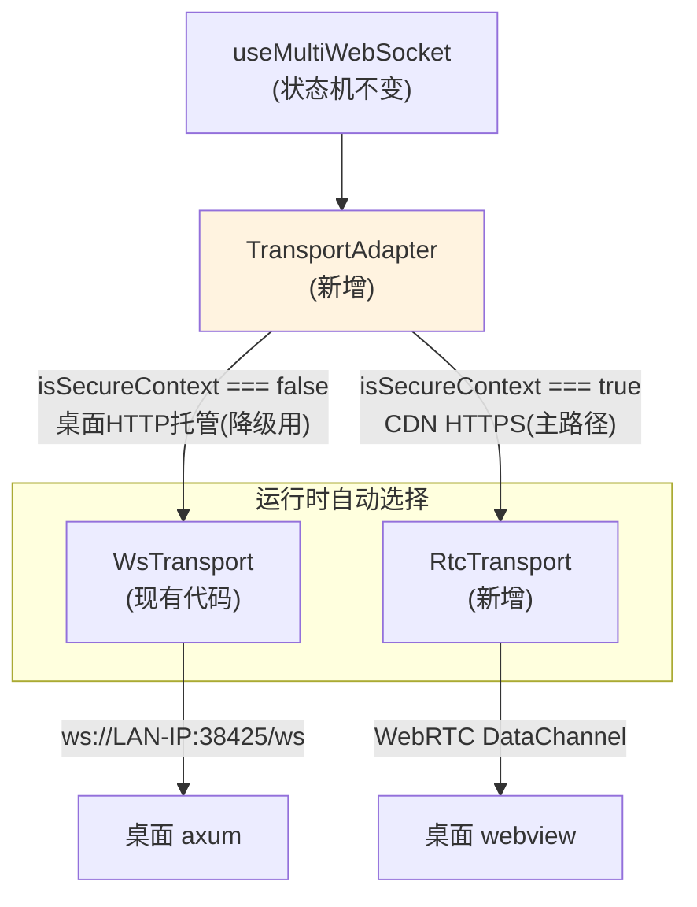

- `useMultiWebSocket` 保持公开 API 不变，内部抽传输接口
- `TransportAdapter` 运行时根据 `isSecureContext` 选择实现：HTTPS 页面 → RtcTransport；HTTP 页面 → WsTransport
- **WsTransport 分支的适用场景**：主设计范围内（CDN HTTPS PWA）始终走 RtcTransport。WsTransport 分支服务的是[降级文档](./offline-degradation-design.md)中"导航到桌面 HTTP 托管 PWA"的场景——该页面 origin 是 `http://<桌面IP>:38425`（非 Secure Context），用 ws:// 直连。本次实施只建 RtcTransport，WsTransport 分支保留接口签名但标记为降级用
- 消息协议（见 §6.3）与现有 WS 逐字节兼容，传输层无感

### 6.2 RtcTransport 职责

1. **信令客户端**：创建会话（带 code 或 token）→ POST offer → 长轮询 answer（30s 超时）
2. **RTCPeerConnection**：dataChannel（label `dropvoice`，ordered/reliable）+ 非 trickle ICE（同 §5.5）
3. **码的获取**：摄像头扫码（`html5-qrcode` 复用）解析 QR 载荷 → 提取 code + deviceId；或从 localStorage 读 token 重连
4. 通道建立后按现有协议收发；token 持久化键不变（`dropvoice:token:<deviceId>`）
5. **断线检测**：`iceconnectionstatechange` → `disconnected`/`failed` → 触发 token 重连；`visibilitychange`（PWA 回前台）→ 触发重连

### 6.3 消息协议（DataChannel 应用层）

DataChannel 和现有 WebSocket 共享同一套 JSON 消息格式（逐字节兼容）：

| 方向 | 消息格式 | 说明 |
| --- | --- | --- |
| 手机→桌面 | `{"type":"text","text":"你好"}` | 发送文本 |
| 桌面→手机 | `{"type":"ack"}` | 确认收到 |
| 桌面→手机 | `{"type":"token","token":"dvct_xxx"}` | 首次配对成功后签发连接令牌 |
| 桌面→手机 | `{"type":"error","code":"...","message":"..."}` | 错误（含 `token_evicted`：连接令牌因达到 100 上限被 FIFO 驱逐，手机需重新扫码配对） |

> **token 签发时机**：首次配对（code 认证）成功且 DataChannel open 后，桌面签发 `dvct_` 令牌。重连（token 认证）不签发新令牌。手机收到后持久化到 `localStorage["dropvoice:token:<deviceId>"]`。

### 6.4 SSE 事件格式（桌面接收）

桌面 SSE 长连接收到的事件：

| event | data 格式 | 说明 |
| --- | --- | --- |
| `offer` | `{"session_id":"…","credential":"…","sdp":"v=0\r\n…"}` | 手机发来的 offer，credential 为 code 或 token，桌面校验后生成 answer |
| `ping` | `{"ts":1723000000}` | 15s 具名事件（SSE 流内 `tokio::select!` 周期发送，非 axum `KeepAlive` 注释），防 CF 125s 超时 + 连接活性监测 |

> **字段统一**：SSE 事件 data 和 `SignalSession` 结构中统一使用 `credential` 字段（承载 code 或 token，服务器不解析）。§3.2 安全模型时序图、§4.4 首次配对时序图、§4.5 重连时序图、§4.6 会话结构、§6.4 SSE 事件表——五处字段命名一致。

### 6.5 二维码载荷

```
dropvoice://pair?code=123456&device=<deviceId>&name=<urlencoded-name>
```

| 字段 | 必填 | 说明 |
| --- | --- | --- |
| `code` | ✅ | 6 位配对码 |
| `device` | ✅ | 桌面 device_id（UUID v4），信令端点路径参数 |
| `name` | ❌ | 设备名称（URL encoded），仅用于 PWA 设备列表显示 |

自定义 scheme `dropvoice://`：PWA 摄像头扫码直接拿到结构化 payload。

---

## 7. 错误处理与超时

### 7.1 信令阶段

| 场景 | 检测方 | 行为 |
| --- | --- | --- |
| POST offer → 404（deviceId 不存在） | 手机 | 提示"设备不在线或已下线"，回到扫码 |
| POST offer → 429（限速） | 手机 | 提示"操作过快"，1s 后可重试 |
| 长轮询 answer → 204（30s 超时无 answer） | 手机 | 桌面可能离线**或 SSE 未就绪**（桌面刚启动）；提示"连接超时"，回到扫码 |
| 长轮询 answer → 404（session 过期） | 手机 | 提示"配对超时，请重新扫码" |
| 长轮询 answer → status: rejected | 手机 | credential 错误；提示"配对码无效或已过期" |
| SSE 断开（网络中断） | 桌面 JS | `EventSource` 自动重连（浏览器原生，指数退避） |
| SSE → 401（pairing_token 过期） | 桌面 JS | 停止 SSE → invoke Rust 重新注册 → 刷新 token → 重建 SSE |

> **SSE 竞态说明**：桌面刚启动时 heartbeat 注册 → 获取 pairing_token → JS 建立 SSE，存在短暂窗口。此窗口内手机发的 offer 会创建 session 并尝试 SSE 推送，但桌面 SSE 尚未连接 → 手机长轮询必然 204 超时。这是正常行为（等同于"桌面离线"），手机端表现为"连接超时，请重试"。

### 7.2 ICE / DataChannel 阶段

| 场景 | 检测方 | 行为 |
| --- | --- | --- |
| ICE 收集超时（2s 内未 complete） | 双方 | 用已收集的 candidate 继续（fallback），大概率仍可连 |
| ICE 失败（`iceconnectionstatechange → failed`） | 双方 | 触发 token 重连（新 offer/answer） |
| DataChannel 未 open（DTLS 握手失败） | 双方 | 触发重连；连续 3 次失败 → 提示"无法连接，检查网络" |
| AP 隔离（host candidate 不可达，mDNS 多播同时被阻断） | ICE 超时 | 最终表现为 ICE failed → 提示"请检查是否在同一局域网 / AP 隔离设置" |

### 7.3 重连策略

```
DataChannel 断开
  → 等 1s（避免瞬时抖动）
  → 用 token 发新 offer（§4.5 重连流程）
  → 失败 → 指数退避（2s, 4s, 8s, max 30s）
  → 连续 3 次失败 → UI 显示"重连失败，点击重试"
  → visibilitychange（回前台）→ 立即重连（不等退避）
```

---

## 8. 用户视角体验

### 8.1 首次配对

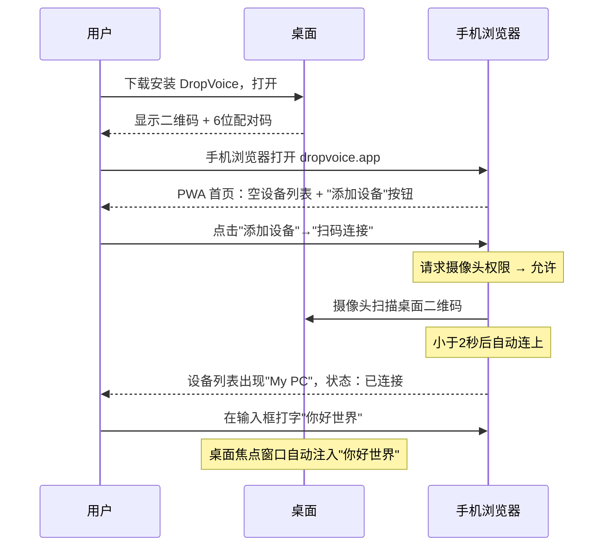

### 8.2 升级为 PWA

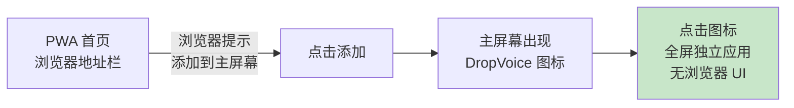

### 8.3 日常使用（token 自动重连）

用户点击主屏图标 → PWA 秒开 → token 在后台自动完成重连 → 设备状态直接显示"已连接" → 打字即注入。

### 8.4 多设备添加

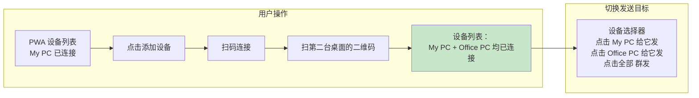

### 8.5 桌面隐藏到托盘（已验证 ✅）

用户点关闭按钮 → 桌面隐藏到托盘 → 手机继续打字 → 仍然注入成功。**用户完全无感**。

> **已验证**（§5.2）：Tauri 2 `window.hide()` 在 Windows 上不触发任何节流或冻结。23 分钟隐藏测试中 DataChannel 508 条消息零丢失，定时器 maxGap=1015ms。

### 8.6 手机切后台再回来（iOS）

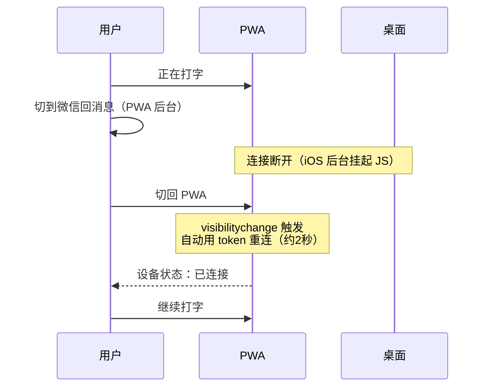

这是 PWA 固有限制（当前 ws:// 方案在 iOS 后台同样会断），不是 WebRTC 引入的。

---

## 9. VPS 负载测算（2核2G 3Mbps）

| 资源 | 计算 | 结果 |
| --- | --- | --- |
| **SSE 长连接** | 10万注册 × 10% 在线 = 1万连接 × ~20KB/连接 | 200MB 内存 → 2G 够 |
| **SSE 心跳带宽** | 15 bytes × 每连接/15s × 1万 = 10KB/s | 忽略不计 |
| **PWA 静态回源** | 3万次/天 × 4KB(index.html+sw.js) | 120MB/天 → 3Mbps 够 |
| **配对峰值带宽** | 50对/秒 × 10KB SDP | 500KB/s → 瞬时峰值，CF 吸收 |
| **CPU** | 信令是低频事件（仅在配对时活跃） | 2核绰绰有余 |

前提：PWA 静态资源走 CF CDN 缓存，不消耗 VPS 带宽。

---

## 10. 边界场景与现实限制

### 10.1 AP 隔离 + mDNS 阻断（叠加效应）

公共 Wi-Fi（咖啡馆、机场、酒店）几乎都开启 AP 隔离；企业访客网络普遍开启。

> **叠加效应**：AP 隔离**同时阻断**两层——① host candidate 的 IP 直连（二层隔离）；② mDNS 多播（UDP 5353 的 `224.0.0.251` 同样被 AP 隔离阻断）。

AP 隔离下，局域网内设备无法直接通信，WebRTC host candidate 不可达，mDNS `.local` 解析也不可用。STUN 救不了（同 LAN 两设备的 STUN 反射地址是同一公网 IP）。**设计决策：不部署 TURN。** AP 隔离网络下提示"请更换网络"——这是产品定位（家庭/办公 LAN）的合理边界。

### 10.2 mDNS 互通的跨浏览器风险

规范依赖"两端都是浏览器引擎→mDNS 候选原生互通"。

> **风险评估（已降级）**：Chrome 确认用 mDNS 混淆本地 IP（生成 `.local` 候选——**实验已验证**）。Safari/WebKit 同样实现了 mDNS 混淆（WebKit bug #227741 确认 host candidates 默认 obfuscated using mDNS protocol），与 Chrome 行为一致。因此两端都生成 `.local` 候选的前提**成立**。
>
> 但跨浏览器互通仍有一个未验证环节：两个浏览器各自生成 `.local` 候选后，需 OS mDNS resolver（Android 的 NSD / iOS 的 Bonjour）能互相解析对方的 `.local` 名称。Chrome↔Safari（即 Android↔iOS、Android↔macOS）的实际互通需真机验证。此项从"未知探险"降级为**回归测试**——M0②覆盖。

### 10.3 iOS Safari 限制

iOS Safari 自 iOS 11（2017）支持 RTCPeerConnection + RTCDataChannel。PWA 后台时 JS 挂起，连接断开。回前台后需重建连接。~30s 断开阈值和"不能复用 RTCPeerConnection"是经验性结论（规范层面 ICE 有 `restartIce()` 机制），M0 真机验证实际行为。

### 10.4 Caddy 配置要点

```caddyfile
dropvoice.bytehome.fun {
    handle /assets/* {
        header Cache-Control "public, max-age=31536000, immutable"
        root * /srv/dropvoice/mobile-dist
        file_server
    }
    handle /index.html {
        header Cache-Control "no-cache"
        root * /srv/dropvoice/mobile-dist
        file_server
    }
    handle /sw.js {
        header Cache-Control "no-cache"
        root * /srv/dropvoice/mobile-dist
        file_server
    }
    handle /api/* {
        reverse_proxy localhost:38424
    }
    handle {
        root * /srv/dropvoice/mobile-dist
        file_server
    }
    log {
        output file /var/log/caddy/dropvoice.log
        format json
    }
}
```

> **SSE 缓冲说明**（axum 源码 `sse.rs:90-107` 确认）：axum SSE 只发 `content-type: text/event-stream` 和 `cache-control: no-cache` 两个 header，**不发 `X-Accel-Buffering: no`**。Caddy 默认不对代理响应做缓冲（与 Nginx 不同），所以 Caddy 部署下 SSE 正常。若未来改用 Nginx 代理，需手动加 `X-Accel-Buffering: no` header。

### 10.5 dev 环境跨端口 CORS

dev 环境桌面 webview origin 是 `http://localhost:5173`（Vite dev），信令服务器在 `http://localhost:38424`。PWA 在 `http://localhost:5174`（Vite proxy → `:38424`，同源效果）。

**桌面 webview JS 直连信令服务器**（不走 Vite proxy，proxy 只服务 PWA）→ `localhost:5173` → `localhost:38424` 跨端口 → 触发 CORS。需在 axum 配置：

```rust
CorsLayer::new()
    .allow_origin(["http://localhost:5173"])  // dev: 桌面 webview
    .allow_methods([Method::GET, Method::POST])
    .allow_headers([AUTHORIZATION, CONTENT_TYPE])
```

prod 环境同域部署，不触发 CORS，此配置仅 dev 生效（通过环境变量控制）。

---

## 11. 里程碑

| 里程碑 | 内容 | 前置验证 | 估计 |
| --- | --- | --- | --- |
| **M0 风险验证** | ① ~~Windows 隐藏窗口节流~~ **已验证无节流（§5.2，23 分钟隐藏测试）** ② iOS Safari DataChannel 真机测试 ③ ~~CF SSE 穿透~~ **已实测 keepalive 运行良好** ④ ICE 空 iceServers Chrome↔Safari 跨浏览器连通回归测试 | 无 | 0.5 天 |
| **M1 信令后端** | 4 端点 + SSE（自行 yield ping 事件）+ 会话 TTL 60s/GC + 每device并发上限 + 长轮询唤醒（双检模式）+ **新建 query 版认证 extractor**（复用 `find_id_by_token`，非 `AuthenticatedDevice`）+ 速率豁免（独立 Router merge）+ dev CORS + OpenAPI + 单测；废弃 2 个旧端点；现有端点加 /api 前缀；**同步修改桌面 `pairing_client.rs` 中所有 API 路径加 /api 前缀** | M0④通过 | 1 天 |
| **M2 凭据统一** | 6 位 code 桌面生成 + 桌面验证；`dvct_` token 替换 UUID（新增 base64 直接依赖） | M1 完成 | 0.5 天 |
| **M3 桌面 WebRTC** | webview JS 信令客户端(EventSource) + RTCPeerConnection + invoke 桥（正确签名）+ CSP 更新（prod/dev 双版本 + 构建脚本注入）+ backgroundThrottling + WebLock + **新建 `app.emit("pairing_token")` 事件链路**（含 401→重新注册→刷新 token→JS 重建 SSE 的完整握手；现有 heartbeat 无 emit，是新增工作）+ 多 PC 管理 | **M1 完成（本地）**（JS 信令客户端需打 M1 端点联调） | 1.5 天 |
| **M4 PWA 传输** | TransportAdapter + RtcTransport + QR 载荷解析 + 消息协议映射 + 错误处理 | M1-M3 完成 | 1.5 天 |
| **M5 联调验收** | 真机矩阵（Windows/macOS × Android/iOS）+ e2e + Caddy/CF 部署 | 全部完成 | 1 天 |

> **M0①③已完成**：Windows 隐藏窗口节流实验已通过（23 分钟隐藏，零节流零冻结）；CF SSE 穿透已实测。M0 剩余项为 iOS Safari 真机测试和 Chrome↔Safari 跨浏览器回归。M3 前置依赖改为"M1 完成（本地）"——JS 信令客户端需要打 M1 的端点才能真正联调。

---

## 12. 开放问题

1. **跨浏览器 mDNS 互通**：Chrome 和 Safari/WebKit 都默认做 mDNS 混淆（WebKit bug #227741 确认）。但 OS 层面 `.local` 名称的互相解析（Android NSD ↔ iOS Bonjour）仍需真机回归测试。M0②覆盖。
2. **SSE 连接数扩展性**：万级桌面在线 = 1万 SSE 长连接，2核2G 可接受；超出需升 WebSocket 信令。
3. **token 无过期**：`dvct_` 令牌永不过期，上限 100 FIFO。是否需要加过期时间？当前与现状一致，暂不改。驱逐时桌面发 `{type:"error",code:"token_evicted"}` 帧通知手机（§6.3）。
