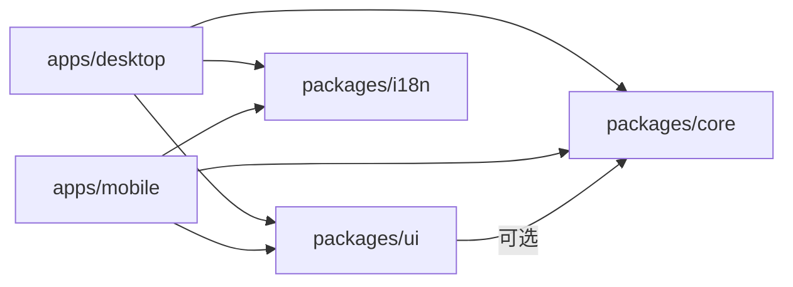

# 项目结构与代码架构规范

> 版本: 1.0.0
> 最后更新: 2026-07-16
> 状态: 已批准

## 1. 概述

本规范定义 DropVoice 项目的目录结构、模块划分和依赖方向。

## 2. 决策

### 2.1 整体结构

采用 **Monorepo** 结构，使用 `apps/` + `packages/` 组织代码。

```
dropvoice/
├── apps/                          # 可独立部署的应用
│   ├── desktop/                   # Tauri 桌面应用
│   └── mobile/                    # 移动 PWA
├── packages/                      # 共享包
│   ├── core/                      # 核心业务逻辑
│   ├── ui/                        # 共享 UI 组件
│   └── i18n/                      # 国际化
├── specs/                         # 规范文档
│   └── full/                      # 完整规范
├── DESIGN.md                      # 设计规范（Google Labs 格式）
├── CHANGELOG.md                   # 变更日志（Keep a Changelog 格式）
├── .pre-commit-config.yaml        # prek 配置
├── .prettierrc                    # Prettier 配置
├── .oxlintrc.json                 # oxlint 配置
├── rustfmt.toml                   # Rust 格式化配置
├── clippy.toml                    # Clippy 配置
├── pnpm-workspace.yaml            # pnpm workspace 配置
├── tsconfig.base.json             # 基础 TypeScript 配置
├── vitest.config.ts               # Vitest 配置
├── vite.config.ts                 # Vite 配置
├── tailwind.config.ts             # Tailwind 配置
├── package.json                   # 根 package.json
└── .env.example                   # 环境变量示例
```

### 2.2 应用层 (apps/)

#### desktop/ - Tauri 桌面应用

```
apps/desktop/
├── src/                           # React 前端
│   ├── components/                # 组件
│   │   ├── Header.tsx
│   │   ├── QRCodeSection.tsx
│   │   ├── ConnectedDevices.tsx   # 已连接设备列表
│   │   ├── InjectionQueueStatus.tsx # 注入队列状态
│   │   └── ui/                    # 基础 UI 组件
│   ├── hooks/                     # Hooks
│   ├── App.tsx                    # 根组件
│   ├── main.tsx                   # 入口
│   └── i18n.ts                    # i18n 初始化
├── src-tauri/                     # Rust 后端
│   ├── src/
│   │   ├── commands/              # Tauri 命令（按领域拆分）
│   │   │   ├── mod.rs             # 模块导出
│   │   │   ├── server.rs          # 服务器管理（start, stop, get_connection_info）
│   │   │   ├── settings.rs        # 设置管理（language, theme, input_delay）
│   │   │   └── window.rs          # 窗口管理（minimize_to_tray）
│   │   ├── server/                # HTTP/WebSocket 服务器
│   │   │   ├── mod.rs
│   │   │   ├── http.rs            # HTTP 路由（axum）
│   │   │   ├── websocket.rs       # WebSocket 处理
│   │   │   ├── connection_manager.rs # 连接管理器（支持多手机）
│   │   │   ├── auth.rs            # 认证（配对码 + Token）
│   │   │   ├── validation.rs      # 消息验证
│   │   │   ├── rate_limit.rs      # 速率限制
│   │   │   ├── health.rs          # 健康检查
│   │   │   └── cors.rs            # CORS 配置
│   │   ├── network/               # 网络相关
│   │   │   ├── mod.rs
│   │   │   ├── discovery.rs       # 局域网发现
│   │   │   ├── stun.rs            # STUN 客户端
│   │   │   └── signaling.rs       # 信令客户端
│   │   ├── text/                  # 文本注入
│   │   │   ├── mod.rs
│   │   │   └── injector.rs        # 跨平台文本注入
│   │   ├── config/                # 配置管理
│   │   │   ├── mod.rs
│   │   │   └── migration.rs       # 配置版本迁移
│   │   ├── telemetry/             # 遥测
│   │   │   ├── mod.rs
│   │   │   ├── logging.rs         # 日志配置
│   │   │   └── metrics.rs         # 业务指标
│   │   ├── platform/              # 平台抽象层
│   │   │   ├── mod.rs
│   │   │   ├── windows.rs
│   │   │   ├── macos.rs
│   │   │   └── linux.rs
│   │   ├── error.rs               # 错误类型（AppError）
│   │   ├── lib.rs                 # 库入口
│   │   └── main.rs                # 主入口
│   ├── tests/                     # 集成测试
│   │   ├── server_tests.rs
│   │   ├── websocket_tests.rs
│   │   └── text_injection_tests.rs
│   ├── capabilities/              # Tauri 权限配置
│   ├── icons/                     # 应用图标
│   ├── Cargo.toml
│   └── tauri.conf.json
├── tests/                         # 前端测试
│   ├── setup.ts
│   ├── mocks/
│   └── utils/
├── package.json
├── vite.config.ts
└── vitest.config.ts
```

#### mobile/ - 移动 PWA

```
apps/mobile/
├── src/
│   ├── components/                # 组件
│   │   ├── AddDeviceModal.tsx     # 添加设备对话框
│   │   ├── ConnectionPill.tsx     # 连接状态胶囊
│   │   ├── DeviceDots.tsx         # 设备切换指示器
│   │   ├── DeviceMenu.tsx         # 设备菜单
│   │   ├── DeviceSelector.tsx     # 设备选择器（Chip 形式）
│   │   ├── InstallPrompt.tsx      # 安装提示（PWA/书签）
│   │   ├── ManualInputForm.tsx    # 手动输入表单
│   │   ├── NetworkModeIndicator.tsx # 网络模式指示器
│   │   ├── QRScanner.tsx          # QR 扫描器
│   │   ├── SendModeSelector.tsx   # 发送模式选择器
│   │   ├── SettingsPage.tsx       # 设置页面
│   │   ├── TextInput.tsx          # 文本输入区
│   │   └── UsageAlert.tsx         # 用量提示
│   ├── hooks/                     # Hooks
│   │   ├── useDeviceManager.ts    # 设备管理
│   │   ├── useMultiWebSocket.ts   # 多设备 WebSocket
│   │   └── useSettings.ts         # 设置
│   ├── types/                     # 类型定义
│   │   ├── device.ts              # 设备类型
│   │   └── index.ts
│   ├── utils/                     # 工具函数
│   │   ├── cameraSupport.ts       # 摄像头支持检测
│   │   ├── createStorage.ts       # 存储抽象层
│   │   ├── deviceColor.ts         # 设备颜色生成
│   │   ├── deviceStorage.ts       # 设备持久化
│   │   └── storage.ts             # 草稿存储
│   ├── App.tsx                    # 根组件
│   ├── main.tsx                   # 入口
│   ├── i18n.ts                    # i18n 初始化
│   ├── index.css                  # 全局样式
│   └── index.html                 # HTML 模板
├── public/                        # 静态资源
│   ├── icons/
│   ├── manifest.json              # PWA manifest
│   └── sw.js                      # Service Worker
├── tests/                         # 测试
│   └── utils/
│       └── deviceColor.test.ts
├── package.json
└── vite.config.ts
```

### 2.3 共享包层 (packages/)

#### core/ - 核心业务逻辑

```
packages/core/
├── src/
│   ├── types/                     # 共享类型
│   │   ├── device.ts              # 设备类型定义
│   │   ├── connection.ts          # 连接类型定义
│   │   └── index.ts
│   ├── state/                     # 状态管理
│   │   ├── atoms.ts               # Jotai atoms（theme, language, activeDeviceId）
│   │   └── query-client.ts        # React Query 配置
│   ├── machines/                  # 状态机
│   │   ├── connection.ts          # 连接状态机（useReducer）
│   │   └── device.ts              # 设备状态机（useReducer）
│   ├── errors/                    # 错误处理
│   │   ├── parser.ts              # 错误解析（parseError, formatError）
│   │   └── codes.ts               # 错误码定义
│   ├── platform/                  # 平台检测
│   │   └── index.ts               # detectEnvironment, isSecureContext
│   ├── connection/                # 连接管理
│   │   └── manager.ts             # ConnectionManager
│   ├── billing/                   # 计费（预留）
│   │   └── api.ts                 # getUsage, upgradePlan
│   └── index.ts                   # 入口
├── package.json
└── tsconfig.json
```

#### ui/ - 共享 UI 组件

```
packages/ui/
├── src/
│   ├── primitives/                # 基础组件（基于 @base-ui/react）
│   │   ├── Button.tsx             # 按钮
│   │   ├── Input.tsx              # 输入框
│   │   ├── Select.tsx             # 下拉选择
│   │   ├── Dialog.tsx             # 对话框
│   │   ├── Tooltip.tsx            # 提示
│   │   ├── Switch.tsx             # 开关
│   │   ├── Badge.tsx              # 徽章
│   │   ├── Progress.tsx           # 进度条
│   │   ├── Tabs.tsx               # 标签页
│   │   ├── Alert.tsx              # 警告
│   │   └── Card.tsx               # 卡片
│   ├── composite/                 # 复合组件
│   │   ├── QRCode.tsx             # 二维码
│   │   ├── DeviceSelector.tsx     # 设备选择器
│   │   ├── ConnectionStatus.tsx   # 连接状态
│   │   ├── ConnectionModeBadge.tsx # 连接模式徽章
│   │   └── Toast.tsx              # Toast 通知
│   ├── layout/                    # 布局组件
│   │   ├── Header.tsx             # 页头
│   │   └── PageContainer.tsx      # 页面容器
│   ├── tokens/                    # 设计 Token（由 DESIGN.md 自动生成）
│   │   └── theme.css              # Tailwind v4 @theme
│   ├── hooks/                     # 共享 Hooks
│   │   └── useErrorHandler.ts     # 错误处理 Hook
│   └── index.ts                   # 入口
├── package.json
└── tsconfig.json
```

#### i18n/ - 国际化

```
packages/i18n/
├── src/
│   ├── index.ts                   # 入口
│   ├── config.ts                  # i18n 配置
│   ├── detector.ts                # 语言检测
│   └── types.ts                   # 类型安全的翻译 key
├── locales/
│   ├── en/
│   │   ├── common.json            # 通用翻译
│   │   ├── errors.json            # 错误消息
│   │   ├── devices.json           # 设备相关
│   │   └── settings.json          # 设置相关
│   ├── zh/
│   │   └── ...（同 en 结构）
│   ├── zh-TW/
│   │   └── ...
│   └── ja/
│       └── ...
└── package.json
```

## 3. 决策依据

### 3.1 选择 apps/ + packages/ 结构

**参考项目:**

- Yaak (mountain-loop/yaak): 使用 `apps/` + `crates/` + `packages/`
- CC-Switch (farion1231/cc-switch): 使用 `src/` + `src-tauri/`

**选择理由:**

- DropVoice 有 2 个独立前端（桌面 + 移动 PWA），与 Yaak 类似
- `apps/` 目录明确标识可部署应用
- `packages/` 目录标识共享库
- 原生支持 pnpm workspace

**否决方案:**

- ❌ 功能模块化（Feature-based）: 无法清晰区分桌面和移动两个独立应用
- ❌ 分层架构（Layer-based）: 偏 Java/C# 社区，前端生态不常见

### 3.2 Rust 后端按领域拆分 commands/

**参考项目:**

- CC-Switch: `src-tauri/src/commands/` 目录，按功能拆分

**选择理由:**

- `commands.rs` 当前 500+ 行，承载过多职责
- 按领域拆分（server, settings, window）提高可维护性
- 与 CC-Switch 的做法一致

**否决方案:**

- ❌ 独立 crate（如 Yaak）: DropVoice 规模较小，独立 crate 增加维护成本

### 3.3 Monorepo 工具选择 pnpm workspace

**选择理由:**

- pnpm 原生支持 workspace
- 无需额外工具（Turborepo/Nx）
- DropVoice 规模适中，pnpm workspace 足够

## 4. 接口规范

### 4.1 包间依赖关系



### 4.2 pnpm-workspace.yaml

```yaml
packages:
  - 'apps/*'
  - 'packages/*'
```

### 4.3 根 package.json

```json
{
  "name": "dropvoice",
  "private": true,
  "scripts": {
    "dev": "pnpm --filter @dropvoice/desktop dev",
    "dev:mobile": "pnpm --filter @dropvoice/mobile dev",
    "build": "pnpm --filter @dropvoice/desktop build",
    "test": "pnpm -r test",
    "lint": "pnpm -r lint",
    "typecheck": "pnpm -r typecheck",
    "quality": "pnpm typecheck && pnpm lint && pnpm test"
  }
}
```

### 4.4 每个 package 的 package.json

```json
{
  "name": "@dropvoice/core",
  "private": true,
  "type": "module",
  "main": "./src/index.ts",
  "types": "./src/index.ts",
  "scripts": {
    "test": "vitest run",
    "typecheck": "tsc --noEmit"
  }
}
```

## 5. 约束

1. **禁止循环依赖**: packages 之间不得相互依赖（ui → core 可选）
2. **单一职责**: 每个 package 只负责一个领域
3. **显式导出**: 使用 `index.ts` 明确导出公共 API
4. **命名规范**: 包名使用 `@dropvoice/` 前缀
5. **版本管理**: 所有包共享根 package.json 的版本号
