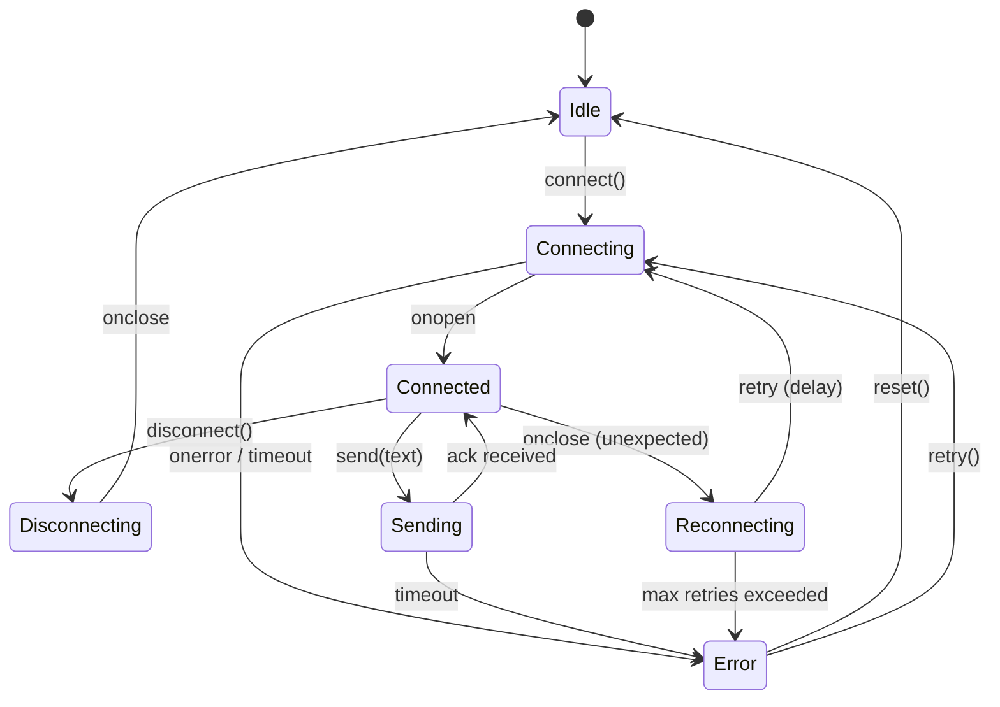
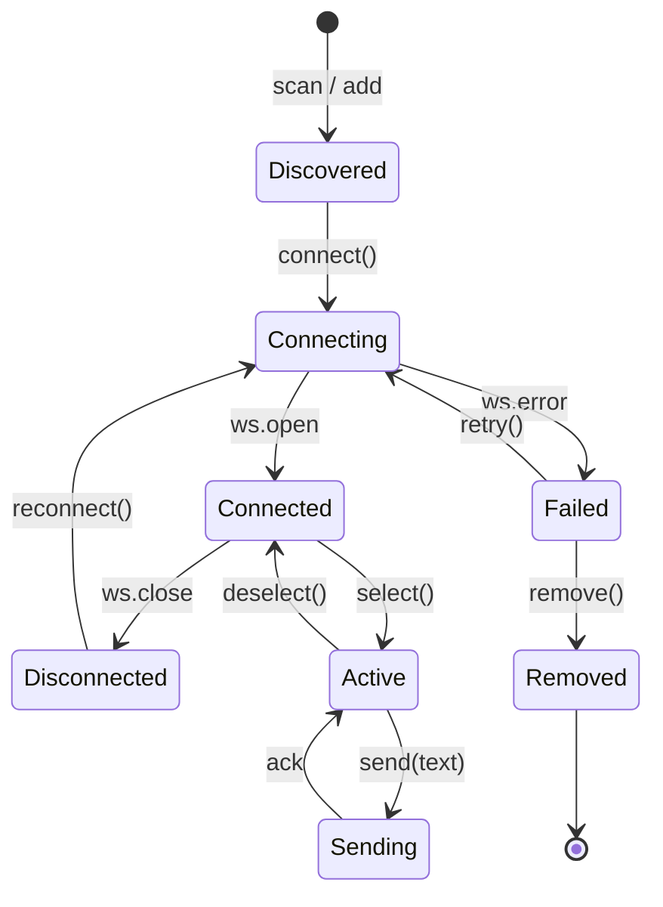
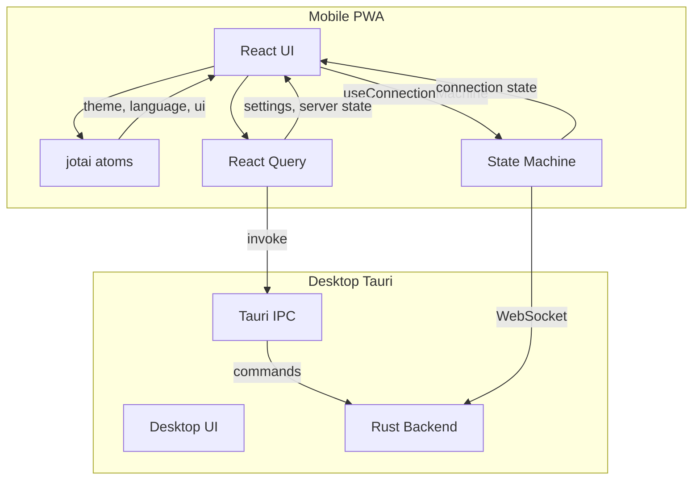

# 状态管理与数据流规范

> 版本: 1.0.0
> 最后更新: 2026-07-16
> 状态: 已批准

## 1. 概述

本规范定义 DropVoice 的前端状态管理方案、数据流架构和状态机设计。

## 2. 决策

### 2.1 状态管理分层

| 层级 | 技术 | 用途 | 作用域 |
|------|------|------|--------|
| 客户端状态 | `jotai` | 主题、语言、UI 状态 | 细粒度响应式 |
| 服务器状态 | `@tanstack/react-query` | Tauri invoke 调用 | 缓存 + 重试 |
| 连接状态 | 手写 `useReducer` | WebSocket 生命周期 | 复杂状态转换 |
| 设备状态 | 手写 `useReducer` | 设备生命周期 | 复杂状态转换 |

### 2.2 Jotai Atoms 定义

```typescript
// packages/core/src/state/atoms.ts

// 主题
export const themeAtom = atom<'light' | 'dark' | 'system'>('system');

// 语言
export const languageAtom = atom<SupportedLanguage>('zh');

// 活跃设备 ID
export const activeDeviceIdAtom = atom<string | null>(null);

// 设备列表
export const devicesAtom = atom<Device[]>([]);

// 连接模式
export const connectionModeAtom = atom<'lan' | 'p2p' | 'relay'>('lan');
```

### 2.3 React Query 配置

```typescript
// packages/core/src/state/query-client.ts

export const queryClient = new QueryClient({
  defaultOptions: {
    queries: {
      staleTime: 5 * 60 * 1000, // 5 分钟
      retry: 3,
      refetchOnWindowFocus: false,
    },
  },
});
```

### 2.4 连接状态机



**状态定义:**

| 状态 | 描述 | 可转换到 |
|------|------|---------|
| Idle | 初始/断开状态 | Connecting |
| Connecting | 正在连接 | Connected, Error |
| Connected | 已连接 | Sending, Reconnecting, Disconnecting |
| Sending | 发送中 | Connected, Error |
| Reconnecting | 重连中 | Connecting, Error |
| Error | 错误状态 | Idle, Connecting |
| Disconnecting | 断开中 | Idle |

**事件定义:**

| 事件 | 参数 | 说明 |
|------|------|------|
| CONNECT | url: string | 发起连接 |
| OPEN | ws: WebSocket | 连接成功 |
| CLOSE | - | 连接关闭 |
| ERROR | error: ConnectionError | 连接错误 |
| SEND | text: string | 发送文本 |
| ACK | - | 收到确认 |
| SEND_TIMEOUT | - | 发送超时（3秒） |
| RETRY | - | 重试连接 |
| RESET | - | 重置状态 |

**错误类型:**

```typescript
type ConnectionError = 'unreachable' | 'refused' | 'timeout' | 'unknown';
```

### 2.5 设备状态机



**设备数据模型:**

```typescript
interface Device {
  id: string;                    // UUID
  name: string;                  // 显示名称
  url: string;                   // WebSocket URL
  status: DeviceStatus;          // 连接状态
  lastConnected: number;         // 最后连接时间戳
  ip: string;                    // IP 地址
  port: number;                  // 端口
  errorType?: DeviceErrorType;   // 错误类型
  reconnectAttempts?: number;    // 重连次数
  hasExhaustedRetries?: boolean; // 是否耗尽重试
  autoConnect?: boolean;         // 是否自动连接
}

type DeviceStatus = 'connected' | 'disconnected' | 'connecting' | 'reconnecting';
type DeviceErrorType = 'unreachable' | 'refused' | 'timeout' | 'unknown';
```

### 2.6 数据流架构



## 3. 决策依据

### 3.1 选择 jotai 而非 Redux/Zustand

**参考项目:**
- Yaak: 使用 jotai
- CC-Switch: 使用 React Context + React Query

**选择理由:**
- jotai 轻量、响应式、无 boilerplate
- 与 React 19 兼容
- Yaak 在生产环境验证
- 原子化状态，细粒度更新

**否决方案:**
- ❌ Redux: 过重，对于 DropVoice 规模不必要，样板代码多
- ❌ Zustand: 虽然轻量，但 jotai 的原子化更适合细粒度更新

### 3.2 选择手写 useReducer 而非 xstate

**选择理由:**
- DropVoice 连接状态只有 4-5 个状态，xstate 过度工程化
- xstate 包大小 ~30KB，学习曲线高
- 手写 useReducer + TypeScript 类型约束足够
- 参考项目 Yaak 和 CC-Switch 均未使用 xstate

**否决方案:**
- ❌ xstate: 过度工程化，包大小大，学习曲线高，对于 4-5 个状态的场景不必要

### 3.3 选择 @tanstack/react-query

**参考项目:**
- Yaak: 使用 @tanstack/react-query
- CC-Switch: 使用 @tanstack/react-query

**选择理由:**
- 业界标准，社区活跃
- 内置缓存、重试、乐观更新
- 与 Tauri invoke 集成良好

## 4. 接口规范

### 4.1 useConnection Hook

```typescript
// packages/core/src/hooks/useConnection.ts

type ConnectionState =
  | { status: 'idle' }
  | { status: 'connecting'; url: string; attempt: number }
  | { status: 'connected'; ws: WebSocket; url: string }
  | { status: 'reconnecting'; url: string; attempt: number; timer: ReturnType<typeof setTimeout> }
  | { status: 'sending'; ws: WebSocket; timer: ReturnType<typeof setTimeout> }
  | { status: 'error'; error: ConnectionError; url?: string };

type ConnectionEvent =
  | { type: 'CONNECT'; url: string }
  | { type: 'OPEN'; ws: WebSocket }
  | { type: 'CLOSE' }
  | { type: 'ERROR'; error: ConnectionError }
  | { type: 'SEND'; text: string }
  | { type: 'ACK' }
  | { type: 'SEND_TIMEOUT' }
  | { type: 'RETRY' }
  | { type: 'RESET' };

function connectionReducer(state: ConnectionState, event: ConnectionEvent): ConnectionState;

interface UseConnectionReturn {
  state: ConnectionState;
  connect: (url: string) => void;
  send: (text: string) => boolean;
  disconnect: () => void;
  reset: () => void;
}

export function useConnection(): UseConnectionReturn;
```

### 4.2 useDeviceManager Hook

```typescript
// packages/core/src/hooks/useDeviceManager.ts

type AddDeviceResult = 'added' | 'switched' | false;

interface UseDeviceManagerReturn {
  isInitialized: boolean;
  devices: Device[];
  activeDeviceId: string | null;
  setActiveDeviceId: (deviceId: string | null) => void;
  setDevices: (devices: Device[]) => void;
  addDevice: (url: string) => AddDeviceResult;
  removeDevice: (deviceId: string) => void;
}

export function useDeviceManager(): UseDeviceManagerReturn;
```

### 4.3 useSettings Hook

```typescript
// packages/core/src/hooks/useSettings.ts

type Theme = 'light' | 'dark' | 'system';

interface UseSettingsReturn {
  theme: Theme;
  setTheme: (theme: Theme) => void;
  language: SupportedLanguage;
  setLanguage: (lang: SupportedLanguage) => void;
  resolvedTheme: 'light' | 'dark';
}

export function useSettings(): UseSettingsReturn;
```

### 4.4 React Query 使用示例

```typescript
// 获取连接信息
const { data: connectionInfo } = useQuery({
  queryKey: ['connection-info'],
  queryFn: () => invoke<ConnectionInfo>('get_connection_info'),
  refetchInterval: 2000,
});

// 获取设置
const { data: settings } = useQuery({
  queryKey: ['settings'],
  queryFn: () => invoke<Settings>('get_settings'),
});
```

> **实现说明 (2026-07-21):** `ConnectionInfo` 与 `Settings` 类型由
> `@dropvoice/core/types` 统一导出，字段名采用 **snake_case** 直接匹配
> Rust 后端的 serde 序列化结果（Tauri v2 默认不做 rename_all）。
> 桌面端 `apps/desktop/src/lib/invoke.ts` 的 `tauriInvoke` 包装器直接
> `import type { ConnectionInfo, Settings } from '@dropvoice/core'`，
> 不再在 app 内重复定义。移动端 PWA 不调用 Tauri，不使用这些类型。
>
> `useConnection` / `useSettings` hook 已移除（从未被消费）。`useTheme`
> 提升到 `@dropvoice/ui` 共享；`useConnection` 的职责（连接生命周期）
> 由 mobile 的 `useMultiWebSocket` 承担，内部通过 `connectionReducer`
> dispatch 驱动（保持 §5 constraint 3 "reducer 必须是纯函数"——reducer
> 不再调用 setTimeout，timer 由 hook 持有）。

## 5. 约束

1. **状态归属**: 全局状态用 jotai，服务端状态用 react-query，复杂状态机用 useReducer
2. **避免 prop drilling**: 使用 jotai atom 跨组件共享状态
3. **状态机纯函数**: reducer 必须是纯函数，便于测试
4. **最大重试次数**: 连接重试最多 5 次
5. **发送超时**: 发送超时 3 秒
6. **最大设备数**: 最多 5 台设备
