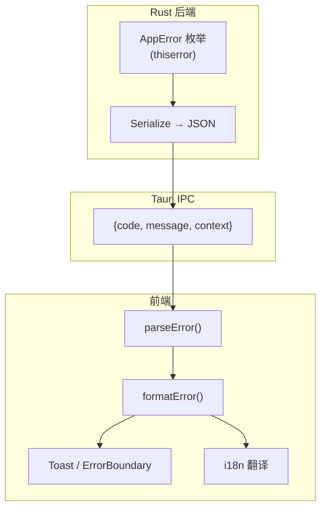

# 错误处理规范

> 版本: 1.0.0
> 最后更新: 2026-07-16
> 状态: 已批准

## 1. 概述

本规范定义 DropVoice 的错误类型、错误码、错误传播链和错误展示方式。

## 2. 决策

### 2.1 错误类型架构



### 2.2 错误码命名规范

**格式:** `SCREAMING_SNAKE_CASE`

**前缀规则:**
- `SERVER_` - 服务器相关
- `NETWORK_` - 网络相关
- `TEXT_` - 文本注入相关
- `CONFIG_` - 配置相关
- `DEVICE_` - 设备相关

**最大长度:** 50 字符

### 2.3 错误码清单

#### 服务器错误

| 错误码 | i18n Key | 说明 | 上下文参数 |
|--------|----------|------|-----------|
| `SERVER_ALREADY_RUNNING` | `errors.serverAlreadyRunning` | 服务器已在运行 | - |
| `SERVER_START_FAILED` | `errors.serverStartFailed` | 服务器启动失败 | reason |
| `PORT_IN_USE` | `errors.portInUse` | 端口被占用 | port |
| `PORT_BIND_FAILED` | `errors.portBindFailed` | 端口绑定失败 | port, reason |

#### 网络错误

| 错误码 | i18n Key | 说明 | 上下文参数 |
|--------|----------|------|-----------|
| `NETWORK_UNREACHABLE` | `errors.networkUnreachable` | 网络不可达 | reason |
| `CONNECTION_REFUSED` | `errors.connectionRefused` | 连接被拒绝 | - |
| `CONNECTION_TIMEOUT` | `errors.connectionTimeout` | 连接超时 | - |
| `CONNECTION_LOST` | `errors.connectionLost` | 连接断开 | - |

#### 文本注入错误

| 错误码 | i18n Key | 说明 | 上下文参数 |
|--------|----------|------|-----------|
| `TEXT_INJECTION_FAILED` | `errors.textInjectionFailed` | 文本注入失败 | reason |
| `TEXT_TOO_LONG` | `errors.textTooLong` | 文本超过长度限制 | length, max |
| `TEXT_EMPTY` | `errors.textEmpty` | 文本为空 | - |

#### 消息与队列错误

> 2026-07-21 新增：原本 `validation.rs` 对超大消息和非法 JSON 都返回
> `INTERNAL_ERROR`，掩盖了 4xx 类输入错误。现拆分为独立的输入错误码。

| 错误码 | i18n Key | 说明 | 上下文参数 |
|--------|----------|------|-----------|
| `MESSAGE_TOO_LARGE` | `errors.messageTooLarge` | WebSocket 消息超过 1 MB 上限 | length, max |
| `MESSAGE_INVALID` | `errors.messageInvalid` | 消息 JSON 解析失败 | reason |
| `QUEUE_FULL` | `errors.queueFull` | 注入队列已满（`injection.queue_size`） | depth, max |

#### 配置错误

| 错误码 | i18n Key | 说明 | 上下文参数 |
|--------|----------|------|-----------|
| `INVALID_LANGUAGE` | `errors.invalidLanguage` | 无效语言代码 | lang |
| `INVALID_THEME` | `errors.invalidTheme` | 无效主题 | theme |
| `SETTINGS_SAVE_FAILED` | `errors.settingsSaveFailed` | 设置保存失败 | reason |

#### 设备错误

| 错误码 | i18n Key | 说明 | 上下文参数 |
|--------|----------|------|-----------|
| `DEVICE_NOT_FOUND` | `errors.deviceNotFound` | 设备未找到 | deviceId |
| `DEVICE_ALREADY_CONNECTED` | `errors.deviceAlreadyConnected` | 设备已连接 | deviceId |
| `MAX_DEVICES_REACHED` | `errors.maxDevicesReached` | 达到最大设备数 | max |

### 2.4 错误传播链

```mermaid
flowchart LR
    subgraph "Rust"
        A["业务逻辑"] -->|Result<T, AppError>| B["Tauri Command"]
        B -->|Serialize| C["JSON"]
    end

    subgraph "前端"
        C -->|invoke| D["parseError()"]
        D -->|ParsedError| E["formatError()"]
        E -->|{title, description}| F["toast.error()"]
    end
```

### 2.5 错误展示策略

| 场景 | 展示方式 | 说明 |
|------|---------|------|
| 用户操作失败 | Toast | 非阻塞，3 秒消失 |
| 连接断开 | ConnectionPill | 持续显示，带重试按钮 |
| 致命错误 | ErrorBoundary | 阻塞，显示错误详情 |
| 开发环境 | Console | 打印完整错误信息 |

## 3. 决策依据

### 3.1 选择 thiserror 而非纯 anyhow

**参考项目:**
- Yaak: 使用 thiserror
- CC-Switch: 使用 thiserror

**选择理由:**
- thiserror 派生 Error trait，自动生成 Display 实现
- 结构化错误类型，便于前端解析
- 与 Tauri IPC 的 Serialize 集成良好

**否决方案:**
- ❌ 纯 anyhow: 丢失错误类型信息，前端无法区分错误类型

### 3.2 错误码 + i18n 映射

**选择理由:**
- 错误码提供机器可读的标识
- i18n key 支持多语言错误消息
- 结构化上下文支持参数化消息

**否决方案:**
- ❌ 纯字符串错误: 无法国际化，无法结构化处理

### 3.3 错误码前缀分组

**选择理由:**
- 按模块分组便于管理和查找
- 前缀明确错误来源
- 便于日志过滤和监控

## 4. 接口规范

### 4.1 Rust AppError

```rust
// src-tauri/src/error.rs

#[derive(Debug, thiserror::Error)]
pub enum AppError {
    #[error("Server already running")]
    ServerAlreadyRunning,

    #[error("Port {port} in use")]
    PortInUse { port: u16 },

    #[error("Failed to bind port: {reason}")]
    PortBindFailed { port: u16, reason: String },

    #[error("Network unreachable: {reason}")]
    NetworkUnreachable { reason: String },

    #[error("Connection refused")]
    ConnectionRefused,

    #[error("Connection timeout")]
    ConnectionTimeout,

    #[error("Connection lost")]
    ConnectionLost,

    #[error("Text injection failed: {reason}")]
    TextInjectionFailed { reason: String },

    #[error("Text too long: {length}/{max} characters")]
    TextTooLong { length: usize, max: usize },

    #[error("Text is empty")]
    TextEmpty,

    #[error("Invalid language: {lang}")]
    InvalidLanguage { lang: String },

    #[error("Invalid theme: {theme}")]
    InvalidTheme { theme: String },

    #[error("Failed to save settings: {reason}")]
    SettingsSaveFailed { reason: String },

    #[error("Device not found: {device_id}")]
    DeviceNotFound { device_id: String },

    #[error("Device already connected: {device_id}")]
    DeviceAlreadyConnected { device_id: String },

    #[error("Maximum devices reached: {max}")]
    MaxDevicesReached { max: usize },

    #[error("IO error: {path}: {source}")]
    Io {
        path: String,
        #[source]
        source: std::io::Error,
    },

    #[error("{0}")]
    Internal(String),
}

impl AppError {
    /// 错误码，用于前端 i18n 映射
    pub fn error_code(&self) -> &'static str {
        match self {
            Self::ServerAlreadyRunning => "SERVER_ALREADY_RUNNING",
            Self::PortInUse { .. } => "PORT_IN_USE",
            Self::PortBindFailed { .. } => "PORT_BIND_FAILED",
            Self::NetworkUnreachable { .. } => "NETWORK_UNREACHABLE",
            Self::ConnectionRefused => "CONNECTION_REFUSED",
            Self::ConnectionTimeout => "CONNECTION_TIMEOUT",
            Self::ConnectionLost => "CONNECTION_LOST",
            Self::TextInjectionFailed { .. } => "TEXT_INJECTION_FAILED",
            Self::TextTooLong { .. } => "TEXT_TOO_LONG",
            Self::TextEmpty => "TEXT_EMPTY",
            Self::InvalidLanguage { .. } => "INVALID_LANGUAGE",
            Self::InvalidTheme { .. } => "INVALID_THEME",
            Self::SettingsSaveFailed { .. } => "SETTINGS_SAVE_FAILED",
            Self::DeviceNotFound { .. } => "DEVICE_NOT_FOUND",
            Self::DeviceAlreadyConnected { .. } => "DEVICE_ALREADY_CONNECTED",
            Self::MaxDevicesReached { .. } => "MAX_DEVICES_REACHED",
            Self::Io { .. } => "IO_ERROR",
            Self::Internal(_) => "INTERNAL_ERROR",
        }
    }

    /// 错误上下文，用于前端展示详细信息
    pub fn error_context(&self) -> serde_json::Value {
        match self {
            Self::PortInUse { port } => serde_json::json!({ "port": port }),
            Self::PortBindFailed { port, reason } => serde_json::json!({ "port": port, "reason": reason }),
            Self::NetworkUnreachable { reason } => serde_json::json!({ "reason": reason }),
            Self::TextTooLong { length, max } => serde_json::json!({ "length": length, "max": max }),
            Self::InvalidLanguage { lang } => serde_json::json!({ "lang": lang }),
            Self::InvalidTheme { theme } => serde_json::json!({ "theme": theme }),
            Self::DeviceNotFound { device_id } => serde_json::json!({ "deviceId": device_id }),
            Self::MaxDevicesReached { max } => serde_json::json!({ "max": max }),
            Self::Io { path, .. } => serde_json::json!({ "path": path }),
            _ => serde_json::json!({}),
        }
    }

    /// 用户友好的建议
    pub fn suggestion(&self) -> Option<&'static str> {
        match self {
            Self::NetworkUnreachable { .. } => Some("check_network"),
            Self::ConnectionRefused => Some("check_server_running"),
            Self::ConnectionTimeout => Some("retry_later"),
            Self::PortInUse { .. } => Some("change_port"),
            Self::MaxDevicesReached { .. } => Some("remove_device"),
            _ => None,
        }
    }
}

// Tauri command 返回类型
pub type AppResult<T> = Result<T, AppError>;

// Serialize 实现
impl serde::Serialize for AppError {
    fn serialize<S>(&self, serializer: S) -> Result<S::Ok, S::Error>
    where
        S: serde::Serializer,
    {
        let error_json = serde_json::json!({
            "code": self.error_code(),
            "message": self.to_string(),
            "context": self.error_context(),
        });
        error_json.serialize(serializer)
    }
}

// Tauri command 使用示例
#[tauri::command]
pub async fn start_server(...) -> AppResult<String> {
    // ...
    Err(AppError::PortInUse { port: 38425 })
}
```

### 4.2 前端错误解析

```typescript
// packages/core/src/errors/parser.ts

import { z } from 'zod';

// 错误 JSON Schema
const ErrorSchema = z.object({
  code: z.string(),
  message: z.string(),
  context: z.record(z.unknown()).optional(),
});

export type ParsedError = z.infer<typeof ErrorSchema>;

/**
 * 解析后端返回的错误
 */
export function parseError(error: unknown): ParsedError;

/**
 * 格式化错误为用户友好的消息
 */
export function formatError(
  error: unknown,
  t: (key: string, params?: Record<string, unknown>) => string
): { title: string; description: string; suggestion?: string };
```

### 4.3 错误码 → i18n 映射

```typescript
// packages/core/src/errors/codes.ts

const ERROR_I18N_MAP: Record<string, string> = {
  'SERVER_ALREADY_RUNNING': 'errors.serverAlreadyRunning',
  'PORT_IN_USE': 'errors.portInUse',
  'PORT_BIND_FAILED': 'errors.portBindFailed',
  'NETWORK_UNREACHABLE': 'errors.networkUnreachable',
  'CONNECTION_REFUSED': 'errors.connectionRefused',
  'CONNECTION_TIMEOUT': 'errors.connectionTimeout',
  'CONNECTION_LOST': 'errors.connectionLost',
  'TEXT_INJECTION_FAILED': 'errors.textInjectionFailed',
  'TEXT_TOO_LONG': 'errors.textTooLong',
  'TEXT_EMPTY': 'errors.textEmpty',
  'INVALID_LANGUAGE': 'errors.invalidLanguage',
  'INVALID_THEME': 'errors.invalidTheme',
  'SETTINGS_SAVE_FAILED': 'errors.settingsSaveFailed',
  'DEVICE_NOT_FOUND': 'errors.deviceNotFound',
  'DEVICE_ALREADY_CONNECTED': 'errors.deviceAlreadyConnected',
  'MAX_DEVICES_REACHED': 'errors.maxDevicesReached',
  'IO_ERROR': 'errors.ioError',
  'INTERNAL_ERROR': 'errors.internalError',
};

const SUGGESTION_I18N_MAP: Record<string, string> = {
  'check_network': 'errors.suggestion.checkNetwork',
  'check_server_running': 'errors.suggestion.checkServerRunning',
  'retry_later': 'errors.suggestion.retryLater',
  'change_port': 'errors.suggestion.changePort',
  'remove_device': 'errors.suggestion.removeDevice',
};
```

### 4.4 useErrorHandler Hook

```typescript
// packages/ui/src/hooks/useErrorHandler.ts

import { useCallback } from 'react';
import { toast } from 'sonner';
import { parseError, formatError } from '@dropvoice/core/errors';
import { useTranslation } from 'react-i18next';

interface UseErrorHandlerReturn {
  handleError: (error: unknown, fallbackMessage?: string) => void;
}

export function useErrorHandler(): UseErrorHandlerReturn {
  const { t } = useTranslation();

  const handleError = useCallback(
    (error: unknown, fallbackMessage?: string) => {
      const { title, description } = formatError(error, t);

      toast.error(title, {
        description: description || fallbackMessage,
      });

      // 开发环境打印详细错误
      if (import.meta.env.DEV) {
        console.error('[Error]', parseError(error));
      }
    },
    [t]
  );

  return { handleError };
}
```

### 4.5 i18n 错误消息

```json
// packages/i18n/locales/en/errors.json
{
  "serverAlreadyRunning": "Server is already running",
  "portInUse": "Port {{port}} is already in use",
  "portBindFailed": "Failed to bind port {{port}}: {{reason}}",
  "networkUnreachable": "Network is unreachable: {{reason}}",
  "connectionRefused": "Connection refused",
  "connectionTimeout": "Connection timed out",
  "connectionLost": "Connection lost",
  "textInjectionFailed": "Failed to inject text: {{reason}}",
  "textTooLong": "Text is too long ({{length}}/{{max}} characters)",
  "textEmpty": "Text is empty",
  "invalidLanguage": "Invalid language: {{lang}}",
  "invalidTheme": "Invalid theme: {{theme}}",
  "settingsSaveFailed": "Failed to save settings: {{reason}}",
  "deviceNotFound": "Device not found",
  "deviceAlreadyConnected": "Device already connected",
  "maxDevicesReached": "Maximum devices reached ({{max}})",
  "ioError": "IO error: {{path}}",
  "internalError": "Internal error",
  "suggestion": {
    "checkNetwork": "Please check your network connection",
    "checkServerRunning": "Please ensure the server is running",
    "retryLater": "Please try again later",
    "changePort": "Try using a different port",
    "removeDevice": "Remove a device before adding a new one"
  }
}
```

## 5. 约束

1. **错误码唯一性**: 每个错误场景对应唯一错误码
2. **错误上下文**: 包含足够信息用于调试，但不包含敏感数据
3. **用户友好**: 错误消息面向用户，技术细节仅在开发环境显示
4. **i18n 必须**: 所有用户可见的错误消息必须支持国际化
5. **建议可选**: 建议信息根据错误类型提供，帮助用户解决问题
