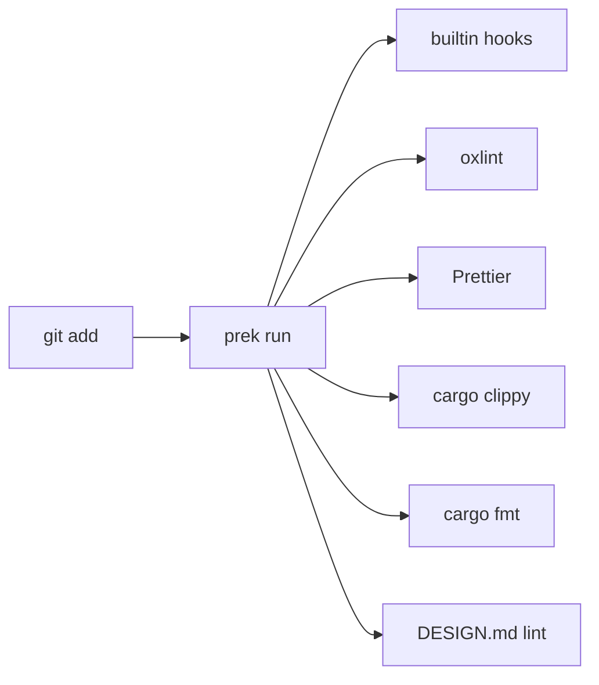

# 代码质量门控规范

> 版本: 1.0.0
> 最后更新: 2026-07-16
> 状态: 已批准

## 1. 概述

本规范定义 DropVoice 的代码质量检查工具、流程和标准。

## 2. 决策

### 2.1 工具链

| 工具 | 用途 | 配置文件 | 说明 |
|------|------|---------|------|
| `oxlint` | 前端 Lint | `.oxlintrc.json` | 替代 ESLint |
| `Prettier` | 前端格式化 | `.prettierrc` | 支持 CSS/Tailwind |
| `cargo clippy` | Rust Lint | `clippy.toml` | - |
| `cargo fmt` | Rust 格式化 | `rustfmt.toml` | - |
| `prek` | Pre-commit 管理 | `.pre-commit-config.yaml` | 替代 lefthook |
| `@google/design.md` | DESIGN.md Lint | `DESIGN.md` | 最高级别规则 |

### 2.2 Pre-commit 流程



### 2.3 Prek 配置

```yaml
# .pre-commit-config.yaml
fail_fast: false

repos:
  - repo: builtin
    hooks:
      - id: trailing-whitespace
      - id: end-of-file-fixer
      - id: check-yaml
      - id: check-json

  - repo: local
    hooks:
      - id: oxlint
        name: oxlint
        entry: pnpm oxlint
        language: system
        types_or: [javascript, typescript]
        pass_filenames: false

      - id: prettier
        name: Prettier
        entry: pnpm prettier --write
        language: system
        types_or: [javascript, typescript, json, css]

      - id: cargo-fmt
        name: cargo fmt
        entry: cargo fmt --manifest-path apps/desktop/src-tauri/Cargo.toml --
        language: system
        types: [rust]
        pass_filenames: false

      - id: cargo-clippy
        name: cargo clippy
        entry: cargo clippy --manifest-path apps/desktop/src-tauri/Cargo.toml -- -D warnings
        language: system
        types: [rust]
        pass_filenames: false

      - id: design-md-lint
        name: DESIGN.md lint
        entry: npx @google/design.md lint DESIGN.md
        language: system
        files: DESIGN\.md$
        pass_filenames: false
```

### 2.4 Oxlint 配置

```json
// .oxlintrc.json
{
  "rules": {
    "no-unused-vars": "error",
    "no-explicit-any": "warn",
    "react-hooks/rules-of-hooks": "error",
    "react-hooks/exhaustive-deps": "warn"
  }
}
```

### 2.5 Prettier 配置

```json
// .prettierrc
{
  "semi": true,
  "singleQuote": true,
  "tabWidth": 2,
  "trailingComma": "es5",
  "printWidth": 100,
  "plugins": ["prettier-plugin-tailwindcss"]
}
```

### 2.6 Rust 配置

```toml
# rustfmt.toml
edition = "2021"
max_width = 100
tab_spaces = 4

# clippy.toml
msrv = "1.75"
```

### 2.7 DESIGN.md Lint 规则

| 规则 | 严重级别 | 说明 |
|------|---------|------|
| `broken-ref` | error | Token 引用无法解析 |
| `missing-primary` | warning | 缺少 primary 颜色 |
| `contrast-ratio` | warning | 对比度低于 WCAG AA |
| `orphaned-tokens` | warning | 定义但未引用的 Token |
| `missing-typography` | warning | 缺少排版 Token |
| `section-order` | warning | 章节顺序错误 |
| `unknown-key` | warning | 可能的拼写错误 |

**Lint 级别:** 最高级别（所有 error 必须修复）

## 3. 决策依据

### 3.1 选择 oxlint 而非 ESLint

**参考项目:**
- Yaak: 使用 oxlint（通过 vp lint）

**选择理由:**
- 比 ESLint 快 100 倍
- 规则兼容 ESLint
- Rust 实现，启动快

**否决方案:**
- ❌ ESLint: 慢，配置复杂

### 3.2 选择 Prettier 而非 oxc formatter

**选择理由:**
- 支持 CSS/HTML/JSON 格式化
- 有 prettier-plugin-tailwindcss 插件（自动排序类名）
- 社区标准

**否决方案:**
- ❌ oxc formatter: 不支持 CSS，无 Tailwind 插件

### 3.3 选择 prek 而非 lefthook

**参考项目:**
- CPython, FastAPI, Home Assistant 等大型项目使用 prek

**选择理由:**
- Rust 实现，无依赖
- 兼容 pre-commit 配置格式
- 社区采用广泛

**否决方案:**
- ❌ lefthook: 私有配置格式，社区较小

## 4. 接口规范

### 4.1 Package.json scripts

```json
{
  "scripts": {
    "lint": "oxlint src/",
    "lint:fix": "oxlint src/ --fix",
    "format": "prettier --write \"src/**/*.{ts,tsx,json,css}\"",
    "format:check": "prettier --check \"src/**/*.{ts,tsx,json,css}\"",
    "typecheck": "tsc --noEmit",
    "design:lint": "npx @google/design.md lint DESIGN.md",
    "quality": "pnpm typecheck && pnpm lint && pnpm format:check && pnpm test"
  }
}
```

### 4.2 CI 检查

```yaml
# .github/workflows/quality.yml
- name: Lint
  run: pnpm lint

- name: Format
  run: pnpm format:check

- name: TypeCheck
  run: pnpm typecheck

- name: DESIGN.md
  run: pnpm design:lint
```

## 5. 约束

1. **零警告**: cargo clippy 使用 `-D warnings` 将警告视为错误
2. **格式统一**: 所有代码必须通过 Prettier/fmt 格式化
3. **Pre-commit 必须通过**: 提交前必须通过所有检查
4. **DESIGN.md Lint**: 最高级别，所有 error 必须修复
5. **Tailwind 类名排序**: Prettier 插件自动排序 Tailwind 类名
