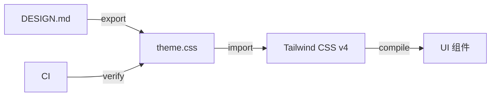

# UI 设计规范

> 版本: 1.0.0
> 最后更新: 2026-07-16
> 状态: 已批准

## 1. 概述

本规范定义 DropVoice 的 UI 设计系统、组件库结构和设计 Token。

## 2. 决策

### 2.1 设计文档

采用 Google Labs 的 **DESIGN.md** 规范作为设计系统文档。

**工具链:**
- `npx @google/design.md lint DESIGN.md` - 验证设计文档（最高级别规则）
- `npx @google/design.md export --format css-tailwind DESIGN.md` - 导出 Tailwind v4 CSS
- `npx @google/design.md diff` - 版本对比

**同步机制:**
```json
{
  "scripts": {
    "design:lint": "npx @google/design.md lint DESIGN.md",
    "design:export:css": "npx @google/design.md export --format css-tailwind DESIGN.md > packages/ui/src/tokens/theme.css",
    "design:sync": "pnpm design:lint && pnpm design:export:css",
    "prebuild": "pnpm design:sync"
  }
}
```

### 2.2 UI 框架

| 组件 | 技术 | 说明 |
|------|------|------|
| 基础组件 | @base-ui/react | 无样式、可访问、React 19 |
| 样式 | Tailwind CSS v4 | 原子化 CSS |
| 类名管理 | clsx + tailwind-merge | 条件类名 + 合并 |
| 变体管理 | class-variance-authority | 组件变体 |
| 图标 | lucide-react | 图标库 |
| 动效 | framer-motion | 动画库 |

### 2.3 组件库结构

基于 **Atomic Design** 方法论分三层:

```
packages/ui/src/
├── primitives/                # Atoms - 基础组件
│   ├── Button.tsx             # 按钮
│   ├── Input.tsx              # 输入框
│   ├── Select.tsx             # 下拉选择
│   ├── Dialog.tsx             # 对话框
│   ├── Tooltip.tsx            # 提示
│   ├── Switch.tsx             # 开关
│   ├── Badge.tsx              # 徽章
│   ├── Progress.tsx           # 进度条
│   ├── Tabs.tsx               # 标签页
│   ├── Alert.tsx              # 警告
│   └── Card.tsx               # 卡片
├── composite/                 # Molecules - 复合组件
│   ├── QRCode.tsx             # 二维码
│   ├── DeviceSelector.tsx     # 设备选择器
│   ├── ConnectionStatus.tsx   # 连接状态
│   ├── ConnectionModeBadge.tsx # 连接模式徽章
│   └── Toast.tsx              # Toast 通知
├── layout/                    # Templates - 布局组件
│   ├── Header.tsx             # 页头
│   └── PageContainer.tsx      # 页面容器
├── tokens/                    # 设计 Token（由 DESIGN.md 自动生成）
│   └── theme.css              # Tailwind v4 @theme
├── hooks/                     # 共享 Hooks
│   └── useErrorHandler.ts     # 错误处理 Hook
└── index.ts                   # 入口
```

### 2.4 桌面端 UI 结构

```
┌─────────────────────────────────────────────────────────────┐
│                      Header                                 │
│  [Logo] [App Name] [v0.0.2]     [Lang] [Theme] [Settings]  │
├─────────────────────────────────────────────────────────────┤
│                      Main Content                           │
│                                                             │
│         ┌──────────────────────────────┐                   │
│         │      LAN Warning Banner      │ ← 顶部警告        │
│         │  ⚠️ Use on trusted networks   │                   │
│         └──────────────────────────────┘                   │
│                                                             │
│         ┌──────────────────────────────┐                   │
│         │        QR Code Section       │                   │
│         │                              │                   │
│         │     ┌──────────────────┐     │                   │
│         │     │    [QR CODE]     │     │                   │
│         │     └──────────────────┘     │                   │
│         │                              │                   │
│         │  http://192.168.1.1:38425    │                   │
│         │  Connected: 2 devices        │                   │
│         └──────────────────────────────┘                   │
│                                                             │
│         ┌──────────────────────────────┐                   │
│         │     Connected Devices        │                   │
│         │  📱 iPhone  192.168.1.105    │                   │
│         │  📱 Android 192.168.1.106    │                   │
│         └──────────────────────────────┘                   │
│                                                             │
└─────────────────────────────────────────────────────────────┘
```

### 2.5 移动端 UI 结构

```
┌─────────────────────────────────────┐
│      Connection Status              │
│  [🔴 Disconnected] Retry           │
├─────────────────────────────────────┤
│      Device Selector (if 2+)       │
│  [PC-100] [Laptop] [+ Add]        │
├─────────────────────────────────────┤
│         Text Input                  │
│  ┌───────────────────────────────┐  │
│  │                               │  │
│  │   Type your text...           │  │
│  │                               │  │
│  └───────────────────────────────┘  │
│  123/10000        ⚙️                │
├─────────────────────────────────────┤
│      Send Mode (if 2+ devices)     │
│  [当前设备] [所有设备] [选择设备]   │
├─────────────────────────────────────┤
│      Device Dots (if 2+ devices)   │
│        ● ○ ○                       │
├─────────────────────────────────────┤
│      Action Buttons                │
│  [↩️ Restore] [📤 Send] [🗑️]       │
└─────────────────────────────────────┘
```

### 2.6 DeviceDots 组件规范

**规则:**
- 仅在设备数量 > 1 时显示
- 活跃设备: 实心圆点 (14px) + 设备颜色
- 非活跃设备: 空心圆点 (10px) + 设备颜色
- 连接中: 脉冲动画
- 断开: 40% 透明度

**设备颜色生成:**
- 基于 IP 地址哈希
- 使用黄金角度（137.5°）分散颜色
- 确定性：相同 IP 总是相同颜色

### 2.7 DESIGN.md 同步流程



**CI 验证:**
```yaml
- name: Verify DESIGN.md sync
  run: |
    pnpm design:export:css
    git diff --exit-code packages/ui/src/tokens/theme.css || {
      echo "DESIGN.md tokens out of sync. Run 'pnpm design:sync' locally."
      exit 1
    }
```

### 2.8 PWA 环境策略

| 环境 | Service Worker | 摄像头 | 安装提示 |
|------|---------------|--------|---------|
| HTTPS / localhost | ✅ 注册 | ✅ 可用 | 📱 安装应用 |
| HTTP LAN | ❌ 不注册 | ❌ 不可用 | 🔖 添加书签 |

**环境检测:**
```typescript
function getPWAInstallStrategy(): 'pwa' | 'bookmark' | 'none';
```

## 3. 决策依据

### 3.1 选择 @base-ui/react

**参考项目:**
- Yaak: 自建 UI 组件库
- CC-Switch: 使用 Radix UI（shadcn/ui）

**选择理由:**
- MUI 团队维护，专业可靠
- 无样式设计，与 Tailwind 配合
- API 现代，React 19 兼容

**否决方案:**
- ❌ Radix UI: @base-ui/react API 更现代

### 3.2 选择 Atomic Design 三层结构

**参考来源:**
- Brad Frost 的 Atomic Design 方法论
- shadcn/ui 的组件组织方式

**选择理由:**
- 业界广泛采纳的模式
- 清晰的组件层级
- 便于复用和维护

### 3.3 选择 Tailwind CSS v4

**选择理由:**
- 原子化 CSS，性能好
- 与 DESIGN.md Token 系统集成（css-tailwind 导出）
- 社区标准

### 3.4 UI 结构图说明

**LAN Warning Banner 位置:** 顶部，在 QR 码之前

**设计理由:**
- 安全警告应该在用户看到功能之前就展示
- 醒目的位置确保用户注意到
- 可以被关闭，不会干扰后续操作

## 4. 接口规范

### 4.1 Button 组件

```typescript
interface ButtonProps {
  variant?: 'primary' | 'secondary' | 'outline' | 'ghost' | 'destructive';
  size?: 'sm' | 'md' | 'lg' | 'icon';
  isLoading?: boolean;
  children: React.ReactNode;
  onClick?: () => void;
  disabled?: boolean;
  className?: string;
  ref?: React.Ref<HTMLButtonElement>;  // React 19: ref as prop
}
```

### 4.2 DeviceDots 组件

```typescript
interface DeviceDotsProps {
  devices: Device[];
  activeDeviceId: string | null;
  dark: boolean;
  onSelect: (deviceId: string) => void;
}
```

### 4.3 ConnectionStatus 组件

```typescript
interface ConnectionStatusProps {
  status: 'connected' | 'disconnected' | 'connecting';
  mode?: 'lan' | 'p2p' | 'relay';
  latency?: number;
  onRetry?: () => void;
}
```

### 4.4 DeviceSelector 组件

```typescript
interface DeviceSelectorProps {
  devices: Device[];
  activeDeviceId: string | null;
  onSelect: (deviceId: string) => void;
}
```

## 5. 约束

1. **设计一致性**: 所有组件必须遵循 DESIGN.md 定义的 Token
2. **可访问性**: 所有交互组件必须符合 WCAG 2.1 AA 标准
3. **响应式**: 桌面端固定窗口，移动端全屏响应式
4. **React 19**: 使用 ref as prop，无需 forwardRef
5. **Tailwind 类名**: 使用 prettier-plugin-tailwindcss 自动排序
