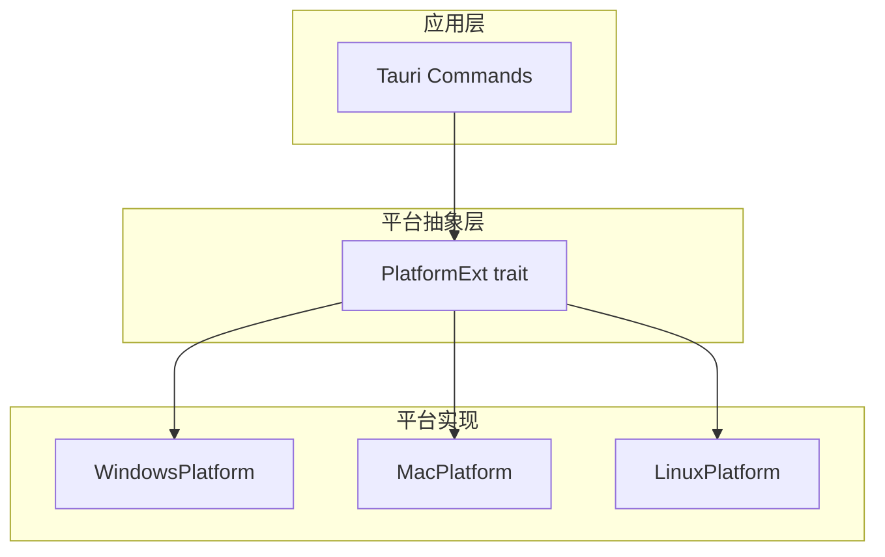

# 跨平台支持规范

> 版本: 1.0.0
> 最后更新: 2026-07-16
> 状态: 已批准

## 1. 概述

本规范定义 DropVoice 的跨平台支持策略、平台抽象层和平台特定行为。

## 2. 决策

### 2.1 平台支持矩阵

| 平台 | 支持级别 | 构建格式 | 最低版本 | 说明 |
|------|---------|---------|---------|------|
| Windows | ✅ 完整支持 | MSI, NSIS | Windows 10 | 主力平台 |
| macOS | ✅ 完整支持 | DMG (Universal) | macOS 10.15 | 主力平台 |
| Linux | ✅ 完整支持 | AppImage, DEB | Ubuntu 22.04 | 完整支持 |

### 2.2 平台抽象层



### 2.3 PlatformExt Trait

> **实现说明 (2026-07-21):** `src-tauri/src/platform/` 模块在 v0.2 已
> **整体移除**——三个平台实现都是 stub（`get_system_theme` 硬编码返回
> `System`，`check_accessibility` 返回 `true`，`set_autostart` 返回
> `Ok(())`，`inject_text` 仅转发给 `text/injector`），`create_platform()`
> 从未被调用，文本注入实际直接走 `text/injector.rs`。同时移除了
> `windows-sys` / `objc2` / `objc2-app-kit` / `xdotool` 这些仅为 stub
> 准备的死依赖。下列 PlatformExt trait 定义作为 v1.0 的目标设计保留，
> 重新实现时按需重新引入对应平台 crate 与本模块。

```rust
// src-tauri/src/platform/mod.rs (v1.0 target — not present in v0.2)

pub trait PlatformExt {
    /// 注入文本到当前光标位置
    fn inject_text(&self, text: &str, delay_ms: u64) -> Result<()>;

    /// 获取系统主题（浅色/深色）
    fn get_system_theme(&self) -> SystemTheme;

    /// 检查是否有无障碍权限（macOS 特有）
    fn check_accessibility(&self) -> bool;

    /// 设置自启动
    fn set_autostart(&self, enabled: bool) -> Result<()>;

    /// 获取系统语言
    fn get_system_language(&self) -> String;
}

/// 根据编译目标选择实现
pub fn create_platform() -> Box<dyn PlatformExt> {
    #[cfg(target_os = "windows")]
    { Box::new(windows::WindowsPlatform) }

    #[cfg(target_os = "macos")]
    { Box::new(macos::MacPlatform) }

    #[cfg(target_os = "linux")]
    { Box::new(linux::LinuxPlatform) }
}
```

### 2.4 平台特定依赖

```toml
# Cargo.toml

[target.'cfg(target_os = "windows")'.dependencies]
windows-sys = { version = "0.61", features = [
    "Win32_Globalization",
    "Win32_UI_Shell",
    "Win32_UI_WindowsAndMessaging",
] }

[target.'cfg(target_os = "macos")'.dependencies]
objc2 = "0.5"
objc2-app-kit = { version = "0.2", features = ["NSColor"] }

[target.'cfg(target_os = "linux")'.dependencies]
xdotool = "0.3"
```

### 2.5 文本注入实现

```rust
// src-tauri/src/text/injector.rs

/// 跨平台文本注入
pub fn inject_text(text: &str, delay_ms: u64) -> Result<()> {
    #[cfg(target_os = "windows")]
    {
        inject_windows(text, delay_ms)
    }

    #[cfg(target_os = "macos")]
    {
        inject_macos(text, delay_ms)
    }

    #[cfg(target_os = "linux")]
    {
        inject_linux(text, delay_ms)
    }
}
```

**平台差异:**

| 平台 | 实现方式 | 说明 |
|------|---------|------|
| Windows | enigo | 逐字符注入，避免输入法问题 |
| macOS | enigo | 需要无障碍权限 |
| Linux | enigo/xdotool | 批量注入 |

### 2.6 PWA 环境策略

| 环境 | Service Worker | 摄像头 | 安装提示 |
|------|---------------|--------|---------|
| HTTPS / localhost | ✅ 注册 | ✅ 可用 | 📱 安装应用 |
| HTTP LAN | ❌ 不注册 | ❌ 不可用 | 🔖 添加书签 |

### 2.7 移动端平台检测

```typescript
// packages/core/src/platform.ts

type Platform = 'ios' | 'android' | 'desktop' | 'unknown';

function detectPlatform(): Platform;
function isSecureContext(): boolean;
function isCameraSupported(): boolean;
function getPWAInstallStrategy(): 'pwa' | 'bookmark' | 'none';
```

## 3. 决策依据

### 3.1 选择 PlatformExt trait

**选择理由:**
- 统一接口，隐藏平台差异
- 编译时选择实现（零成本抽象）
- 便于测试（可 mock）

### 3.2 PWA 策略

**选择理由:**
- HTTP 环境下 Service Worker 和摄像头不可用
- 提供书签作为降级方案
- 用户体验不会因功能缺失而困惑

## 4. 接口规范

### 4.1 平台检测

```typescript
interface EnvironmentInfo {
  protocol: 'http' | 'https';
  hostname: string;
  isSecureContext: boolean;
  isLocalhost: boolean;
  isLAN: boolean;
  serviceWorkerSupported: boolean;
  cameraSupported: boolean;
}

function detectEnvironment(): EnvironmentInfo;
```

### 4.2 安装提示策略

```typescript
function getPWAInstallStrategy(): 'pwa' | 'bookmark' | 'none';
```

### 4.3 CI 构建矩阵

```yaml
# .github/workflows/release.yml
strategy:
  fail-fast: false
  matrix:
    include:
      - platform: windows-latest
        target: windows
        args: '--bundles msi nsis'

      - platform: macos-14
        target: macos
        args: '--target universal-apple-darwin --bundles dmg'

      - platform: ubuntu-22.04
        target: linux
        args: '--bundles appimage deb'
```

## 5. 约束

1. **平台代码隔离**: 平台特定代码必须在平台抽象层之后
2. **降级策略**: 每个平台功能必须有降级方案
3. **测试覆盖**: 每个平台的关键路径必须有测试
4. **CI 矩阵**: 三个平台必须在 CI 中构建和测试
5. **macOS Universal**: 必须支持 Intel + Apple Silicon
