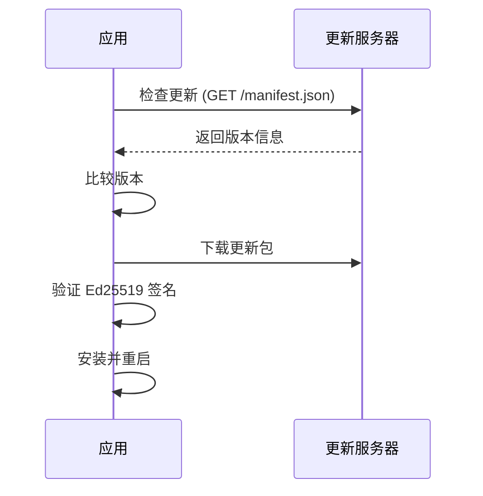

# 打包分发与自动更新规范

> 版本: 1.0.0
> 最后更新: 2026-07-16
> 状态: 已批准

## 1. 概述

本规范定义 DropVoice 的打包格式、代码签名、分发渠道和自动更新机制。

## 2. 决策

### 2.1 构建格式

| 平台 | 格式 | 说明 | 优先级 |
|------|------|------|--------|
| Windows | MSI | 企业友好，支持静默安装 | 主要 |
| Windows | NSIS | 用户友好，支持自定义安装路径 | 推荐 |
| macOS | DMG (Universal) | 支持 Intel + Apple Silicon | 主要 |
| Linux | AppImage | 便携式，无需安装 | 主要 |
| Linux | DEB | Ubuntu/Debian 系 | 推荐 |

### 2.2 代码签名

| 平台 | 证书类型 | 说明 | Secret |
|------|---------|------|--------|
| Windows | EV 证书 | 消除 SmartScreen 警告 | `WINDOWS_CERTIFICATE` |
| macOS | Apple Developer | 公证 + 签名 | `APPLE_CERTIFICATE` |

### 2.3 自动更新



### 2.4 更新清单格式

```json
{
  "version": "1.0.0",
  "notes": "Release notes",
  "pub_date": "2026-08-01T00:00:00Z",
  "platforms": {
    "windows-x86_64": {
      "signature": "ed25519:...",
      "url": "https://github.com/jukanntenn/DropVoice/releases/download/v1.0.0/DropVoice_1.0.0_x64-setup.nsis.zip"
    },
    "darwin-x86_64": {
      "signature": "ed25519:...",
      "url": "https://github.com/jukanntenn/DropVoice/releases/download/v1.0.0/DropVoice_1.0.0_x64.dmg.tar.gz"
    },
    "darwin-aarch64": {
      "signature": "ed25519:...",
      "url": "https://github.com/jukanntenn/DropVoice/releases/download/v1.0.0/DropVoice_1.0.0_aarch64.dmg.tar.gz"
    },
    "linux-x86_64": {
      "signature": "ed25519:...",
      "url": "https://github.com/jukanntenn/DropVoice/releases/download/v1.0.0/DropVoice_1.0.0_amd64.AppImage.tar.gz"
    }
  }
}
```

### 2.5 更新端点

**当前:** 占位链接，后续补充

```
https://releases.dropvoice.app/update/manifest.json
```

### 2.6 分发渠道

| 渠道 | 平台 | 优先级 | 说明 |
|------|------|--------|------|
| GitHub Releases | 全平台 | ⭐⭐⭐⭐⭐ 主要 | 所有平台的主要分发渠道 |
| Homebrew | macOS | ⭐⭐⭐⭐ 推荐 | `brew install dropvoice` |
| Scoop | Windows | ⭐⭐⭐⭐ 推荐 | `scoop install dropvoice` |
| Flathub | Linux | ⭐⭐⭐ 可选 | Flatpak 格式 |
| AUR | Linux (Arch) | ⭐⭐⭐ 可选 | Arch Linux 用户 |

### 2.7 Secrets 配置

| Secret | 用途 | 说明 |
|--------|------|------|
| `GITHUB_TOKEN` | GitHub API 访问 | 自动生成 |
| `TAURI_SIGNING_PRIVATE_KEY` | Tauri 更新签名 | Ed25519 私钥 |
| `TAURI_SIGNING_PRIVATE_KEY_PASSWORD` | 签名密码 | 私钥密码 |
| `APPLE_CERTIFICATE` | macOS 证书 | Base64 编码 |
| `APPLE_CERTIFICATE_PASSWORD` | 证书密码 | - |
| `APPLE_SIGNING_IDENTITY` | 签名身份 | - |
| `APPLE_ID` | Apple ID | - |
| `APPLE_PASSWORD` | App-specific password | - |
| `APPLE_TEAM_ID` | 团队 ID | - |
| `WINDOWS_CERTIFICATE` | Windows 证书 | EV 证书 |
| `WINDOWS_CERTIFICATE_PASSWORD` | 证书密码 | - |

## 3. 决策依据

### 3.1 选择 tauri-plugin-updater

**参考项目:**
- CC-Switch: 使用 tauri-plugin-updater

**选择理由:**
- Tauri 官方插件
- 支持增量更新
- 签名验证（Ed25519）

### 3.2 更新端点

**当前为占位链接，后续补充:**
```
https://releases.dropvoice.app/update/manifest.json
```

### 3.3 选择 Ed25519 签名

**选择理由:**
- 签名速度快
- 密钥小（32 字节）
- 业界标准

## 4. 接口规范

### 4.1 Tauri 配置

```json
// tauri.conf.json
{
  "bundle": {
    "active": true,
    "targets": "all",
    "icon": [
      "icons/32x32.png",
      "icons/128x128.png",
      "icons/128x128@2x.png",
      "icons/icon.icns",
      "icons/icon.ico"
    ],
    "macOS": {
      "minimumSystemVersion": "10.15"
    },
    "linux": {
      "deb": {
        "depends": ["libwebkit2gtk-4.1-0", "libxdo-dev"]
      }
    }
  },
  "plugins": {
    "updater": {
      "endpoints": [
        "https://releases.dropvoice.app/update/manifest.json"
      ],
      "pubkey": "dW50cnVzdGVkIGNvbW1lbnQ6IG1pbmlzaWduIH..."
    }
  }
}
```

### 4.2 前端 API

```typescript
// packages/core/src/updater.ts

interface UpdateInfo {
  version: string;
  date: string;
  notes?: string;
}

async function checkForUpdate(): Promise<UpdateInfo | null>;
async function downloadAndInstall(onProgress?: (progress: number) => void): Promise<void>;
async function relaunchApp(): Promise<void>;
```

### 4.3 UpdateDialog 组件

```typescript
// src/components/UpdateDialog.tsx

interface UpdateDialogProps {
  updateInfo: UpdateInfo;
  onUpdate: () => void;
  onDismiss: () => void;
}
```

### 4.4 版本同步脚本

```javascript
// scripts/sync-version.js
// 同步 package.json 版本到 Cargo.toml
const fs = require('fs');
const path = require('path');

const packageJson = JSON.parse(fs.readFileSync('package.json', 'utf8'));
const version = packageJson.version;

// 同步到 Cargo.toml
const cargoPath = path.join('apps/desktop/src-tauri', 'Cargo.toml');
let cargoContent = fs.readFileSync(cargoPath, 'utf8');
cargoContent = cargoContent.replace(/^version = ".*"$/m, `version = "${version}"`);
fs.writeFileSync(cargoPath, cargoContent);
```

## 5. 约束

1. **签名必须**: 所有发布包必须签名（Ed25519）
2. **向后兼容**: 更新不得破坏用户配置
3. **回滚支持**: 更新失败必须能回滚
4. **版本同步**: package.json 和 Cargo.toml 版本必须同步
5. **Release Notes**: 自动生成，手动审核后发布
6. **端点占位**: 更新端点当前为占位，后续补充
