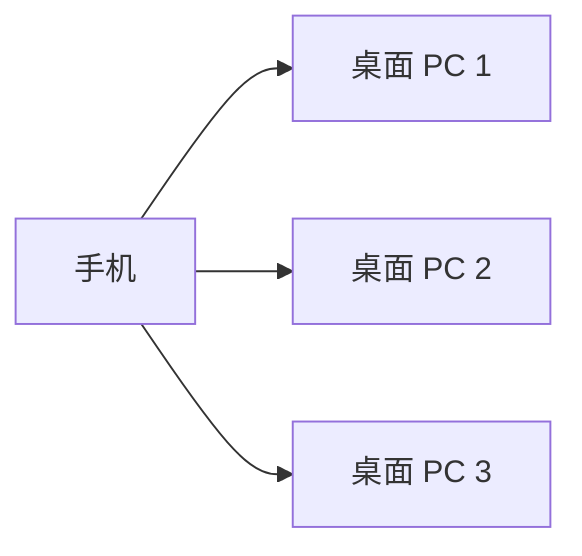
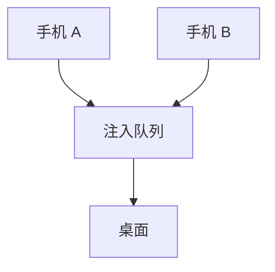

# 多设备管理规范

> 版本: 1.0.0
> 最后更新: 2026-07-16
> 状态: 已批准

## 1. 概述

本规范定义 DropVoice 的多设备管理策略，支持一台手机连接多台桌面。

## 2. 决策

### 2.1 主场景

**一机对多机**: 用户有一台手机，需要向多台电脑发送文本。



### 2.2 设备数据模型

```typescript
// packages/core/src/types/device.ts

interface Device {
  id: string;                    // UUID
  name: string;                  // 显示名称（如 PC-100）
  url: string;                   // WebSocket URL
  status: DeviceStatus;          // 连接状态
  lastConnected: number;         // 最后连接时间戳
  ip: string;                    // IP 地址
  port: number;                  // 端口
  hostname?: string;             // 主机名
  errorType?: DeviceErrorType;   // 错误类型
  reconnectAttempts?: number;    // 重连次数
  hasExhaustedRetries?: boolean; // 是否耗尽重试
  autoConnect?: boolean;         // 是否自动连接（默认 true）
}

type DeviceStatus = 'connected' | 'disconnected' | 'connecting' | 'reconnecting';
type DeviceErrorType = 'unreachable' | 'refused' | 'timeout' | 'unknown';

interface StoredDevice {
  id: string;
  name: string;
  url: string;
  lastConnected: number;
  autoConnect?: boolean;
}

interface DeviceStorage {
  devices: StoredDevice[];
  lastActiveDeviceId: string | null;
}
```

### 2.3 设备选择器

采用 **Chip 形式** 的设备选择器:

- 只有多个设备时显示
- 活跃设备高亮（primary 颜色）
- 设备颜色基于 IP 哈希
- 连接状态图标（✅ ❌ ⏳）

### 2.4 发送模式

| 模式 | 说明 | 适用场景 |
|------|------|---------|
| 当前设备 | 发送到活跃设备 | 默认模式 |
| 所有设备 | 发送到所有已连接设备 | 广播场景 |
| 选择设备 | 用户选择目标设备 | 精确控制 |

**发送模式选择器:** 只有多个设备时显示

### 2.5 多手机冲突处理

当多台手机同时连接同一桌面时:



**策略:**
- 桌面端显示所有连接的手机
- 文本注入采用队列机制（先进先出）
- 注入队列状态显示在桌面端 UI

### 2.6 设备持久化

使用 **localStorage** 按设备分离草稿:

```
dropvoice:devices:v1          → 设备列表
dropvoice:draft:{deviceId}    → 设备草稿
dropvoice:last_sent:{deviceId} → 最后发送
```

### 2.7 设备颜色生成

```typescript
// packages/core/src/utils/deviceColor.ts

/// 基于 IP 地址生成设备颜色
/// 使用黄金角度（137.5°）分散颜色
function getDeviceHue(device: Device): number;
function getDeviceColor(device: Device, dark: boolean): string;
function getDeviceHostLabel(device: string): string;
```

### 2.8 最大设备数

**限制:** 最多 5 台设备

**达到限制时:** 显示错误提示，建议删除旧设备

## 3. 决策依据

### 3.1 选择 Chip 形式而非下拉菜单

**选择理由:**
- 视觉直观，一眼看到所有设备
- 操作简单，一键切换
- 占用空间小

### 3.2 选择注入队列而非直接注入

**选择理由:**
- 避免多设备同时注入导致文本混乱
- 保证注入顺序
- 用户可以看到队列状态

### 3.3 选择 localStorage 而非 SQLite

**选择理由:**
- 设备数据量小（最多 5 台）
- localStorage 简单可靠
- 无需额外依赖

**否决方案:**
- ❌ SQLite: 过重，对于设备数据不必要

## 4. 接口规范

### 4.1 DeviceManager

```typescript
// packages/core/src/connection/manager.ts

type AddDeviceResult = 'added' | 'switched' | false;

interface DeviceManager {
  devices: Device[];
  activeDeviceId: string | null;

  addDevice(url: string): AddDeviceResult;
  removeDevice(deviceId: string): void;
  setActiveDevice(deviceId: string): void;
  connectDevice(deviceId: string): Promise<void>;
  sendToActive(text: string): boolean;
  sendToDevice(deviceId: string, text: string): boolean;
  sendToAll(text: string): boolean;
  connectAll(): Promise<void>;
  disconnectAll(): void;
}
```

### 4.2 useDeviceManager Hook

```typescript
// packages/core/src/hooks/useDeviceManager.ts

interface UseDeviceManagerReturn {
  isInitialized: boolean;
  devices: Device[];
  activeDeviceId: string | null;
  setActiveDeviceId: (deviceId: string | null) => void;
  setDevices: (devices: Device[]) => void;
  addDevice: (url: string) => AddDeviceResult;
  removeDevice: (deviceId: string) => void;
}

export function useDeviceManager(): UseDeviceManagerReturn;
```

### 4.3 DeviceSelector 组件

```typescript
// packages/ui/src/components/DeviceSelector.tsx

interface DeviceSelectorProps {
  devices: Device[];
  activeDeviceId: string | null;
  onSelect: (deviceId: string) => void;
}
```

### 4.4 SendModeSelector 组件

```typescript
// apps/mobile/src/components/SendModeSelector.tsx

type SendMode = 'active' | 'all' | 'selected';

interface SendModeSelectorProps {
  mode: SendMode;
  devices: Device[];
  selectedDevices: string[];
  onModeChange: (mode: SendMode) => void;
  onSelectionChange: (devices: string[]) => void;
}
```

### 4.5 DeviceDots 组件

```typescript
// apps/mobile/src/components/DeviceDots.tsx

interface DeviceDotsProps {
  devices: Device[];
  activeDeviceId: string | null;
  dark: boolean;
  onSelect: (deviceId: string) => void;
}
```

### 4.6 桌面端连接管理

```rust
// src-tauri/src/server/connection_manager.rs

struct ConnectedClient {
    id: String,
    ip: String,
    user_agent: Option<String>,
    connected_at: chrono::DateTime<chrono::Utc>,
}

struct InjectionTask {
    client_id: String,
    text: String,
    timestamp: chrono::DateTime<chrono::Utc>,
}

struct ConnectionManager {
    clients: Arc<RwLock<HashMap<String, ConnectedClient>>>,
    injection_queue: Arc<Mutex<VecDeque<InjectionTask>>>,
    is_processing: Arc<AtomicBool>,
}

impl ConnectionManager {
    async fn register(&self, id: String, ip: String, user_agent: Option<String>);
    async fn unregister(&self, id: &str);
    async fn get_all(&self) -> Vec<ConnectedClient>;
    async fn count(&self) -> usize;
    async fn enqueue_injection(&self, client_id: String, text: String);
}
```

## 5. 约束

1. **最大设备数**: 5 台
2. **自动连接**: 设备列表中的设备启动时自动连接（如果 autoConnect = true）
3. **草稿隔离**: 每个设备独立保存草稿
4. **注入队列**: 多设备同时发送时排队处理
5. **设备颜色**: 基于 IP 哈希，确定性生成
