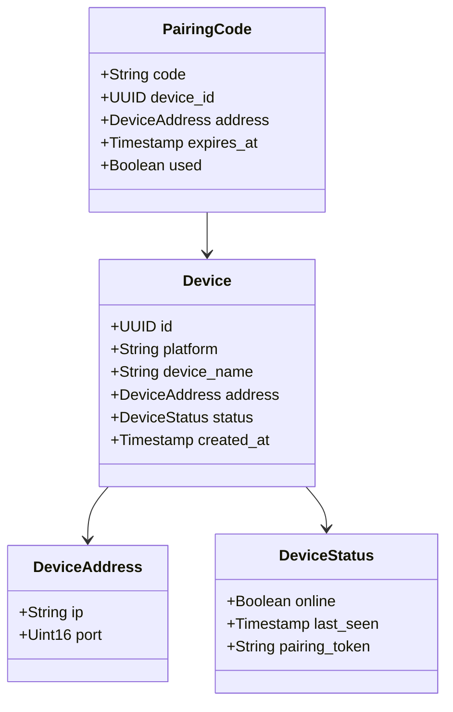
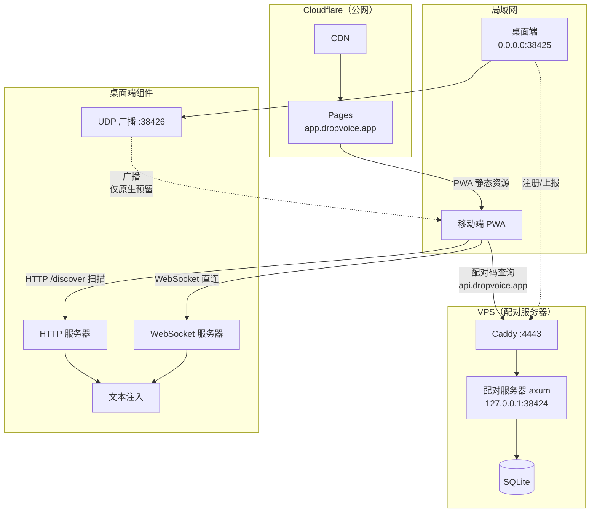
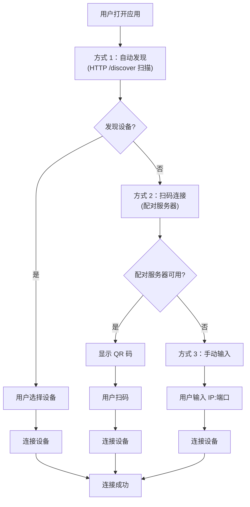
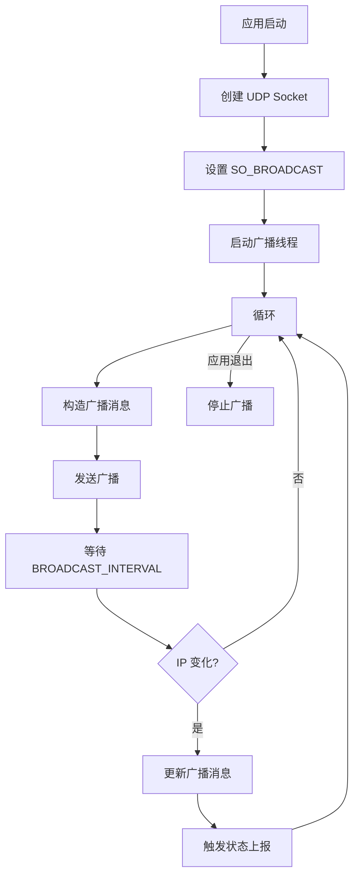
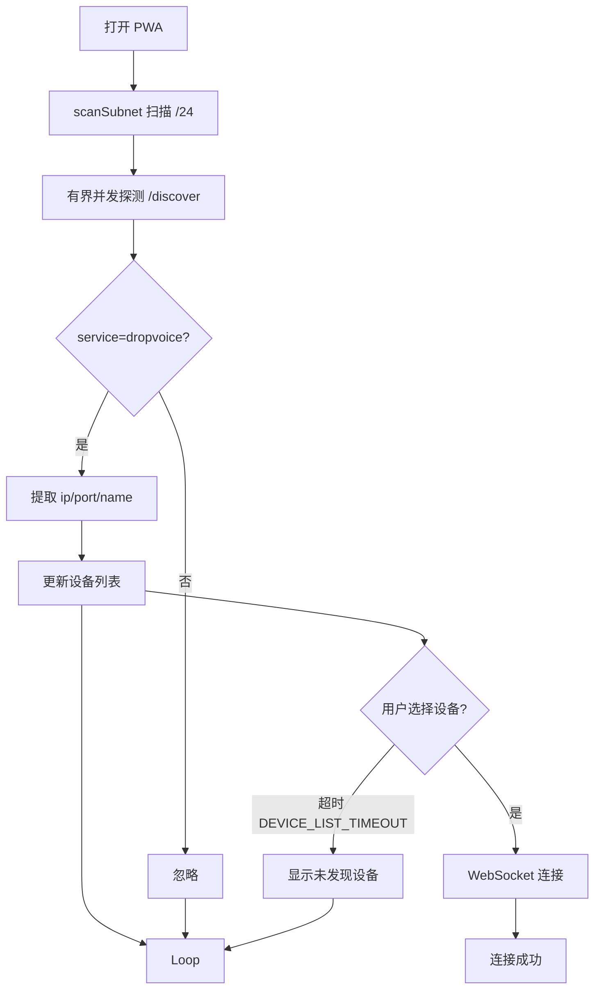
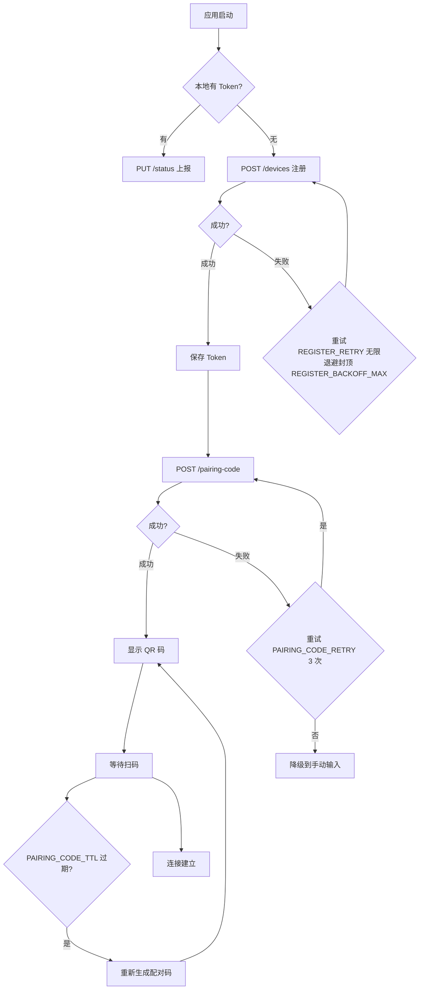
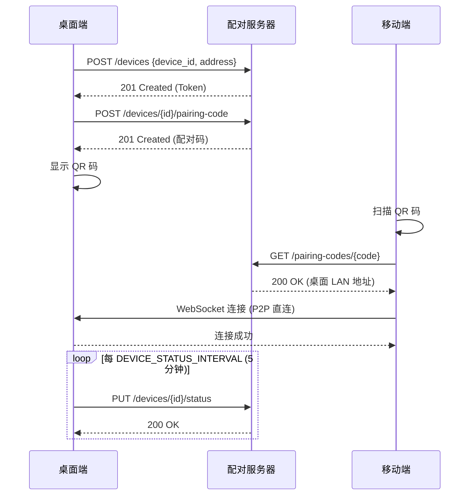
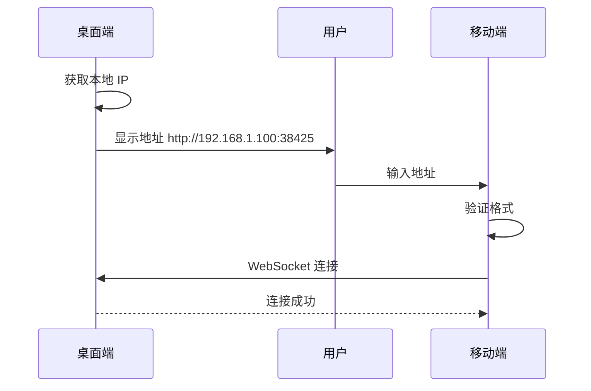
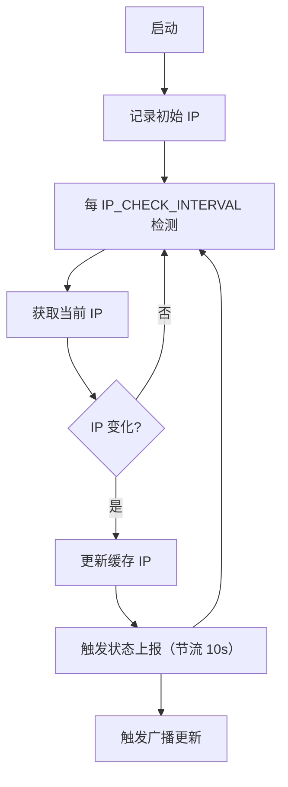
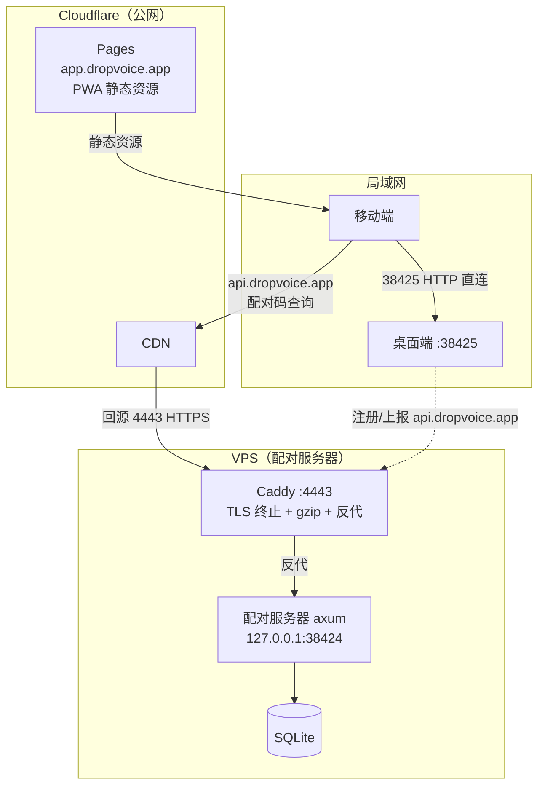

# 连接系统规范

> 版本: 2.0.0
> 最后更新: 2026-07-23
> 状态: 已批准

> **合并说明 (2026-07-23):** 本规范由原 `11-connection-strategy.md`（连接策略）
> 与 `20-connection-system.md`（连接系统设计）合并而成。原 spec 20 文件已转为
> 指针文件（标注废弃）。所有连接相关设计——业务场景、API、运行时生命周期、
> 部署、测试——均集中在本规范，单一事实源。

---

## 1. 业务场景与概述

### 1.1 核心业务问题

DropVoice 的根本问题：**手机 PWA 如何知道桌面端的局域网地址（IP:端口）？**
连接系统的全部设计围绕这一个"地址发现 / 会合（rendezvous）"问题展开。

### 1.2 三个业务场景

| # | 场景 | 为什么需要外部服务 | 职责边界 |
|---|------|------------------|---------|
| A | **PWA 的 HTTPS 宿主** | PWA 必须 HTTPS 才能用 Service Worker / 摄像头扫码 / 安装提示；但局域网是 HTTP，自签证书体验差。需要公网 HTTPS 入口托管 PWA 静态资源 | Cloudflare Pages（§12） |
| B | **LAN 发现失效时的会合** | UDP 广播在企业网/学校网/跨子网常被防火墙阻断；多网卡选错接口；广播包丢失。需要一条"兜底通道"让手机拿到桌面地址 | 配对服务器（纯地址簿，**不中继数据**） |
| C | **v2.0.0 跨网络的地址分发基础** | P2P/Relay 需要先知道"对方是谁、在哪"。信令服务是 ICE/SDP 交换的前置基础 | 配对服务器（v2.0.0 扩展） |

### 1.3 设计目标

| 指标 | 目标值 | 说明 |
|------|-------|------|
| 设备总量 | 100 万 | 支持的最大设备数 |
| 日活设备 | 10 万（10%） | 预期日活跃设备 |
| 服务器配置 | 2 核 2G VPS | 配对服务器配置 |
| 带宽 | 3 Mbps | 配对服务器带宽 |
| 数据库 | SQLite | 优先 SQLite |

### 1.4 核心约束

1. **PWA 需要 HTTPS**：Service Worker、摄像头 API、安装提示。
2. **局域网无 HTTPS**：自签证书体验差。
3. **需要外部 HTTPS 入口**：提供 PWA 资源。

### 1.5 设计原则

1. **自动发现优先**：局域网内自动发现设备，用户只需点击。
2. **离线可用**：PWA 资源本地化，不依赖外部服务。
3. **最小依赖**：减少外部服务依赖，降低故障点。
4. **渐进增强**：基础功能离线可用，高级功能需要网络。

### 1.6 关键产品约束（v1.1.0）

> **同局域网约束**：配对码 `GET /pairing-codes/{code}` 返回的是桌面 **LAN
> IP:端口**。手机与桌面**必须在同一局域网**才能扫码后直连成功。手机在 4G/非同
> 网段时即使扫码拿到地址也连不上桌面——此时必须降级到 v2.0.0 Relay，或 UI 提示
> "请连接同一 WiFi"。**跨网络寻址推迟到 v2.0.0**（spec 12）。

**职责边界**：配对服务器**只做地址发现 / 会合，绝不中继语音/文本数据**。真正的数据
通路是 LAN 直连（现在）/ P2P+Relay（v2.0.0，spec 12）。这是配对服务器可以是
2 核 2G SQLite 极轻量服务的根本原因。

v2.0.0 的 ICE/SDP 信令交换职责归属在 spec 12（独立 STUN/TURN），本规范不展开，
仅做"地址发现"前置预留说明。

---

## 2. 领域模型与术语

### 2.1 核心术语

| 场景 | 术语 | 英文 | 说明 |
|------|------|------|------|
| 服务器 | 配对服务器 | Pairing Server | 提供公网 HTTPS 入口和配对功能（A 线） |
| 桌面服务 | 桌面端本地服务器 | Desktop Local Server | 用户机器上的 HTTP+WS 服务（B 线） |
| 连接码 | 配对码 | Pairing Code | 用于配对的一次性 6 位码 |
| 注册 | 设备配对 | Device Pairing | 设备向配对服务器注册 |
| 心跳 | 状态上报 | Status Report | 设备向配对服务器周期上报状态 |
| 解析 | 配对码查询 | Pairing Code Lookup | 查询配对码获取设备 LAN 地址 |

### 2.2 领域模型



### 2.3 领域事件

| 事件 | 触发条件 | 处理逻辑 |
|------|---------|---------|
| DeviceRegistered | 设备注册（新建） | 生成配对 Token，返回设备信息 |
| DeviceReused | 设备注册（复用/续期） | 返回现有或刷新 Token |
| PairingCodeGenerated | 生成配对码 | 存储配对码，设置过期时间 |
| PairingCodeLookedUp | 配对码被查询 | 返回设备 LAN 地址 |
| PairingCodeExpired | 配对码过期 | 清理过期配对码 |
| StatusReported | 设备上报状态 | 更新设备在线状态和地址 |
| DeviceOffline | 设备超时离线 | 标记设备为离线 |
| DeviceDiscovered | 自动发现设备 | 添加到设备列表（移动端本地） |

---

## 3. 架构设计

### 3.1 整体架构



### 3.2 组件职责

| 组件 | 职责 | 部署位置 |
|------|------|---------|
| Cloudflare CDN + Pages | PWA 静态资源边缘缓存 + DDoS 防护 | 公网 |
| Caddy | 配对服务器 TLS 终止 + 反向代理 + gzip | VPS :4443 |
| 配对服务器 axum | 配对码管理 + 设备地址簿 | VPS localhost:38424 |
| 桌面端 HTTP 服务器 | `/health` + `/discover` + 设备信息 | 用户机器 :38425 |
| 桌面端 WebSocket 服务器 | 双向通信（文本注入） | 用户机器 :38425 |
| 桌面端 UDP 广播 | 原生/桌面间发现预留 | 用户机器 :38426 |
| 移动端 PWA | 用户界面 + HTTP 发现扫描 | 手机 |

### 3.3 三层降级策略



### 3.4 优先级

| 优先级 | 方式 | 用户操作 | 条件 | 用户体验 |
|--------|------|---------|------|---------|
| 🥇 1 | 自动发现 | 点击设备 | LAN `/discover` 扫描可用 | ⭐⭐⭐⭐⭐ |
| 🥈 2 | 扫码连接 | 扫码 | 配对服务器可用 | ⭐⭐⭐⭐ |
| 🥉 3 | 手动输入 | 输入 IP:端口 | 兜底，无条件 | ⭐⭐⭐ |

**优先级决策理由**：自动发现"零输入"体验在能通的场景下最优（手机自动列出设备、用户
点击即可，无需摄像头）。自动发现失败才退到扫码，配对服务器不可用才退到手动输入。

> **优先级修正说明 (2026-07-23):** 原 spec 11（v1.0.0）写"HTTPS 信令优先 > 局域网
> 发现"。经重新评估，自动发现的零输入体验在能通场景下最优，且降级流程已正确建模
> "发现失败才退扫码"，故修正为"自动发现 > 扫码 > 手动输入"。

---

## 4. 时间常量表

> **集中定义原则**：所有过期与周期任务的时间值在此集中定义，各业务章节只引用常量名，
> 不重复写值。常量名用 `SCREAMING_SNAKE_CASE`，与代码常量一致
> （如 Rust `const PAIRING_CODE_TTL: Duration`）。

| 常量名 | 值 | 用途 | 归属 | v1.1.0 |
|--------|-----|------|------|--------|
| `PAIRING_CODE_LENGTH` | **6** | 配对码位数（配对服务器使用） | 服务端 | 实现 |
| `PAIRING_CODE_TTL` | **5 分钟** | 配对码有效期（缩短自原 10 分钟，缩小攻击窗口） | 服务端 | 实现 |
| `DEVICE_STATUS_INTERVAL` | **5 分钟** | 桌面端状态上报周期（心跳） | 桌面端 | 实现 |
| `IP_CHECK_INTERVAL` | **30 秒** | 桌面端 IP 变化检测周期 | 桌面端 | 实现 |
| `IP_REPORT_THROTTLE` | **10 秒** | IP 变化触发的即时上报最小间隔（防风暴） | 桌面端 | 实现 |
| `DEVICE_TOKEN_TTL` | **24 小时** | 配对 Token 有效期（设备最长离线仍能复用） | 服务端 | 实现 |
| `RATE_LIMIT` | **1 req/IP/秒** | 配对服务器速率限制 | 服务端 | 实现 |
| `BROADCAST_INTERVAL` | **2 秒**（固定） | UDP 广播间隔（统一固定值，删除原自适应 1/5 秒） | 桌面端 | 实现 |
| `DEVICE_LIST_TIMEOUT` | **15 秒** | 移动端设备列表移出阈值（延长自 10 秒，容忍抖动） | 移动端 | 实现 |
| `REGISTER_BACKOFF_MAX` | **16 秒** | 注册失败退避封顶（指数 1→2→4→8→16） | 桌面端 | 实现 |
| `HEARTBEAT_BACKOFF_MAX` | **5 分钟** | 心跳失败退避封顶（对齐心跳间隔） | 桌面端 | 实现 |
| `REGISTER_RETRY` | **无限** | 注册重试次数（配对码功能依赖，不放弃） | 桌面端 | 实现 |
| `PAIRING_CODE_RETRY` | **3 次** | 配对码生成重试次数 | 桌面端 | 实现 |
| `STATUS_FAIL_THRESHOLD` | **5 次** | 状态上报失败阈值（超阈值标记本端离线状态） | 桌面端 | 实现 |
| `SQLITE_BUSY_TIMEOUT` | **50 ms** | SQLite 忙等待 | 服务端 | 实现 |
| `CACHE_CLEANUP_INTERVAL` | **1 分钟** | 内存缓存清理周期 | 服务端 | 实现 |
| `BATCH_WRITE_INTERVAL` | **1 秒** | 批量写入周期 | 服务端 | 实现 |
| `DISCOVERY_TIMEOUT` | **5 秒** | 移动端局域网发现等待 | 移动端 | 实现 |
| `SIGNALING_TIMEOUT` | **3 秒** | 配对服务器探测超时 | 移动端/桌面端 | 实现 |

> **Note:** Desktop local pairing code uses 8 digits (configurable), pairing server uses 6 digits.

---

## 5. API 设计

> **两条独立的 API 线，严格分节，不可混淆。** 详见 OpenAPI YAML 权威源：
> - A 线：[`openapi/pairing-server.yaml`](./openapi/pairing-server.yaml)
> - B 线：[`openapi/desktop-local.yaml`](./openapi/desktop-local.yaml)

### 5.1 配对服务器 API（A 线）

公网 HTTPS，部署在 VPS。客户端：桌面端（注册/上报）、移动端（扫码查询）。

| Method | Path | 认证 | 用途 | 成功 | 错误 |
|--------|------|------|------|------|------|
| POST | `/devices` | 无 | 设备注册（幂等 upsert，带 `device_id`） | 201/200 | 400, 429 |
| POST | `/devices/{device_id}/pairing-code` | Bearer token | 生成配对码 | 201 | 401, 404, 429 |
| GET | `/pairing-codes/{code}` | 无 | 查询配对码 → 桌面 LAN 地址 | 200 | 404, 410 |
| PUT | `/devices/{device_id}/status` | Bearer token | 状态/地址上报（IP 变化刷新） | 200 | 401, 404 |

#### 5.1.1 `POST /devices` 幂等 upsert 语义

| 客户端请求 | 服务端行为 | 状态码 |
|----------|----------|--------|
| `device_id=X`，X 不存在 | 创建记录，颁发 token | **201 Created** |
| `device_id=X`，X 存在，token 有效 | 返回现有记录（含原 token） | **200 OK** |
| `device_id=X`，X 存在，token 已过期 | 刷新 token，返回新 token | **200 OK** |

请求体：`{ device_id, platform, address:{ip, port}, device_name? }`
（完整 schema 见 `pairing-server.yaml#/components/schemas/DeviceRegisterRequest`）

> **决策依据**：`device_id` 由客户端生成（UUID v4，§14）。重复注册是预期内的正常
> 行为（应用重启、网络重连、IP 变化都会触发），不是冲突。幂等 upsert（201/200）
> 符合 RESTful 语义，客户端无需错误分支。
>
> **409 Conflict 否定理由**：409 语义是"请求与服务器状态冲突，本次失败"。但这里
> 恰恰不是失败——重复注册是正常预期。把正常行为报成 4xx 会误导客户端进入错误分支。
> **故不返回 409**。
>
> **v2.0.0 安全增强**：引入 `device_secret`（长效机密，首次启动生成，不广播，POST
> 时携带，服务端存哈希）后，"id 存在但 secret 不匹配"将成为 409 的**合法触发场景**
> （劫持防护）。详见 §14、spec 13。

#### 5.1.2 `GET /pairing-codes/{code}` 同局域网约束

返回桌面 **LAN 地址**。**手机与桌面须在同一局域网，否则连接失败**（§1.6）。

#### 5.1.3 统一错误响应格式

```json
{
    "error": {
        "code": "PAIRING_CODE_EXPIRED",
        "message": "The pairing code has expired",
        "details": {
            "code": "123456",
            "expired_at": "2026-07-18T12:10:00Z"
        }
    }
}
```

错误码用 `SCREAMING_SNAKE_CASE`，全集：

| 错误码 | HTTP | 说明 |
|--------|------|------|
| `INVALID_REQUEST` | 400 | 请求参数无效 |
| `TOKEN_INVALID` | 401 | Token 无效或已过期 |
| `DEVICE_NOT_FOUND` | 404 | 设备不存在 |
| `PAIRING_CODE_NOT_FOUND` | 404 | 配对码不存在 |
| `PAIRING_CODE_EXPIRED` | 410 | 配对码已过期或已使用 |
| `RATE_LIMITED` | 429 | 速率超限 |

### 5.2 桌面端本地 API（B 线）

LAN HTTP（明文），运行在用户机器 `0.0.0.0:38425`。客户端：手机直连。

| Method | Path | 认证 | 用途 | 成功 | 错误 |
|--------|------|------|------|------|------|
| GET | `/health` | 无 | 健康检查（spec 16 §2.5） | 200 | - |
| GET | `/discover` | 无 | 返回 `{service, ip, port, url}`（移动端实际发现路径） | 200 | - |
| GET | `/ws`（WebSocket） | `?code=` 或 `?token=` | 双向通信（文本注入/控制） | 101 | - |

> **B 线为明文 HTTP**：同局域网手机直连，不经过 TLS 终止。v1.1.0 信任模型为"同
> LAN 可信网络"（详见 §14）。完整 schema 见 `desktop-local.yaml`。

### 5.3 WebSocket 协议（`GET /ws`，不纳入 OpenAPI）

#### 握手

```
GET /ws?code=<8-digit-pairing-code>     # 首次配对
GET /ws?token=<uuid>                     # 已配对（首次配对后服务端下发 token）
```

桌面端 HTTP server 与 WebSocket 共用端口（38425），WS 路径固定 `/ws`。

#### 消息 JSON schema（双向）

桌面端 → 移动端：状态更新、注入确认。
移动端 → 桌面端：文本注入请求、控制命令。

（具体消息体定义随文本注入规范演进，本规范不展开消息字段，仅约束握手与端口契约。）

---

## 6. 三种连接方式

### 6.1 方式 1：自动发现（优先）

#### 6.1.1 双通道实现（关键事实）

> **实现说明 (2026-07-21，权威)**：浏览器（PWA）**无法打开原始 UDP socket**，
> 因此移动端不能直接监听 UDP 广播。实际架构为双通道：
>
> 1. **桌面端 UDP 广播** (`network/discovery.rs::start_broadcast`)：每 `BROADCAST_INTERVAL`
>    （2 秒）向 `255.255.255.255:38426` 发送 `dropvoice|{version}|{ip}|{port}|{device_name}`，
>    **供未来原生/桌面间发现使用**，移动端不消费。
> 2. **HTTP `/discover` 端点** (`server/http.rs::discover_handler`)：返回
>    `{ service, ip, port, url }`，是**移动端 PWA 唯一可用的发现路径**。
> 3. **移动端 `lib/discovery.ts`**：`probeDiscovery(host, port)` 探测单个
>    `/discover`，`scanSubnet(baseIp)` 以有界并发扫描 `/24` 子网，返回
>    `DiscoveredDevice[]` 供 AddDeviceModal 渲染一键候选。

#### 6.1.2 UDP 广播协议（原生预留）

**广播消息格式（4 字段，固化 name，不含 device_id）**：
```
dropvoice|{version}|{ip}|{port}|{device_name}
```

**示例**：
```
dropvoice|1|192.168.1.100|38425|My-PC
```

**字段说明**：
- `dropvoice`：协议标识（固定前缀）
- `version`：协议版本（当前为 `1`，前向兼容）
- `ip`：设备 LAN IPv4 地址
- `port`：设备端口（38425）
- `device_name`：固化的设备名（§6.6）

> **不含 device_id 的决策理由**：广播是公开信道，device_id 公开会导致 §14 提到的
> MITM 向量（同 LAN 者可拿 id 去 `POST /devices` 认领 token）。原生发现需要去重时
> 用 `ip:port` 去重（同地址即同设备）。

**广播参数**：
- 广播地址：`255.255.255.255`（或子网广播地址）
- 广播端口：`38426`（与数据端口 38425 分开）
- 广播间隔：`BROADCAST_INTERVAL` 2 秒（**固定**，原 spec 20 的自适应 1/5 秒已删除）
- 消息编码：UTF-8

#### 6.1.3 桌面端广播流程



#### 6.1.4 移动端发现流程（HTTP 扫描）



#### 6.1.5 三平台实现细节

**跨平台封装**：使用 `socket2` 库（跨平台 UDP 操作）。

```rust
use socket2::{Domain, Protocol, Socket, Type};

struct BroadcastSocket { socket: Socket }

impl BroadcastSocket {
    fn new() -> Result<Self, Error> {
        let socket = Socket::new(Domain::IPV4, Type::DGRAM, Some(Protocol::UDP))?;
        socket.set_broadcast(true)?;
        Ok(Self { socket })
    }
    fn send_broadcast(&self, data: &[u8], port: u16) -> Result<usize, Error> {
        let addr = SocketAddrV4::new(Ipv4Addr::BROADCAST, port);
        self.socket.send_to(data, &addr.into())
    }
    fn recv_broadcast(&self, buf: &mut [u8]) -> Result<(usize, SocketAddr), Error> {
        self.socket.recv_from(buf)
    }
}
```

| 平台 | 注意事项 |
|------|---------|
| Windows | 可能需添加防火墙例外规则；使用 `WSASendTo`/`WSARecvFrom` |
| macOS | 可能需应用签名才能绑定端口；标准 BSD Socket API |
| Linux | 可能需 `CAP_NET_ADMIN`；标准 BSD Socket API |

#### 6.1.6 异常处理

| 异常场景 | 影响 | 处理策略 |
|---------|------|---------|
| Socket 创建失败 | 无法广播/监听 | 降级到手动输入 |
| 防火墙阻止 | 无法广播/扫描 | 提示用户添加防火墙例外 |
| 广播消息格式错误 | 无法解析 | 忽略该消息，继续 |
| 设备超时 `DEVICE_LIST_TIMEOUT` | 设备从列表移除 | 15 秒未刷新则移出 |
| IP 变化 | 广播错误 IP | IP 检测线程每 30 秒检测，变化时更新（§8） |
| 多网卡 | 广播到错误网络 | 优先选择默认路由对应的接口 |

### 6.2 方式 2：扫码连接（配对服务器）

#### 6.2.1 桌面端流程



#### 6.2.2 时序图



#### 6.2.3 异常处理

| 异常场景 | 影响 | 处理策略 |
|---------|------|---------|
| 配对服务器不可达 | 无法配对 | 降级到手动输入 |
| 设备配对失败 | 无法生成配对码 | 无限重试（退避封顶 `REGISTER_BACKOFF_MAX`） |
| 生成配对码失败 | 无法显示 QR 码 | `PAIRING_CODE_RETRY` 3 次，失败后降级 |
| 配对码过期 | 扫码失败 | 桌面端自动重新生成 |
| 查询配对码失败 | 无法获取设备地址 | 显示错误，提示重新扫码 |
| 上报状态失败 | 设备被标记离线 | 重试，超 `STATUS_FAIL_THRESHOLD` 标记离线 |
| Token 过期 | 无法认证 | 自动重 `POST /devices` 续期（§7.5） |
| IP 变化 | 配对码返回错误 IP | `IP_CHECK_INTERVAL` 30 秒检测，立即上报 |

### 6.3 方式 3：手动输入（兜底）

#### 6.3.1 流程



#### 6.3.2 异常处理

| 异常场景 | 影响 | 处理策略 |
|---------|------|---------|
| 获取本地 IP 失败 | 无法显示地址 | 显示"无法获取 IP"错误 |
| 地址格式错误 | 无法连接 | 显示格式错误提示 |
| 连接失败/超时 | 无法连接 | 显示连接失败提示 |
| 多网卡 IP | 显示多个 IP | 显示所有可用 IP |

### 6.4 连接超时

引用时间常量表（§4）：

| 方式 | 超时常量 | 值 |
|------|---------|-----|
| 局域网发现 | `DISCOVERY_TIMEOUT` | 5 秒 |
| 配对服务器探测 | `SIGNALING_TIMEOUT` | 3 秒 |
| 手动输入 | 无 | 用户主动发起 |

### 6.5 PWA 在非 HTTPS 环境的降级

| 功能 | HTTPS / localhost | HTTP LAN |
|------|-------------------|----------|
| Service Worker | ✅ 完整 | ❌ 不可用 |
| 摄像头扫码 | ✅ 可用 | ❌ 不可用 |
| 离线访问 | ✅ 可用 | ❌ 不可用 |
| 安装提示 | 📱 安装应用 | 🔖 添加书签 |

### 6.6 device_name 设计

#### 6.6.1 取消 hostname→IP 运行时回退

原 spec 20 §5.1 的回退链 `用户自定义 → hostname → IP` 存在两个根本缺陷：
1. **IP 会变**（§8 整章讲 IP 变化），作为 name 极不稳定，用户会误判为新设备。
2. **Windows 默认 hostname**（`DESKTOP-A7B3X9F2`）对用户毫无识别价值。

**新设计**：`稳定性` 与 `可读性` 分离——device_name **固化**（一次计算、永不变更），
IP **不进 name 字段**，仅存 `address.ip`，UI 在撞名/需要区分时显示 `name (ip)`。

#### 6.6.2 生成规则（一次性，固化到 config.toml）

首次启动按优先级**计算一次**默认 device_name 并写入 config.toml 固化：

```
device_name =
  用户自定义值（若已设置）
  否则 取一次 hostname，做友好化处理（见下）
  否则 "DropVoice Desktop"（固定品牌默认名）
```

**hostname 友好化**：
- Windows 的 `DESKTOP-XXX` 默认 hostname（对用户无意义）→ 丢弃，用品牌默认名。
- 其他平台 hostname（macOS/Linux 用户自定义，通常可读）→ 原样用。

#### 6.6.3 关键性质

- **固化**：一旦写入 config.toml，**永不再自动变更**（即便后续 hostname 改了）。
  这保证广播包/配对码里的 name 稳定，移动端不会因 name 变化误判为新设备。
- **允许用户修改**（区别于 device_id 不可改）：在设置页修改，存 config.toml，修改后
  触发一次状态上报刷新服务端记录。
- **IP 不进 name**：UI 用 `name (ip)` 组合显示。

---

## 7. 桌面端运行时生命周期

> 用"启动序列 + 三后台任务 + 重试矩阵"统一组织，替代原 spec 20 散落的多处流程图。

### 7.1 启动序列（一次性）

```
应用启动
  ├─ 1. init_logging()（spec 16，已实现）
  ├─ 2. 加载 config.toml（device_id / device_name / token；缺失则生成，§14、§6.6）
  ├─ 3. 启动本地 HTTP+WS 服务器（端口 38425，已实现 start_server）
  ├─ 4. 启动 UDP 广播（已实现 start_broadcast）
  ├─ 5.【v1.1.0 新增】注册到配对服务器（POST /devices，幂等 upsert，存 token）
  └─ 6.【v1.1.0 新增】启动三个后台任务（见 §7.2）
```

**失败处理**：1-4 步失败用现有降级（手动输入）；第 5 步失败降级到 LAN 发现/手动输入
（扫码不可用）；第 6 步子任务失败各自重试，不影响主进程。

### 7.2 三个后台任务（持续运行）

| 任务 | 触发 | 作用 | 失败处理 |
|------|------|------|---------|
| **T1 广播任务**（已实现） | 每 `BROADCAST_INTERVAL` 2 秒 | UDP 广播存在感 | 单次失败仅 warn，下周期重试 |
| **T2 IP 变化检测**（新增） | 每 `IP_CHECK_INTERVAL` 30 秒 | 比对 IP，变化→刷新广播 + 立即上报 | 获取失败用上次 IP |
| **T3 状态上报/心跳**（新增） | 每 `DEVICE_STATUS_INTERVAL` 5 分钟 | `PUT /status`（续期 token + 标记在线） | 见 §7.3 重试矩阵 |

### 7.3 重试与回退矩阵

| 场景 | 重试策略 | 重试耗尽后 | 用户可见影响 |
|------|---------|----------|-----------|
| `POST /devices` 失败（注册） | 指数退避：1→2→4→8→16s，封顶 `REGISTER_BACKOFF_MAX` 16s，**无限重试** | 不放弃（配对码依赖它） | 扫码不可用，降级 LAN 发现/手动输入 |
| `POST /pairing-code` 失败 | `PAIRING_CODE_RETRY` 3 次（1s 间隔） | 降级显示"扫码不可用" | QR 区显示错误，LAN/手动仍可用 |
| `PUT /status` 失败（心跳） | 指数退避封顶 `HEARTBEAT_BACKOFF_MAX` 5 分钟 | 标记本端"离线上报"状态，下周期继续 | 服务端可能误判离线，本地连接不受影响 |
| UDP 广播失败 | 不重试（下周期自然重发） | - | 无（广播 best-effort） |
| IP 获取失败 | 用上次记录 IP | - | 广播/上报用旧 IP，可能短暂失联 |

**核心设计**：注册用**无限重试**（配对码功能依赖它，放弃 = 功能永久不可用），其他用
有限重试 + 降级。配对服务器只是 plan B，LAN 发现是主路径——plan B 挂了不影响 plan A。

### 7.4 上报机制（心跳内容）

`PUT /devices/{id}/status` 请求体：`{ address:{ip, port}, device_name? }`。

- IP 变化时 T2 立即触发一次额外上报（不等 5 分钟）。
- device_name 变化（用户改名）也触发一次上报。
- **节流**：T2 触发的即时上报最多每 `IP_REPORT_THROTTLE` 10 秒一次（防 IP 抖动风暴）。

### 7.5 Token 过期处理

主题 5.1.1 已定"token 过期 → 重 POST 触发 200 续期"。具体：

1. T3 心跳收到 401 → 触发 `POST /devices`（带同 `device_id`）。
2. 服务端 200 刷新 token → 桌面端存新 token（config.toml）。
3. 重放原心跳。

续期是**自动透明**的，用户无感。token 存 config.toml（与 device_id 同文件）。

---

## 8. IP 变化检测机制

### 8.1 问题分析

设备局域网 IP 可能因以下原因变化：
- DHCP 租约到期重新分配
- 用户切换 WiFi 网络
- 网络接口重启
- 多网卡切换

### 8.2 方案：轮询 + 变化检测

**核心思路**：独立检测线程 + 变化触发上报。

1. **独立检测线程**：每 `IP_CHECK_INTERVAL` 30 秒检测一次 IP 变化。
2. **变化触发上报**：IP 变化时立即上报到配对服务器（节流 10 秒）。
3. **变化触发广播**：IP 变化时立即更新广播消息。
4. **正常心跳**：每 5 分钟发送一次状态上报（即使 IP 未变化）。

### 8.3 三平台实现

跨平台使用 `local-ip-address` 库（已集成）：
- Linux：Netlink socket 获取网络接口。
- macOS：`getifaddrs` 获取网络接口。
- Windows：Win32 API 获取网络适配器表。

调用 `local_ip()` 获取当前 IP，与上次记录比较，变化则触发上报和广播更新。

### 8.4 流程



### 8.5 异常处理

| 异常场景 | 影响 | 处理策略 |
|---------|------|---------|
| 获取 IP 失败 | 无法检测变化 | 使用上次记录的 IP |
| 多网卡 IP | 可能选错 IP | 优先选择默认路由对应的接口 |
| IPv6 地址 | 可能不兼容 | 优先使用 IPv4 地址 |
| IP 频繁变化 | 上报风暴 | 节流 `IP_REPORT_THROTTLE` 10 秒一次 |
| 网络断开 | 无法上报 | 使用上次记录的 IP |

---

## 9. 数据库设计

### 9.1 表结构

**设备表（devices）**

| 字段 | 类型 | 约束 | 说明 |
|------|------|------|------|
| id | TEXT | PRIMARY KEY | 设备 UUID v4（客户端生成） |
| platform | TEXT | NOT NULL | `"desktop"` |
| device_name | TEXT | NULL | 固化的设备名（§6.6） |
| ip | TEXT | NOT NULL | 当前 LAN IP 地址 |
| port | INTEGER | NOT NULL | 端口号（38425） |
| pairing_token | TEXT | UNIQUE | 配对 Token（64 字符） |
| is_online | INTEGER | NOT NULL DEFAULT 0 | 是否在线 |
| last_seen | INTEGER | NOT NULL | 最后在线时间戳 |
| created_at | INTEGER | NOT NULL | 创建时间戳 |

**配对码表（pairing_codes）**

| 字段 | 类型 | 约束 | 说明 |
|------|------|------|------|
| code | TEXT | PRIMARY KEY | 6 位配对码 |
| device_id | TEXT | NOT NULL, FK | 关联设备 ID |
| ip | TEXT | NOT NULL | 设备 IP（冗余） |
| port | INTEGER | NOT NULL | 设备端口（冗余） |
| expires_at | INTEGER | NOT NULL | 过期时间戳 |
| used | INTEGER | NOT NULL DEFAULT 0 | 是否已使用 |

### 9.2 索引设计

| 表 | 索引 | 用途 |
|----|------|------|
| devices | idx_pairing_token | Token 查询 |
| devices | idx_last_seen | 离线设备清理 |
| pairing_codes | idx_expires_at | 过期配对码清理 |

### 9.3 SQLite 优化配置

| 配置项 | 值 | 说明 |
|--------|-----|------|
| `journal_mode` | WAL | 提高并发性能 |
| `synchronous` | NORMAL | 平衡性能和安全 |
| `cache_size` | 100MB | 内存缓存页 |
| `mmap_size` | 256MB | 内存映射 |
| `busy_timeout` | `SQLITE_BUSY_TIMEOUT` 50ms | 忙等待时间 |

迁移工具用 sqlx 内置 `sqlx migrate`（§9 技术栈），迁移脚本放
`apps/pairing-server/migrations/`。

---

## 10. 性能优化

### 10.1 内存缓存设计

**缓存结构**：
- 配对码缓存：`code -> (device_info, expires_at)`
- Token 缓存：`token -> device_id`

**缓存策略**：
- 配对码生成时写入缓存
- 配对码查询时优先查缓存
- 配对码过期时从缓存删除
- 定期清理过期缓存（每 `CACHE_CLEANUP_INTERVAL` 1 分钟）

**缓存大小限制**：
- 配对码缓存：最多 10 万条
- Token 缓存：最多 100 万条

### 10.2 批量写入设计

**批量写入队列**：
- 状态上报请求入队
- 每 `BATCH_WRITE_INTERVAL` 1 秒执行一次批量 UPDATE
- 使用事务保证原子性

**优势**：减少数据库锁竞争、提高写入吞吐量、降低磁盘 IO。

### 10.3 压缩策略：在 Caddy，服务端不压缩

> **架构边界（关键）**：压缩职责三层划分，**配对服务器（axum）禁止任何响应压缩**。

| 层 | 压缩职责 | 实现方式 |
|----|---------|---------|
| **axum（配对服务器）** | ❌ **不压缩** | 不引入 `tower-http::CompressionLayer`，响应 plaintext 直返 Caddy |
| **Caddy（反向代理）** | ✅ **负责压缩** | `encode gzip`（§12 Caddyfile） |
| **Cloudflare（CDN）** | 自动边缘压缩 | 不可控，不写入规范 |

**决策理由**：axum → Caddy 是 **localhost 回环**，回环带宽非瓶颈，axum 压缩纯烧
CPU（2 核 VPS 稀缺资源）无收益。Caddy 压缩后传给 Cloudflare 省**回源带宽**
（VPS 出口 3 Mbps 是瓶颈），且 Caddy 是专门代理层，gzip 是成熟特性，零额外成本。

**明确约束**：**配对服务器（axum）禁止启用任何响应压缩中间件。**

**压缩算法**：保持 `gzip`（Web 通用标准，浏览器支持全面；响应体小，zstd 压缩率差异
可忽略）。

> WebSocket 压缩是独立话题（WS 有自己的 permessage-deflate）。配对服务器不涉及 WS；
> 桌面端 WS 在 LAN 直连不经 Caddy，默认关闭压缩（LAN 带宽充足），不在本规范展开。

### 10.4 性能估算

**请求量估算**：

| 指标 | 计算过程 | 结果 |
|------|---------|------|
| 日活设备 | 100 万 × 10% | 10 万 |
| 每设备每天状态上报 | 24 小时 × 12 次/小时 | 288 次 |
| 每设备每天配对码 | 扫码连接 | 4 次 |
| 日总请求数 | 10 万 × 292 | 2920 万 |
| 平均 QPS | 2920 万 / 86400 | 338 |
| 峰值 QPS | 338 × 3 | 1014 |

**资源占用估算**：

| 资源 | 平均 | 峰值 | 限制 | 状态 |
|------|------|------|------|------|
| CPU | 0.17 核 | 0.5 核 | 2 核 | ✅ |
| 内存 | 800MB | 900MB | 2G | ✅ |
| 带宽 | 51KB/s | 152KB/s | 375KB/s | ✅ |
| 磁盘 IO | 1 次/秒 | 10 次/秒 | - | ✅ |
| 数据库大小 | 500MB | - | 20GB | ✅ |

---

## 11. 可观测性

> 横切规范引用 spec 16（监控日志可观测性）。本节定义**配对服务器特有**部分，
> 通用部分（tracing/OTel/指标类型）引用 spec 16，不重复。

### 11.1 实现范围说明（v1.1.0）

> **实现范围**：v1.1.0 仅实现 **L1 日志 + L2 健康检查 + L3 计数器（仅日志输出）**。
> **L4 告警系统（阈值触发、通知渠道）和 L5 指标导出（Prometheus/OTLP）标记为后续
> 实现，本次不实现。** 实现者只需：① 接入 tracing 结构化日志；② 实现 `/health`；
> ③ 用 AtomicU64 维护核心计数器并周期 `info!` 打印。告警和 Dashboard 等基础设施
> 后续随独立可观测性迭代引入。

| 层级 | 内容 | v1.1.0 |
|------|------|--------|
| **L1 日志** | 结构化日志（tracing JSON） | ✅ 实现（引用 spec 16 §2.2） |
| **L2 健康检查** | `GET /health` 端点 | ✅ 实现（引用 spec 16 §2.5） |
| **L3 计数器** | 请求/错误/设备数（AtomicU64） | ✅ 实现，仅日志输出 |
| **L4 告警** | 阈值触发 + 通知渠道 | ❌ 后续实现 |
| **L5 指标导出** | Prometheus / OTLP | ❌ 后续实现（spec 16 v1.0 OTLP 规划） |

### 11.2 关键指标（L3 计数器）

配对服务器特有指标（本规范定义）：

| 指标名 | 类型 | 说明 | v1.1.0 |
|--------|------|------|--------|
| `devices_registered_total` | Counter | 设备注册总数（含复用） | L3 计数 |
| `devices_online` | Gauge | 当前在线设备数 | L3 计数 |
| `pairing_codes_active` | Gauge | 当前有效配对码数 | L3 计数 |
| `pairing_codes_issued_total` | Counter | 配对码生成总数 | L3 计数 |
| `pairing_code_lookups_total` | Counter | 配对码查询总数 | L3 计数 |

通用指标（请求/错误/内存）引用 spec 16 §2.4 的命名规范。

> **L4 告警**：原 spec 20 的阈值/邮件告警列已删除。告警渠道后续选型，候选：
> AlertManager / Webhook（钉钉/飞书/Slack）。不锁死邮件。

### 11.3 日志与追踪

两种日志类型，**统一走 tracing 管道**（输出到 stdout + JSON file 双 layer，spec 16 §2.2）：

| 类型 | 用途 | 实现方式 | 字段 | v1.1.0 |
|------|------|---------|------|--------|
| **应用日志** | 业务事件、错误、状态变更 | `tracing::info!/warn!/error!` | level/message/timestamp + 结构化字段 | ✅ |
| **请求日志（access log）** | 每个 HTTP 请求维度记录 | `tower-http::trace::TraceLayer` | method/path/status/duration_ms/client_ip/device_id? | ✅ |

**约束**：
- 字段命名遵循 spec 16：时间戳 ISO8601 UTC，级别 5 级（ERROR/WARN/INFO/DEBUG/TRACE），结构化字段 snake_case。
- access log 的 `device_id` 标为 optional（有则记，无则省略，如 `GET /pairing-codes/{code}` 是手机发起、无认证）。

**请求日志样例**（TraceLayer 输出）：
```json
{
    "timestamp": "2026-07-18T12:00:00Z",
    "level": "info",
    "method": "POST",
    "path": "/devices",
    "status": 201,
    "duration_ms": 5,
    "client_ip": "1.2.3.4",
    "device_id": "550e8400-e29b-41d4-a716-446655440000"
}
```

### 11.4 tracing span（配对服务器特有）

配对服务器作为 HTTP 服务，链路追踪是它特有的可观测性需求（桌面端是本地应用，无 HTTP 链路）。v1.1.0 用 tracing 的 `#[instrument]` 宏记录，**不依赖 OTLP**（OTLP 推迟到 spec 16 的 v1.0 规划）。

| Span | 触发 | 关键字段 | 用途 |
|------|------|---------|------|
| `http.request` | 每个 HTTP 请求 | method, path, status, duration_ms, client_ip | 请求维度（access log 来源） |
| `device.register` | `POST /devices` | device_id, is_new (201/200), platform | 设备注册链路 |
| `pairing_code.issue` | `POST /pairing-code` | device_id, code, expires_at | 配对码生成 |
| `pairing_code.lookup` | `GET /pairing-codes/{code}` | code, hit/miss/expired | 配对码查询 |
| `status.report` | `PUT /status` | device_id, ip_changed | 状态上报 |

---

## 12. 部署方案

### 12.1 部署拓扑



### 12.2 端口分配表

| 组件 | 端口 | 监听地址 | 说明 |
|------|------|---------|------|
| Caddy（VPS） | 4443 | `:4443` | **Cloudflare 回源端口** |
| 配对服务器 axum（VPS） | 38424 | `127.0.0.1:38424` | 仅回环，经 Caddy 反代 |
| 桌面端本地服务器 | 38425 | `0.0.0.0:38425` | LAN 暴露给手机 |
| 桌面端 UDP 广播 | 38426 | `255.255.255.255:38426` | LAN 发现广播 |

### 12.3 技术栈

| 组件 | 版本 | 用途 |
|------|------|------|
| Rust | 1.97+ | 应用服务（`+` 表示最低支持版本） |
| SQLite | 3.53+ | 数据库 |
| Caddy | 2.11+ | 反向代理 |
| Cloudflare | - | CDN + Pages + HTTPS |

**配对服务器 Rust 依赖**：

| crate | 版本 | 用途 |
|-------|------|------|
| axum | 0.8 | HTTP 框架（原生 async） |
| tokio | 1 | 异步运行时 |
| sqlx | 0.9 | SQLite 访问（异步 + 编译期 SQL 校验 + 迁移） |
| tower-http | 0.7 | 中间件（TraceLayer access log、CORS） |
| tracing | 0.1 | 结构化日志 |
| tracing-subscriber | 0.3 | 日志订阅（env-filter + json） |
| uuid | 1 | UUID v4 生成 |
| thiserror | 2 | 错误类型 |
| directories | 6 | 跨平台目录解析（现代库，非 `dirs`） |
| socket2 | 0.6 | 跨平台 UDP 操作 |

> spec 03 标注：桌面端后续应从 `dirs` 迁移到 `directories` 保持一致（不在本次范围）。

### 12.4 Caddyfile（生产）

```caddyfile
{
    # Cloudflare 回源场景：Caddy 接收 Cloudflare 的 HTTPS 回源，
    # 用 Cloudflare Origin 证书（非 Let's Encrypt，因 Caddy 不直接面向公网 DNS 验证）。
}

api.dropvoice.app {
    # 监听 4443（Cloudflare 回源端口），非默认 443
    bind 0.0.0.0 4443

    # API 代理到配对服务器（localhost:38424）
    handle /api/* {
        reverse_proxy localhost:38424
    }
    handle /devices/* {
        reverse_proxy localhost:38424
    }
    handle /pairing-codes/* {
        reverse_proxy localhost:38424
    }

    # gzip 压缩（§10.3，服务端不压缩，Caddy 负责）
    encode gzip

    # TLS：Cloudflare Origin 证书（Full strict 模式）
    tls /etc/caddy/cf-origin.pem /etc/caddy/cf-origin.key {
        protocols tls1.2 tls1.3
    }
}
```

> **PWA 静态资源不在 Caddy**：改走 Cloudflare Pages（边缘 CDN，零 VPS 负载）。
> `app.dropvoice.app/*`（静态）→ Cloudflare Pages；`api.dropvoice.app/*`（API）→
> Caddy:4443 → axum:38424。Caddyfile 只保留 API 反代，移除静态资源 handle。

**TLS 证书决策**：从"自动 Let's Encrypt"改为 **Cloudflare Origin 证书**。理由——
Cloudflare Full (strict) 要求源站有效证书，而 Caddy 自动 HTTPS 依赖公网 DNS 验证
（80/443），但回源走 4443 且 DNS 指向 Cloudflare（非源站 IP），Let's Encrypt 验证
失败。Cloudflare Origin 证书专为此场景设计（有效期长、支持通配符、仅 Cloudflare 信任）。

### 12.5 Cloudflare 配置

| 配置项 | 值 | 说明 |
|--------|-----|------|
| SSL/TLS 模式 | Full (strict) | 端到端加密 |
| 回源端口 | 4443 | 非标准 HTTPS（白名单端口） |
| 缓存级别 | Standard | 标准缓存 |
| 浏览器缓存 TTL | 4 小时 | 静态资源缓存 |
| Always Online | 开启 | 源站故障时保持在线 |

### 12.6 systemd 服务配置

```ini
[Unit]
Description=DropVoice Pairing Server
After=network.target

[Service]
Type=simple
User=dropvoice
WorkingDirectory=/opt/dropvoice
ExecStart=/opt/dropvoice/pairing-server
Restart=always
RestartSec=5
LimitNOFILE=65536

[Install]
WantedBy=multi-user.target
```

---

## 13. 测试规范

> 单元测试 / 集成测试的通用策略引用 spec 06。本节定义**配对服务器特有**的 e2e 与
> 压力测试。

### 13.1 本地测试环境（与生产同构）

> **同构原则**：e2e/压测环境与生产环境**完全同构**，**唯一差异是 TLS 证书**
> （本地 Caddy 自签 `tls internal`，生产 Cloudflare Origin 证书）。CDN/Pages 绕过
> （不测 PWA 托管，那是 Cloudflare 职责）。

| 组件 | 生产 | 本地测试 | 同构 |
|------|------|---------|------|
| axum 配对服务器 | 同二进制 | 同二进制 | ✅ |
| SQLite | 生产 DB | 临时 DB（同 schema） | ✅ |
| Caddy | VPS Caddy | 本地 Caddy（同 Caddyfile 结构） | ✅ |
| 反代拓扑 | Caddy:4443 → axum:38424 | 同 | ✅ |
| **TLS 证书** | Cloudflare Origin | **自签** | ❌ 唯一差异 |
| Cloudflare CDN | ✅ | ❌ 绕过 | ❌（不影响 API） |

**实现**：`apps/pairing-server/docker/docker-compose.local.yml`，启动 Caddy + axum
两个容器。

**本地 Caddyfile**（`Caddyfile.test`，与生产结构镜像，仅 TLS 差异）：
```caddyfile
api.dropvoice.test {
    bind 0.0.0.0 4443

    # 与生产完全相同的 API 反代
    handle /api/* { reverse_proxy pairing-server:38424 }
    handle /devices/* { reverse_proxy pairing-server:38424 }
    handle /pairing-codes/* { reverse_proxy pairing-server:38424 }

    encode gzip

    # 唯一差异：自签证书（生产用 Cloudflare Origin 证书）
    tls internal
}
```

### 13.2 e2e 测试

| 维度 | 定义 |
|------|------|
| 工具 | **Rust reqwest**（Rust 原生 HTTP 客户端，与 axum 测试契合，非浏览器工具——配对 API 无 UI） |
| 环境 | `docker-compose.test.yml`（Caddy + axum） |
| 入口 | `https://localhost:4443`（自签，客户端忽略证书校验） |
| 不 Mock | 真实 axum + 真实 SQLite + 真实 Caddy 反代 + 真实 gzip |
| 覆盖场景 | ① 设备注册 upsert（201/200/续期）② 配对码生成+查询+过期 ③ 状态上报+IP 变化 ④ token 过期续期 ⑤ 错误响应格式 ⑥ 速率限制 |
| 目录 | `apps/pairing-server/tests/e2e/` |

### 13.3 压力测试

| 维度 | 定义 |
|------|------|
| 工具 | **k6**（专用 HTTP 压测工具，JS 脚本，内置指标采集，单二进制零运行时依赖） |
| 环境 | 同 `docker-compose.test.yml` + 可选部署 staging VPS |
| 目标 | 验证 §1.3 容量目标：100 万设备、峰值 1014 QPS（§10.4） |
| 关键指标 | RPS（吞吐）、P95/P99 延迟、错误率、CPU/内存占用 |
| 场景 | ① 注册洪流（10 万设备并发注册）② 心跳稳态（1014 QPS 持续）③ 配对码读写混合 ④ SQLite 锁竞争（并发写入） |
| 阈值 | P95 < 100ms、错误率 < 1%、CPU < 80% |
| 目录 | `apps/pairing-server/tests/load/`（k6 脚本 `*.js`） |

> **合并门槛**：配对服务器 PR 必须附带压测脚本 + 容量验证报告。

---

## 14. 安全设计

### 14.1 认证安全

| 机制 | 说明 |
|------|------|
| API Token | 64 字符随机字符串，设备注册时颁发 |
| Token 过期 | `DEVICE_TOKEN_TTL` 24 小时，状态上报时续期（§7.5） |
| 速率限制 | `RATE_LIMIT` 1 req/IP/秒 |

### 14.2 传输安全

| 机制 | 说明 |
|------|------|
| HTTPS（公网） | Cloudflare 提供边缘证书 + Origin 证书（§12.4） |
| HSTS | 强制 HTTPS |
| 最小 TLS 版本 | TLS 1.2 |
| LAN HTTP（B 线） | 明文，v1.1.0 信任模型为"同 LAN 可信网络" |

### 14.3 数据安全

| 机制 | 说明 |
|------|------|
| 最小数据原则 | 只存储必要信息 |
| 定期清理 | 过期数据自动删除（配对码/离线设备） |
| 备份 | 每日备份数据库 |

### 14.4 device_id 公开广播的安全 caveat

device_id 公开广播（UDP 包含 device_id 时）。但本规范的广播格式**故意不含 device_id**
（§6.1.2），防 MITM。配对服务器 `POST /devices` 的"认领"在 v1.1.0 是**无认证**的：
同 LAN 任何人知道某桌面的 id（从其他渠道）都能 POST 拿到 token。

**v1.1.0 判断**：信任模型为"同 LAN 可信网络"（类似 AirDrop 非联系人模式），LAN 发现
路径同样无认证（可伪造 UDP 广播），配对服务器路径继承同一信任模型是**一致的、可接受的**。

### 14.5 v2.0.0 安全增强预留（device_secret）

真正的强认证应随 v2.0.0 跨网络/Relay 引入 `device_secret`：
- 首次启动生成**长效机密** `device_secret`（不广播，存 config.toml）。
- `POST /devices` 时携带 `device_secret`，服务端存哈希。
- "id 已存在但 secret 不匹配"将成为 **409 Conflict 的合法触发场景**（劫持防护）——
  此时 §5.1.1 删除的 409 将重新引入。

详见 spec 13 的 v2.0.0 device_secret 预留说明。

---

## 15. 前端接口契约

> 取自原 spec 11 §4。这些是桌面端/移动端共享的 TS 接口，与 §7 运行时生命周期对齐。

### 15.1 ConnectionManager

```typescript
// packages/core/src/connection/manager.ts

interface ConnectionManager {
  initialize(): Promise<{
    discoveredDevices: DiscoveredDevice[];
    pairingCode: string | null;  // 来自配对服务器（v1.1.0）
    manualUrl: string;
  }>;
}

interface DiscoveredDevice {
  id: string;          // 桌面端地址派生的标识（ip:port），非 device_id
  name: string;        // 固化的 device_name
  ip: string;
  port: number;
  method: 'discovery' | 'pairing' | 'manual';
}
```

### 15.2 桌面端 UI

```typescript
// src/components/ConnectionPanel.tsx

interface ConnectionPanelProps {
  connectionInfo: {
    pairingCode: string | null;
    discoveredDevices: DiscoveredDevice[];
    manualUrl: string;
  };
}
```

### 15.3 手机端 UI

```typescript
// 扫码后获取桌面地址
async function handleQRScan(scannedUrl: string): Promise<void>;

// 自动发现后显示设备列表
function DiscoverySection({ devices }: { devices: DiscoveredDevice[] }): JSX.Element;

// 手动输入
function ManualSection({ url }: { url: string }): JSX.Element;
```

---

## 16. 约束

1. **降级必须**：每种方式失败必须有降级方案（自动发现 → 扫码 → 手动）。
2. **超时控制**：每种方式有独立超时（见 §4 时间常量表）。
3. **用户反馈**：每种方式的状态必须有 UI 反馈。
4. **同局域网约束**：v1.1.0 配对码返回 LAN 地址，手机与桌面须同局域网（§1.6）。
5. **配对服务器不中继数据**：只做地址发现/会合，数据走 LAN 直连（v1.1.0）/ P2P+Relay（v2.0.0）。
6. **服务端不压缩**：配对服务器 axum 禁止任何响应压缩中间件（§10.3）。
7. **device_id 客户端生成**：UUID v4，永不变更，不允许用户修改（§14、§7）。
8. **device_name 固化**：一次计算写入 config.toml，永不再自动变更；允许用户手动改（§6.6）。
9. **IP 不进 name 字段**：UI 用 `name (ip)` 组合显示（§6.6）。
10. **回源端口 4443**：Cloudflare 回源固定 4443，Caddy 监听 4443（§12）。
11. **TLS 用 Cloudflare Origin 证书**：非 Let's Encrypt（§12.4）。
12. **PWA 走 Cloudflare Pages**：Caddy 只反代 API（§12）。
13. **e2e/压测与生产同构**：唯一差异是 TLS 证书（§13）。
14. **监控告警后续实现**：v1.1.0 只做 L1+L2+L3（§11）。
