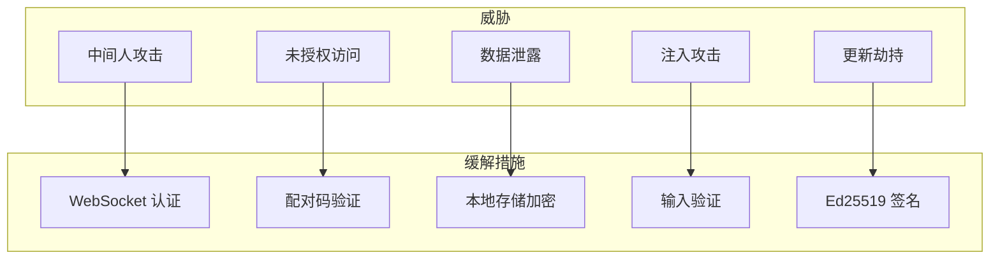

# 安全规范

> 版本: 1.0.0
> 最后更新: 2026-07-16
> 状态: 已批准

## 1. 概述

本规范定义 DropVoice 的安全措施，包括认证、加密、速率限制等。

## 2. 决策

### 2.1 威胁模型



### 2.2 WebSocket 认证

**流程:**
1. 桌面生成配对码（本地 8 位 / 配对服务器 6 位，5 分钟有效期）
2. 手机扫码或输入配对码
3. 验证通过后生成连接 Token
4. 后续通信使用 Token 认证

### 2.3 速率限制

**桌面端本地服务器（B 线，LAN 场景）：**

| 限制 | 值 | 说明 |
|------|-----|------|
| 每分钟请求数 | 30 | 防止暴力攻击 |
| 每小时请求数 | 500 | 防止滥用 |
| 最大文本长度 | 10,000 字符 | 防止资源耗尽 |
| 最大消息大小 | 1 MB | 防止内存溢出 |
| 最大并发连接 | `server.max_connections` (默认 10) | 防止连接耗尽 / DoS |
| 注入队列深度 | `injection.queue_size` (默认 100) | 防止队列无界增长导致 OOM |

**配对服务器（A 线，公网场景）：**

| 限制 | 值 | 说明 |
|------|-----|------|
| 每 IP 每秒请求数 | 1 | 防止注册/配对码洪水攻击 |
| 配对码有效期 | 5 分钟 | 缩小攻击窗口 |
| Token 有效期 | 24 小时 | 设备最长离线仍可复用 |
| device_name 最大长度 | 64 字符 | 防止存储膨胀 |

> **设计说明：** 两个服务的速率限制策略不同——桌面端按客户端 ID 的分钟/小时窗口
> 限制（LAN 可信网络），配对服务器按 IP 的滑动窗口秒级限制（公网不可信网络）。

> **实现说明 (2026-07-21):**
> - `max_connections` 在 `connection_manager.register()` 中强制执行——超限
>   返回 `MAX_DEVICES_REACHED`，`ws_handler` 在 WebSocket upgrade 完成前
>   拒绝连接（发送 typed error 后关闭 socket），不占用 slot。
> - `queue_size` 在 `enqueue_injection()` 中强制执行——超限返回
>   `QUEUE_FULL`，`handle_text_message` 将错误回传给客户端。
> - AES-256-GCM 本地加密存储与 Ed25519 更新签名验证为 v1.0+ 范围，
>   当前版本未实现（`aes-gcm` / `ed25519-dalek` 未引入）。

### 2.4 本地存储加密

**算法:** AES-256-GCM

**密钥管理:**
- 设备首次运行时生成 256 位密钥
- 密钥存储在系统目录（非项目目录）
- 敏感配置使用加密存储

### 2.5 自动更新签名

**算法:** Ed25519

**流程:**
1. 发布时使用私钥签名更新包
2. 应用内置公钥
3. 更新时验证签名

### 2.6 CORS 配置

```rust
CorsLayer::new()
    .allow_origin(["http://localhost:5173", "http://127.0.0.1:5173"])
    .allow_methods([GET, POST])
    .allow_headers([CONTENT_TYPE, AUTHORIZATION])
    .max_age(Duration::from_secs(3600))
```

### 2.7 CSP 配置

```
default-src 'self';
script-src 'self';
style-src 'self' 'unsafe-inline';
connect-src 'self' ws: wss:;
img-src 'self' data:;
```

### 2.8 device_secret 强认证（v2.0.0 预留）

> **预留说明 (2026-07-23):** 与 spec 11 §14.5 联动。当前 v1.1.0 信任模型为"同
> LAN 可信网络"（类似 AirDrop 非联系人模式），配对服务器 `POST /devices` 的设备
> 认领是**无认证**的，LAN 发现路径同样无认证。强认证推迟到 v2.0.0。

**v2.0.0 设计方向：**
- 桌面端首次启动生成**长效机密** `device_secret`（不广播，存 config.toml）。
- `POST /devices` 时携带 `device_secret`，配对服务器存其哈希（如 Argon2id）。
- "device_id 已存在但 device_secret 不匹配" → 返回 **409 Conflict**（劫持防护）。
  - 这是 spec 11 §5.1.1 中"v1.1.0 删除 409"在 v2.0.0 重新引入的合法触发场景。

**否定方案：**
- ❌ v1.1.0 引入 device_secret：信任模型尚需同 LAN 假设，过早引入增加复杂度无收益。

## 3. 决策依据

### 3.1 选择配对码而非密码

**选择理由:**
- 配对码短期有效（5 分钟）
- 一次性使用，无需记忆
- 用户体验更好

### 3.2 选择 AES-256-GCM

**选择理由:**
- 业界标准对称加密
- GCM 模式提供认证加密
- 性能好

### 3.3 选择 Ed25519

**选择理由:**
- 签名速度快
- 密钥小（32 字节）
- 业界标准

## 4. 接口规范

### 4.1 认证接口

```rust
// src-tauri/src/server/auth.rs

fn generate_pairing_code() -> String;  // 6 位随机码（配对服务器）/ 8 位（桌面本地）
fn verify_pairing_code(stored: &str, stored_time: DateTime<Utc>, request: &str) -> bool;
fn generate_connection_token() -> String;  // UUID
fn verify_connection_token(token: &str, stored: &[String]) -> bool;
```

### 4.2 验证接口

```rust
// src-tauri/src/server/validation.rs

fn validate_message(data: &[u8]) -> Result<ClientMessage, ValidationError>;
```

### 4.3 速率限制接口

```rust
// src-tauri/src/server/rate_limit.rs

struct RateLimiter {
    async fn check(&self, client_id: &str) -> bool;
}
```

### 4.4 加密接口

```rust
// src-tauri/src/storage/encrypted.rs

struct EncryptedStore {
    fn encrypt(&self, data: &[u8]) -> Vec<u8>;
    fn decrypt(&self, encrypted: &[u8]) -> Vec<u8>;
}
```

### 4.5 签名验证接口

```rust
// src-tauri/src/updater/signature.rs

struct UpdateVerifier {
    fn verify(&self, data: &[u8], signature_bytes: &[u8]) -> bool;
}
```

## 5. 约束

1. **认证必须**: 所有 WebSocket 连接必须认证
2. **加密必须**: 敏感配置必须加密存储
3. **签名必须**: 更新包必须签名验证
4. **速率限制**: 必须实现速率限制防止滥用
5. **输入验证**: 所有输入必须验证长度和格式
6. **强认证后续**: device_secret 强认证为 v2.0.0 范围（§2.8），v1.1.0 不实现
