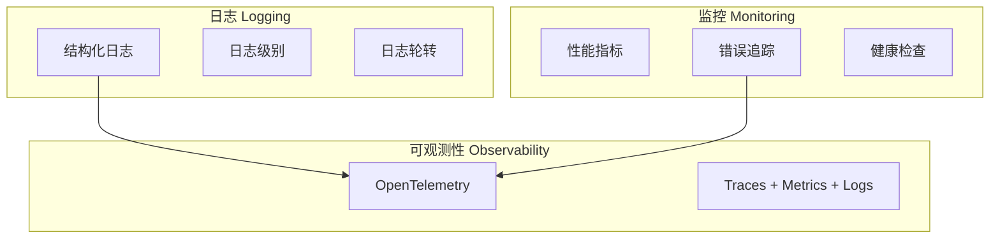

# 监控日志可观测性规范

> 版本: 1.0.0
> 最后更新: 2026-07-16
> 状态: 已批准

## 1. 概述

本规范定义 DropVoice 的日志、监控和可观测性方案。

## 2. 决策

### 2.1 三层架构



### 2.2 日志方案

**技术栈:**
- Rust: `tracing` + `tracing-subscriber` + `tracing-appender`
- 前端: `tauri-plugin-log`

**日志级别:**

| 级别 | 用途 | 示例 |
|------|------|------|
| ERROR | 错误，需要关注 | 连接失败、注入失败 |
| WARN | 警告，可能有问题 | 重试、降级 |
| INFO | 关键事件 | 服务器启动、设备连接 |
| DEBUG | 调试信息 | 消息收发、状态变更 |
| TRACE | 详细追踪 | 原始数据、性能计时 |

**日志轮转:** 按天轮转，保留 30 天

**日志配置:**
```rust
// src-tauri/src/telemetry/logging.rs

fn init_logging() {
    let log_dir = get_log_dir();

    let file_appender = RollingFileAppender::new(
        Rotation::DAILY,
        &log_dir,
        "dropvoice.log",
    );

    let env_filter = EnvFilter::try_from_default_env()
        .unwrap_or_else(|_| EnvFilter::new("info"));

    tracing_subscriber::registry()
        .with(env_filter)
        .with(fmt::layer().with_writer(std::io::stdout))
        .with(fmt::layer().with_writer(file_appender).json())
        .init();
}
```

### 2.3 OpenTelemetry

**初期:** 输出到文件（JSON Lines 格式）

**后期:** 接入 OTel Collector

**文件格式:**
```
# traces.jsonl
{"timestamp":"2026-07-16T10:00:00Z","trace_id":"abc123","span_id":"def456","name":"text_transfer","duration_ms":15,"attributes":{"client_id":"dev_1","text_length":42}}

# metrics.jsonl
{"timestamp":"2026-07-16T10:00:00Z","name":"connections_active","value":2,"attributes":{}}
{"timestamp":"2026-07-16T10:00:00Z","name":"transfers_total","value":156,"attributes":{"success":"true"}}

# logs.jsonl
{"timestamp":"2026-07-16T10:00:00Z","level":"INFO","message":"Client connected","attributes":{"client_id":"dev_1","ip":"192.168.1.100"}}
```

### 2.4 业务指标

#### 连接指标

| 指标名称 | 类型 | 单位 | 说明 |
|---------|------|------|------|
| `connections_active` | Gauge | count | 当前活跃连接数 |
| `connections_total` | Counter | count | 总连接次数 |
| `connections_duration` | Histogram | seconds | 连接持续时间 |
| `connections_failed` | Counter | count | 连接失败次数 |
| `connection_mode` | Counter | count | 按模式统计（lan/p2p/relay） |

#### 文本传输指标

| 指标名称 | 类型 | 单位 | 说明 |
|---------|------|------|------|
| `transfers_total` | Counter | count | 总传输次数 |
| `transfers_bytes` | Counter | bytes | 总传输字节数 |
| `transfers_characters` | Counter | count | 总传输字符数 |
| `transfer_duration` | Histogram | ms | 传输耗时 |
| `transfer_text_length` | Histogram | chars | 文本长度分布 |

#### 文本注入指标

| 指标名称 | 类型 | 单位 | 说明 |
|---------|------|------|------|
| `injections_total` | Counter | count | 总注入次数 |
| `injection_duration` | Histogram | ms | 注入耗时 |
| `injection_queue_size` | Gauge | count | 注入队列长度 |
| `injection_queue_wait` | Histogram | ms | 队列等待时间 |
| `injection_failed` | Counter | count | 注入失败次数 |

#### 服务器指标

| 指标名称 | 类型 | 单位 | 说明 |
|---------|------|------|------|
| `server_uptime` | Gauge | seconds | 服务器运行时间 |
| `server_requests` | Counter | count | HTTP 请求数 |
| `server_errors` | Counter | count | 服务器错误数 |
| `server_memory` | Gauge | bytes | 内存使用量 |

### 2.5 健康检查

```rust
// src-tauri/src/server/health.rs

#[derive(Serialize)]
struct HealthStatus {
    status: &'static str,      // "ok" | "error"
    version: &'static str,
    uptime_seconds: u64,
    connections: usize,
    memory_mb: u64,
}
```

**端点:** `GET /health`

### 2.6 日志文件位置

| 平台 | 路径 |
|------|------|
| Windows | `%LOCALAPPDATA%\dropvoice\logs\` |
| macOS | `~/Library/Logs/dropvoice/` |
| Linux | `~/.local/share/dropvoice/logs/` |

### 2.7 日志清理策略

```rust
// 启动时清理超过 30 天的日志
fn cleanup_old_logs() {
    let log_dir = get_log_dir();
    let retention = chrono::Duration::days(30);

    for entry in fs::read_dir(&log_dir)? {
        let entry = entry?;
        let metadata = entry.metadata()?;

        if let Ok(modified) = metadata.modified() {
            let age = chrono::Utc::now() - chrono::DateTime::from(modified);
            if age > retention {
                fs::remove_file(entry.path())?;
            }
        }
    }
}
```

## 3. 决策依据

### 3.1 选择 OpenTelemetry

**选择理由:**
- 业界标准
- 支持 Traces + Metrics + Logs
- 厂商中立

### 3.2 初期输出到文件

**选择理由:**
- 无需额外基础设施
- 便于调试
- 后续可无缝切换到 OTel Collector

### 3.3 按天轮转

**选择理由:**
- 便于管理日志文件
- 自动清理过期日志
- 磁盘空间可控

## 4. 接口规范

### 4.1 遥测配置

```toml
[telemetry]
enabled = true
output = "file"          # file | otlp
log_dir = "logs"
log_retention_days = 30

[telemetry.otlp]
endpoint = "http://localhost:4317"  # 后续使用
```

### 4.2 指标接口

```rust
// src-tauri/src/telemetry/metrics.rs

struct BusinessMetrics {
    fn record_connection(&self, mode: &str, success: bool, duration_secs: f64);
    fn record_transfer(&self, bytes: u64, chars: u64, duration_ms: f64, success: bool);
    fn record_injection(&self, chars: u64, duration_ms: f64, success: bool);
}
```

### 4.3 Cargo.toml 依赖

```toml
[dependencies]
tracing = "0.1"
tracing-subscriber = { version = "0.3", features = ["env-filter", "json"] }
tracing-appender = "0.2"
```

> **实现说明 (2026-07-21):** `opentelemetry` / `opentelemetry_sdk` /
> `opentelemetry-otlp` 三个 crate **暂未引入**。原本写在 Cargo.toml 中
> 但 `src/` 内从未 `use`，反而把 tonic/gRPC 整栈拖入 release 二进制。
> 现 v0.2 仅使用 `tracing` + `tracing-subscriber`（stdout + JSON file
> 双 layer）+ `BusinessMetrics`（手写 AtomicU64 计数器，由 `info!` 打印）。
> OTLP 导出与 §2.3 的 JSON Lines 输出推迟到 v1.0 阶段，届时再按需添加
> 依赖并实现 `telemetry/otel.rs`。`telemetry.enabled` / `telemetry.output`
> / `telemetry.log_dir` 配置项保留为未来阶段的开关。

## 5. 约束

1. **日志轮转**: 按天轮转，自动清理过期日志
2. **性能**: 日志和指标不得影响应用性能
3. **隐私**: 日志不得包含敏感数据
4. **健康检查**: 必须提供 `/health` 端点
5. **遥测输出**: 初期输出到文件，后期接入 OTel
