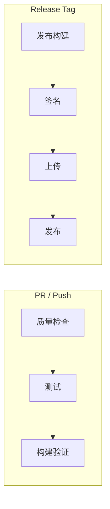
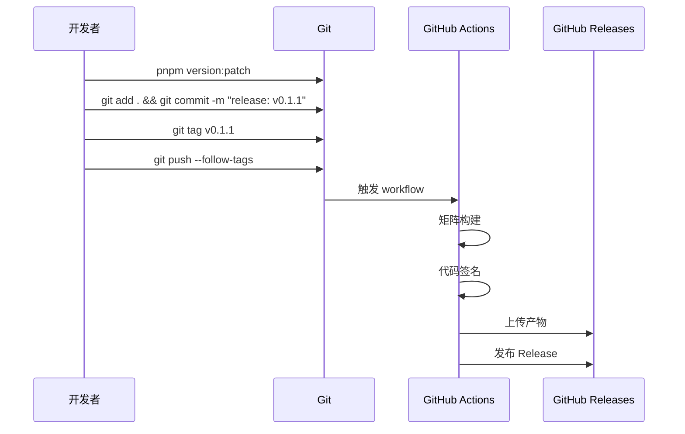

# CI/CD 流水线规范

> 版本: 1.0.0
> 最后更新: 2026-07-16
> 状态: 已批准

## 1. 概述

本规范定义 DropVoice 的 CI/CD 流水线，包括质量检查、测试、构建和发布。

## 2. 决策

### 2.1 流水线概览



### 2.2 质量检查流水线

**触发条件:** PR 和 Push 到 main

```yaml
# .github/workflows/quality.yml

name: Quality Checks

on:
  pull_request:
    branches: [main]
  push:
    branches: [main]

concurrency:
  group: quality-${{ github.ref }}
  cancel-in-progress: true

jobs:
  frontend:
    name: Frontend
    runs-on: ubuntu-latest
    steps:
      - uses: actions/checkout@v4

      - uses: pnpm/action-setup@v4
        with:
          version: 11

      - uses: actions/setup-node@v4
        with:
          node-version: 22
          cache: pnpm

      - run: pnpm install --frozen-lockfile

      - name: TypeScript
        run: pnpm typecheck

      - name: Lint
        run: pnpm lint

      - name: Format
        run: pnpm format:check

      - name: Test
        run: pnpm test

      - name: DESIGN.md
        run: pnpm design:lint

  design-sync:
    name: Design Sync
    runs-on: ubuntu-latest
    steps:
      - uses: actions/checkout@v4

      - uses: pnpm/action-setup@v4
        with:
          version: 11

      - uses: actions/setup-node@v4
        with:
          node-version: 22
          cache: pnpm

      - run: pnpm install --frozen-lockfile

      - name: Export DESIGN.md tokens
        run: pnpm design:export:css

      - name: Check sync
        run: |
          if [ -n "$(git diff packages/ui/src/tokens/theme.css)" ]; then
            echo "❌ DESIGN.md tokens out of sync"
            echo "Run: pnpm design:sync"
            exit 1
          fi
          echo "✅ Design tokens in sync"

  backend:
    name: Rust (${{ matrix.os }})
    runs-on: ${{ matrix.os }}
    strategy:
      matrix:
        os: [ubuntu-latest, windows-latest, macos-latest]
    steps:
      - uses: actions/checkout@v4

      - uses: dtolnay/rust-toolchain@stable
        with:
          components: rustfmt, clippy

      - uses: Swatinem/rust-cache@v2
        with:
          workspaces: apps/desktop/src-tauri

      - name: Format
        run: cargo fmt --check --manifest-path apps/desktop/src-tauri/Cargo.toml

      - name: Clippy
        run: cargo clippy --manifest-path apps/desktop/src-tauri/Cargo.toml -- -D warnings

      - name: Test
        run: cargo test --manifest-path apps/desktop/src-tauri/Cargo.toml
```

### 2.3 发布流水线

**触发条件:** Push tag `v*`

```yaml
# .github/workflows/release.yml

name: Release

on:
  push:
    tags: ['v*']

permissions:
  contents: write

concurrency:
  group: release-${{ github.ref_name }}
  cancel-in-progress: true

jobs:
  create-release:
    runs-on: ubuntu-latest
    outputs:
      release_id: ${{ steps.create_release.outputs.id }}
    steps:
      - uses: actions/checkout@v4

      - name: Create Release
        id: create_release
        uses: softprops/action-gh-release@v1
        with:
          draft: true
          prerelease: ${{ contains(github.ref_name, '-') }}
          generate_release_notes: true
        env:
          GITHUB_TOKEN: ${{ secrets.GITHUB_TOKEN }}

  build:
    needs: create-release
    strategy:
      fail-fast: false
      matrix:
        include:
          - platform: windows-latest
            target: windows
            args: '--bundles msi nsis'

          - platform: macos-14
            target: macos
            args: '--target universal-apple-darwin --bundles dmg'

          - platform: ubuntu-22.04
            target: linux
            args: '--bundles appimage deb'

    runs-on: ${{ matrix.platform }}
    steps:
      - uses: actions/checkout@v4

      - uses: pnpm/action-setup@v4
        with:
          version: 11

      - uses: actions/setup-node@v4
        with:
          node-version: 22
          cache: pnpm

      - uses: dtolnay/rust-toolchain@stable
        with:
          targets: ${{ matrix.target == 'macos' && 'x86_64-apple-darwin,aarch64-apple-darwin' || '' }}

      - uses: Swatinem/rust-cache@v2
        with:
          workspaces: apps/desktop/src-tauri

      - name: Install Linux dependencies
        if: matrix.target == 'linux'
        run: |
          sudo apt-get update
          sudo apt-get install -y \
            libwebkit2gtk-4.1-dev \
            libgtk-3-dev \
            libayatana-appindicator3-dev \
            librsvg2-dev \
            libsoup-3.0-dev \
            javascriptcoregtk-4.1-dev \
            libxdo-dev

      - run: pnpm install --frozen-lockfile

      - name: Build
        uses: tauri-apps/tauri-action@v0
        with:
          releaseId: ${{ needs.create-release.outputs.release_id }}
          tauriScript: pnpm tauri
          args: ${{ matrix.args }}
        env:
          GITHUB_TOKEN: ${{ secrets.GITHUB_TOKEN }}
          TAURI_SIGNING_PRIVATE_KEY: ${{ secrets.TAURI_SIGNING_PRIVATE_KEY }}
          TAURI_SIGNING_PRIVATE_KEY_PASSWORD: ${{ secrets.TAURI_SIGNING_PRIVATE_KEY_PASSWORD }}
          APPLE_CERTIFICATE: ${{ secrets.APPLE_CERTIFICATE }}
          APPLE_CERTIFICATE_PASSWORD: ${{ secrets.APPLE_CERTIFICATE_PASSWORD }}
          APPLE_SIGNING_IDENTITY: ${{ secrets.APPLE_SIGNING_IDENTITY }}
          APPLE_ID: ${{ secrets.APPLE_ID }}
          APPLE_PASSWORD: ${{ secrets.APPLE_PASSWORD }}
          APPLE_TEAM_ID: ${{ secrets.APPLE_TEAM_ID }}

  publish:
    needs: [create-release, build]
    runs-on: ubuntu-latest
    steps:
      - name: Publish Release
        uses: softprops/action-gh-release@v1
        with:
          release_id: ${{ needs.create-release.outputs.release_id }}
          draft: false
        env:
          GITHUB_TOKEN: ${{ secrets.GITHUB_TOKEN }}
```

### 2.4 发布流程



### 2.5 Secrets 配置

| Secret | 用途 | 说明 |
|--------|------|------|
| `GITHUB_TOKEN` | GitHub API 访问 | 自动生成 |
| `TAURI_SIGNING_PRIVATE_KEY` | Tauri 更新签名 | Ed25519 私钥 |
| `TAURI_SIGNING_PRIVATE_KEY_PASSWORD` | 签名密码 | 私钥密码 |
| `APPLE_CERTIFICATE` | macOS 证书 | Base64 编码 |
| `APPLE_CERTIFICATE_PASSWORD` | 证书密码 | - |
| `APPLE_SIGNING_IDENTITY` | 签名身份 | - |
| `APPLE_ID` | Apple ID | - |
| `APPLE_PASSWORD` | App-specific password | - |
| `APPLE_TEAM_ID` | 团队 ID | - |
| `WINDOWS_CERTIFICATE` | Windows 证书 | EV 证书 |
| `WINDOWS_CERTIFICATE_PASSWORD` | 证书密码 | - |

## 3. 决策依据

### 3.1 选择 GitHub Actions

**选择理由:**
- 与 GitHub 深度集成
- 免费额度充足
- 社区 Actions 丰富

### 3.2 矩阵构建

**选择理由:**
- 并行构建，速度快
- 平台隔离，互不影响
- 统一配置，易于维护

### 3.3 自动发布

**选择理由:**
- 减少人工操作
- 避免发布遗漏
- 自动生成 Release Notes

## 4. 接口规范

### 4.1 Package.json scripts

```json
{
  "scripts": {
    "ci:quality": "pnpm typecheck && pnpm lint && pnpm format:check && pnpm test",
    "ci:build": "pnpm tauri build"
  }
}
```

### 4.2 发布检查清单

| 步骤 | 命令 | 说明 |
|------|------|------|
| 1 | `pnpm version:patch` | 更新版本号 |
| 2 | `git add . && git commit -m "release: v0.1.1"` | 提交版本变更 |
| 3 | `git tag v0.1.1` | 创建标签 |
| 4 | `git push --follow-tags` | 推送触发 CI |
| 5 | 等待 CI 完成 | 自动构建 + 签名 |
| 6 | 检查 Release 草稿 | 确认文件完整 |
| 7 | 发布 Release | 触发自动更新检查 |

## 5. 约束

1. **质量门控**: 所有检查必须通过才能合并
2. **签名必须**: 所有发布包必须签名
3. **Release Notes**: 自动生成，手动审核后发布
4. **版本同步**: package.json 和 Cargo.toml 版本必须同步
5. **标签必须**: 每次发布必须创建 git 标签
